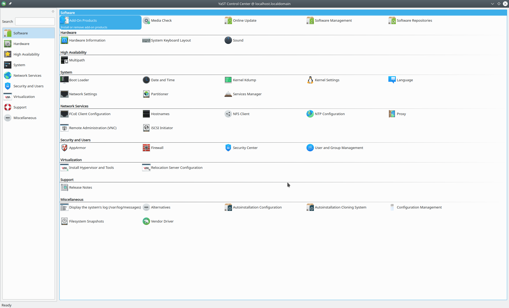

# 其他的 Linux 发行版：技术差异简介

在 Linux 101 讲义中，我们默认使用的发行版是 Ubuntu。当然，可能你正在使用其他的 Linux 发行版。尽管大部分的内容都是通用的，但发行版之间仍然或多或少存在一些差别。下面会简要介绍其他的发行版中需要注意的地方。

## Debian GNU/Linux，与其他的 Debian 衍生版本 {#debian-and-derivation}

Ubuntu 基于 Debian，并且相比 Debian 而言更加新手友好。而 Debian 的开发周期更慢，它的 Stable 分支也更加稳定。在很多方面来说，它们的区别不大，但是仍然需要注意一些事情：

-   不同的发行版、不同的分支的软件源不能混用。向 Debian 添加 Ubuntu 或 Ubuntu PPAs 的源可能会导致软件依赖的混乱。
-   Debian 不会预置一些 Ubuntu 特有的特性。从 Snapcraft 商店、Livepatch（在不停机的情况下修复内核漏洞的服务）到 ZSys（由 Ubuntu 开发的 ZFS 管理工具）都不会预置在 Debian 中。
-   在日常使用中，Debian 也有一些小的区别，例如默认情况下，`/sbin` 不在普通用户的 PATH 中。

## CentOS 与 Fedora {#centos-and-fedora}

### 软件包管理 {#rh-software-management}

「红帽系」的 Linux 发行版与 Ubuntu 等 Debian 系列的发行版最直观的区别就在于它们使用的软件包管理方式不一样。一般使用 `dnf`（推荐）或者 `yum` 来进行软件包管理。`dnf` 和 `yum` 都是使用 Python 编写的程序，谨慎变动系统 Python 环境，以免出现问题。

简单使用：

```console
$ sudo dnf install audacity  # 安装 audacity
$ sudo dnf remove firefox  # 卸载 firefox
$ dnf search thunderbird  # 搜索 thunderbird
$ sudo dnf upgrade  # 更新系统
```

此外，`dnf` 和 `yum` 还可以回滚到以前的软件安装状态，具体可以自行搜索了解。

### 关于 SELinux {#selinux}

SELinux 是由 NSA 编写的开源的 Linux 安全模块，在 CentOS 和 Fedora 上都默认开启。SELinux 解决的问题是，传统的 DAC（自主访问控制, Discretionary Access Control）安全模型（我们在第五章中看到的 `rwx` 就是传统的模型）无法有效应对一些安全风险，如[^1]：

-   用户可能会把「任何人都可读取」的权限赋予在敏感文件（如 SSH 密钥）上。
-   用户的进程可以修改文件的安全性属性。例如，邮件程序可以（尽管不应该）将邮件文件设置为「任何人都可读取」。
-   用户的进程继承用户的权限，如果进程本身有问题或是不安全，那么攻击者可以以该用户的权限作任何事情。例如，如果浏览器被攻击，它可以读取到用户的 SSH 密钥，但浏览器显然不应该做这种事情。

SELinux 添加了额外的「强制访问控制」安全措施：系统中所有的文件、进程和端口等都被贴上了 SELinux 标签，如果访问者（Subject）和被访问对象（Object）的标签不符合规则，访问则会被拒绝。

虽然很多人安装完 CentOS/Fedora 之后做的头几件事之一，就是把 SELinux 关掉。它可能会导致一些奇怪的权限问题，或是让某些程序运行失败。但是我们不建议在需要强安全性的环境中关闭 SELinux。[清华大学 TUNA 协会](https://tuna.moe)曾在活动中做过 [SELinux 的使用介绍](https://tuna.moe/event/2020/selinux-introduction/)，希望进一步了解 SELinux 的同学可以在线观看其[活动录像](https://mirrors.tuna.tsinghua.edu.cn/tuna/tunight/2020-06-27-selinux-introduction/)。

在 Ubuntu 等发行版中，使用的类似于 SELinux 的安全模块是 AppArmor。AppArmor 使用文件路径（而非标签）进行管理，使用相较于 SELinux 简单一些。

## Arch Linux {#archlinux}

### Arch Wiki {#archwiki}

[Arch Wiki](https://wiki.archlinux.org/) 是安装和使用 Arch Linux 必读的资料，内容非常详细。即使不是 Arch Linux 的使用者，Wiki 的内容也非常有参考价值。

### 软件包管理 {#arch-software-management}

Arch 使用的默认软件包管理器是 `pacman`。以下是一些常用的命令。

```console
$ sudo pacman -Syu  # 更新系统所有软件包
$ sudo pacman -S firefox  # 安装 Firefox
$ sudo pacman -Rs chromium  # 卸载 Chromium 和它的所有依赖
$ pacman -Ss audacity  # 搜索 Audacity
```

#### 手动介入 (manual intervention)：更新失败时的处理方式 {#arch-manual-intervention}

由于其滚动发行的特性，在更新时可能会出现安装错误的情况。一般来说，你需要关注 Arch 的主页新闻 (<https://www.archlinux.org/>)，当有软件包需要手动介入更新时，可以看到错误提示和解决方法。

#### AUR {#aur}

[AUR (Arch User Repository)](https://aur.archlinux.org) 由 Arch 用户维护，是 Arch Linux 的一大特色。其上包含了大量的程序可供安装。用户可以对软件包评论、投票，与各自的维护者交流。

有很多的程序（统称为 AUR Helper）可以帮助从 AUR 上下载安装包，例如 `yay` 和 `paru`。

## openSUSE {#opensuse}

提示：关于 openSUSE 有一份不错的手册 [opensuse-guide.org](https://opensuse-guide.org/)（[中文翻译](https://opensuse-guide.ustclug.org)）。

### 发行版本 {#opensuse-release}

openSUSE 最主要使用的发行版本为 Leap 和 Tumbleweed。

openSUSE Leap 是定期发布的常规版本，截至 2022 年初，最新的版本为 15.3。而 openSUSE Tumbleweed（又名「风滚草」）是滚动更新的，类似于 Arch Linux。

!!! warning "openSUSE Leap 15.x 比 openSUSE Leap 42.x 更新。"

### 软件包管理 {#suse-software-management}

openSUSE 使用 RPM 作为其软件包格式，但是与 Fedora、CentOS 等不同的是，其软件包管理器为 ZYpp（Zen / YaST Packages Patches Patterns Products）。用户可以在命令行中使用 `zypper` 进行安装、卸载、升级软件等操作。

以下是一些常用的命令：

```console
$ sudo zypper update  # 更新系统所有软件包
$ sudo zypper install firefox  # 安装 Firefox
$ sudo zypper remove chromium  # 卸载 Chromium 和它的所有依赖
$ zypper search audacity  # 搜索 Audacity
```

### 系统管理工具 YaST {#yast}

YaST 工具是 openSUSE 的一大特色。它提供了图形化的界面，可以帮助系统管理员完成各种常见操作。



YaST 控制中心截图
{: .caption }

### Open Build Service (OBS) {#obs}

[OBS](https://openbuildservice.org/) 源于 openSUSE 为社区打包软件所提供的服务，目前支持为各大 Linux 发行版提供打包服务。用户也可以自己搭建 OBS 服务。

### Btrfs 与系统集成 {#suse-btrfs}

Btrfs 文件系统是 openSUSE 在安装时为根分区选择的默认文件系统。借助 Btrfs 的快照特性，openSUSE 的 Snapper 可以实现在软件管理操作前后创建快照，允许用户回滚到之前的状态，或者从快照启动系统。

## Gentoo {#gentoo}

### 软件包管理 {#gentoo-software-management}

Gentoo 的软件包管理器是 Portage。其对应最常用的 CLI 工具是 `emerge`。

以下是一些常用的命令：

```console
$ sudo emerge --sync  # 更新软件包索引
$ sudo emerge --update --ask @world  # 更新已安装的程序（不包含依赖）
$ sudo emerge -a firefox  # 安装 Firefox
$ sudo emerge --unmerge chromium  # 卸载 Chromium 和它的所有依赖
$ emerge --search audacity  # 搜索名字中含 audacity 的包
```

由于 Gentoo 以编译安装为主，和其他 Linux 发行版不同，用户可以指定在安装时需要软件的哪些特性。例如，服务器需要的软件特性肯定与桌面不同，一些桌面上必须的功能在服务器上并不需要，反之亦然。用户可以通过修改 USE 标志来为软件包添加或删除特性。

关于 USE 标志的使用可以参考 [Gentoo 官方手册中的简要介绍](https://wiki.gentoo.org/wiki/Handbook:AMD64/Working/USE/zh-cn)。

### OpenRC {#openrc}

尽管 Systemd 已经成为了 Linux 发行版主流选择的 init，OpenRC 仍然是 Gentoo 默认的 init（关于 init 的简介，可参考[第四章](../Ch04/index.md)）。

[^1]: <https://wiki.centos.org/zh/HowTos/SELinux>

## NixOS {#nixos}

[NixOS](https://nixos.org/) 是一个基于 Nix 包管理器的 Linux 发行版，其最大的特点是**声明式配置**和**原子性更新**。与传统发行版不同，NixOS 的整个系统配置都通过一个配置文件来管理，这使得系统配置可以版本控制、可重现，并且可以轻松回滚。

### 核心概念 {#nixos-concepts}

#### 声明式配置 {#nixos-declarative}

NixOS 的整个系统配置都写在 `/etc/nixos/configuration.nix` 文件中。这个文件描述了系统应该是什么样子，而不是如何一步步构建系统。例如：

```nix
{ config, pkgs, ... }:

{
  # 启用 SSH 服务
  services.openssh.enable = true;

  # 安装软件包
  environment.systemPackages = with pkgs; [
    firefox
    vim
    git
  ];

  # 用户配置
  users.users.alice = {
    isNormalUser = true;
    extraGroups = [ "wheel" ];
  };
}
```

#### 不可变包存储 {#nixos-immutable}

NixOS 使用哈希值来标识每个包，相同内容的包总是有相同的哈希值。这意味着：

-   不同版本的软件可以同时存在而不会冲突
-   系统更新是原子性的，要么完全成功，要么完全失败
-   可以轻松回滚到任何之前的配置

### 软件包管理 {#nixos-package-management}

NixOS 使用 `nix` 命令进行软件包管理：

```console
# 搜索软件包
$ nix search nixpkgs firefox

# 安装软件包（临时，重启后消失）
$ nix-env -iA nixpkgs.firefox

# 在配置文件中添加软件包（推荐方式）
# 编辑 /etc/nixos/configuration.nix，然后运行：
$ sudo nixos-rebuild switch
```

#### 配置文件管理 {#nixos-config-management}

```console
# 应用配置更改
$ sudo nixos-rebuild switch

# 测试配置（不应用）
$ sudo nixos-rebuild test

# 启动到新配置
$ sudo nixos-rebuild boot

# 回滚到上一个配置
$ sudo nixos-rebuild switch --rollback
```

### 系统回滚 {#nixos-rollback}

NixOS 的回滚功能是其最强大的特性之一：

```console
# 查看可用的系统配置
$ sudo nix-env --list-generations --profile /nix/var/nix/profiles/system

# 回滚到上一个配置
$ sudo nixos-rebuild switch --rollback

# 回滚到特定配置
$ sudo nixos-rebuild switch --option system-profiles /nix/var/nix/profiles/system-123-link
```

### 通道 (Channels) {#nixos-channels}

NixOS 使用频道来管理软件包集合：

```console
# 查看当前频道
$ nix-channel --list

# 更新频道
$ sudo nix-channel --update

# 切换到不稳定频道
$ sudo nix-channel --add https://nixos.org/channels/nixos-unstable nixos
```

### Nix Flakes {#nixos-flakes}

Nix Flakes 是 Nix 的新特性，提供了更好的可重现性和依赖管理：

```nix
# flake.nix 示例
{
  inputs = {
    nixpkgs.url = "github:NixOS/nixpkgs/nixos-unstable";
  };

  outputs = { self, nixpkgs }: {
    nixosConfigurations.mySystem = nixpkgs.lib.nixosSystem {
      system = "x86_64-linux";
      modules = [ ./configuration.nix ];
    };
  };
}
```

### 开发环境 {#nixos-development}

NixOS 提供了强大的开发环境管理：

```console
# 进入包含特定软件包的 shell
$ nix-shell -p python3 nodejs

# 使用 shell.nix 文件定义开发环境
$ nix-shell
```

### 与其他发行版的主要区别 {#nixos-differences}

1. **配置方式**：传统发行版通过修改各种配置文件，NixOS 通过一个主配置文件
2. **包管理**：传统发行版使用包管理器安装软件，NixOS 通过配置文件声明需要的软件
3. **系统更新**：传统发行版更新可能失败并留下不一致状态，NixOS 更新是原子性的
4. **回滚能力**：传统发行版回滚困难，NixOS 可以轻松回滚到任何之前的配置
5. **可重现性**：NixOS 配置可以完全重现相同的系统环境

### 学习资源 {#nixos-resources}

-   [NixOS 官方手册](https://nixos.org/manual/nixos/stable/)
-   [NixOS Wiki](https://nixos.wiki/)
-   [Nix Pills - 深入学习 Nix 概念 ](https://nixos.org/guides/nix-pills/)
-   [Awesome Nix - Nix 生态系统资源](https://github.com/nix-community/awesome-nix)
-   [NixOS 中文](https://nixos-cn.org/)
-   [NixOS 与 Flakes 一份非官方的新手指南](https://nixos-and-flakes.thiscute.world/zh/)
-   [nix_resources](https://linktr.ee/nix_resources)
-   [wrapper-manager](https://viperml.github.io/wrapper-manager/)

NixOS 的学习曲线相对陡峭，但一旦掌握，它提供了传统发行版无法比拟的系统管理体验。特别适合需要可重现环境、频繁实验或需要强系统一致性的用户。
