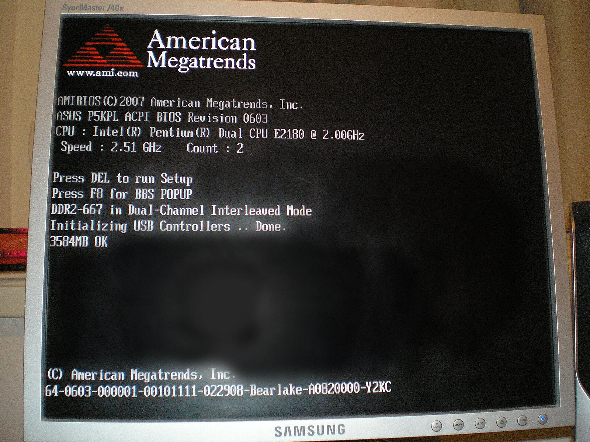

# 故障排查指南

!!! warning "本文可以作为初学者遇到严重错误时的排查指南，内容包括但是不只限于 Linux 系统。"

_本文的内容很多情况下是基于个人经验的，因此可能并不全面，或者可能不是对应问题最好的解决方案。_

## 计算机启动过程

很多的严重故障会发生在计算机的启动阶段，而这一阶段下由于缺乏初学者能使用的调试工具，故障的排查会较为困难。有必要先了解计算机从按下电源键到看到桌面这个过程中涉及的各阶段的任务，以更好地定位问题。

### 按下电源键

在计算机未开机时，ATX 电源会向主板提供 +5VSB（+5V StandBy）电源。在电源按钮按下时，主板的电路会将 PS_ON 信号拉低（与地线连接），这时电源就会正式接通各路低压电源（+5V、+12V、+3.3V、-12V 等）。

??? info "其他电源规格"

    随着计算机技术的发展，电源也出现了各种不同的规格。例如，现代的小型家用 PC 可能使用仅含有 +12V 的电源供电，而在主板上完成各路电压的转换；服务器常用的是笼架式的 +12V 冗余电源；笔记本电脑可能使用电池供电，充电器也可能是各个厂商自己的标准；等等。电源的启动信号可能也不是简单的 PS_ON 信号。关于这些电源规格的信息，需要参考各厂商自己的手册或者电源模块上的标签。我们无法在此给出明确的信息。但是，在没有手册时，有一些规律是可以试探的：

    - 地线（0V）一般是黑色导线；
    - +5V 一般是红色导线；
    - +12V 一般使用黄色导线。

一般而言，如果计算机的电源损坏，则按下电源键时，计算机是完全没有欢迎的（显示、指示灯、风扇等），称为 cold death。此时，可以怀疑是电源的问题。最简单的排查方法是替换法，即如果手边有规格一致的电源，可以试着替换被排查的电源，然后尝试启动设备。如果手边有万用表，则可以测量各路电压是否正常。

### 加载 Boot 程序

按下电源键之后，首先执行 Boot 程序。Boot 程序位于主板上的 FLASH 芯片。这是一段较小的程序，负责对计算机的基本硬件进行初始化检查，并通过各种方式将操作系统启动器载入内存执行。到这一阶段，计算机就会有显示了（典型的是计算机厂商的 Logo）。

对这一阶段进行配置，可以使用 BIOS Utility。使用这一配置程序，一般需要在开机时通过某种键盘组合键（具体取决于主板厂商）。在 BIOS Utility 里面，可以调整系统的基本设置，例如启动顺序、安全启动、CPU 频率、USB 设置、SATA 控制器设置等等。此外，还可以调整启动时屏幕上的显示内容，以显示下面提到的 POST 信息。

如果计算机没有进入到这一阶段，例如 CPU 风扇在按下电源键之后运行，但是显示屏没有任何内容，（机械）硬盘也没有寻道声音，则说明计算机的基础硬件配置有严重故障。例如，使用了不正确的内存模块（内存条）、内存接触不良、CPU 接触不良、CPU 或内存损坏、供电不全等。其中，内存的不良是最常见的问题。可能是使用了不正确的内存（例如，普通内存、ECC 内存、ECC-REG 内存混用），也可能是内存模块与内存插槽的接触不良。对于接触不良，较常见的方法是拔出内存，然后用橡皮仔细清洁内存的接触点（金手指）部分，吹干净橡皮屑后装回。

此外，在这一阶段，主板上的蜂鸣器也可能以某种模式鸣叫。这种模式是有特殊含义的，请查阅主板的手册，即可较为容易地定位问题。

对于硬件故障，最常见的排查方法是逐个尝试、控制变量。例如，如果原来能正常开机的设备在安装了新的内存后不能开机，则可以试着把新安装的内存全部拆下后逐一安装，直到找出有问题的内存为止。

如果能看到 POST 信息（Power On Self Test），则可能在其中会包括主板上各个基本组件（CPU、内存、存储控制器等）的自检信息。根据这些信息可以定位一些问题。

??? info "硬件损坏？"

    值得庆幸的是，现代计算机的硬件并没有那么容易损坏。更常见的问题通常而言是接触不良这类的软故障，或者软件配置上的故障。

    但是，上面的话也不意味着计算机硬件不会损坏。例如，在冬季，干燥环境下人体的静电放电（electrostatic discharge）就可能损坏 CMOS 集成电路。在冬季拆装计算机时特别需要注意这点。

??? info "内存检测"

    你可能能注意到，在启动阶段，主板的 Boot 程序会对内存进行基本的检测。但是，这个检测是很简单的，并没有对安装的内存进行全面的检测。如果怀疑问题与损坏的内存模块有关，请使用 memtest86+ 这类内存检测工具进行全面的内存检查。

Boot 程序完成自检后，会根据引导设置，从各个设备上尝试找到引导信息，并根据引导信息，从对应的设备上加载启动程序。常见的启动方式包括：

-   磁盘启动
-   USB 启动（也称为可移动驱动器启动）
-   CDROM 启动
-   网络启动（PXE 类方法）

对于最常见的磁盘启动而言，在旧式的引导方式中，启动信息称为主引导记录（MBR，Master Boot Record），存储在硬盘的第 0 个扇区上。新式的。
