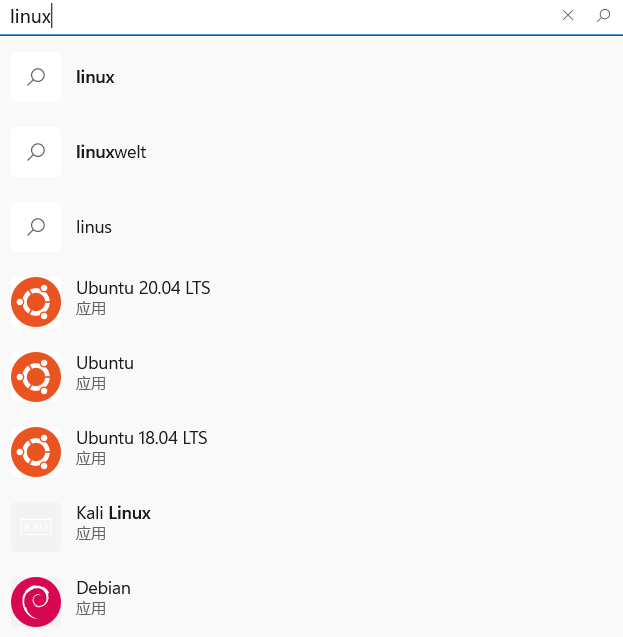

# Windows Subsystem for Linux

!!! Warning "本文仍在编辑中，尚未校对、审阅和和修订"

!!! abstract "导言"

    本章节将介绍在 Windows 上体验和使用 Linux 的较好的方法之一——Windows Subsystem for Linux。

    WSL 有着接近原生的性能、GPU 的支持和极易的安装方法，完整的 Linux 内核环境可以在涵盖绝大部分的 Linux 日常开发环境。

## 安装 {#install}

### 自动安装方法 {#install-auto}

在 Windows 10 Build 19041（Windows 10 2004）版本或以上，可以通过一条命令直接完成安装（需要以管理员身份运行）：

```shell
wsl --install
```

这条命令会完成如下几个操作：

- 启用 WSL 和虚拟化平台
- 下载并安装 WSL 的 Linux 内核
- 设定 WSL 2 默认的版本
- 从微软商店里面下载 Ubuntu 进行安装

安装完毕之后可以直接通过 `ubuntu` 命令启动。

### 手动安装 {#install-manual}

如果系统版本在 Windows 10 Build 19041 以下，如 Windows 10 LTSC 2019 ，需要手动配置系统。

#### 启用 WSL 和虚拟化平台 {#enable-windows-features}

使用管理员身份在 Powershell 中运行

```batch
Dism.exe /Online /Enable-feature /Featurename:Microsoft-Windows-Subsystem-Linux /All /NoRestart
Dism.exe /Online /Enable-feature /Featurename:VirtualMachinePlatform /All /NoRestart
```

#### 安装 Linux 内核 {#install-linux-kernel}

从微软下载 Linux 内核用于 Windows 的更新，并安装

[x64 内核](https://wslstorestorage.blob.core.windows.net/wslblob/wsl_update_x64.msi)

[ARM64 内核](https://wslstorestorage.blob.core.windows.net/wslblob/wsl_update_arm64.msi)

#### 设置 WSL 2 为默认的 WSL 版本 {#set-default-wsl-version}

```powershell
wsl --set-default-version 2
```

## 安装发行版 {#install-distro}

有许多的方法安装一个新的发行版。

### 从微软商店下载 {#install-distro-msstore}

在微软商店中直接搜索对应的发行版进行安装即可。这种方法仅支持一部分发型版，如 Ubuntu 和 Debian 等。



### 使用 Appx 文件进行安装 {#install-distro-appx}

有的打包为 Appx 的分发方式，也有提供了可执行应用程序来进行安装，在仓库里面提供了安装方式

- Manjaro: [ManjaroWSL2](https://github.com/sileshn/ManjaroWSL2)
- Gentoo: [GentooWSL2](https://github.com/imaandrew/GentooWSL2)

## 使用 {#usage}

### VS Code {#vscode-remote-wsl}

在 VS Code 中安装插件 "WSL" 后，可以像 "Remote - SSH" 一样使用 WSL

（或者也可以直接安装 "Remote Development" 插件，里面包含了 "WSL" 插件）


### JetBrains {#jetbrains-remote-wsl}

包括 IntelliJ IDEA、PyCharm、WebStorm 等，都有对 WSL 的支持。在打开了 WSL 下的目录后，
会自动地选择 WSL 下的工具链，Git 会使用 WSL 中安装的 Git 而不是 Window 下的 Git。

### 在 WSL 中使用资源管理器打开文件夹 {#open-folder-in-wsl}

在 WSL 的终端中，直接输入 `explorer.exe .`，会在当前目录下打开资源管理器，也可以使用 Windows 上的应用程序打开相应的文件。

## 已知的问题 {#known-issues}

### 运行 32 位应用程序 {#32-bit-exe}

由于实现原理，WSL 1 并不支持运行 32 位应用程序。WSL 2 由于是完整的 Linux 内核，可以在安装了对应的
运行时后可以运行 32 位应用程序。

### WSL 下 `/mnt/` 性能问题 {#mnt-performance}

WSL 2 由于相当于是通过网络的方式访问 `/mnt/` 下的文件，导致性能相对于 WSL 1 有明显的下降。

可以通过将文件放在 `/` 下（不包括 `/mnt/`），来提高性能。

相关的 Issue 和评论：[microsoft/WSL#4197](https://github.com/microsoft/WSL/issues/4197#issuecomment-604592340)

