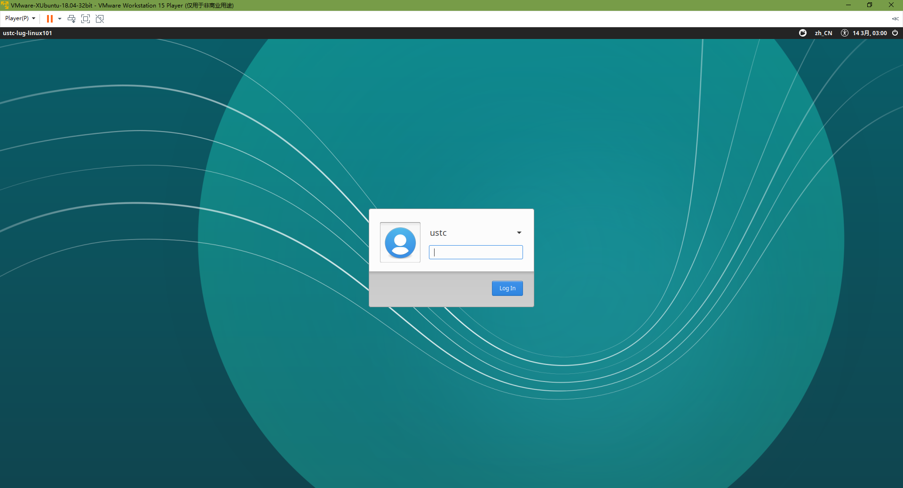
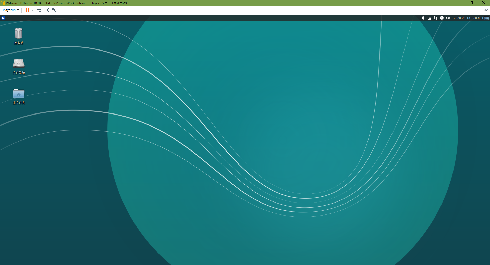

# 初识 Linux

!!! success "本文已完稿并通过审阅，是正式版本。"

!!! abstract "导言"

    21 世纪是计算机科学的世纪。在信息化程度日增月益的现代社会，与计算机和各类电子产品打交道已经成为我们，尤其是年轻人的日常生活中几乎不可避免的事情了。据统计，截至 2021 年 6 月，中国的网民规模已经高达 10.11 亿[^1]，即比例已经超过七成，而其中以中青年为主。在你的生活中，你认为计算机又占据了多大的席位呢？事实上，计算机在你生活中的比重可能远超出你的想象：不仅包括我们熟悉的在日常生活中频繁使用的个人计算机（俗称“电脑”），诸如智能手机操作系统、车载定位导航系统、校内一卡通服务系统以及如今风靡中国的电子支付网络等等都十分倚重各式各样的计算机。这些隐藏在各类用途迥异的设备中、甚至是无形的网络后面的计算机又会是什么模样？

    在本书的第一章，我们将带领你简单了解现代计算机和计算机系统的发展，并正式引入本书的核心介绍对象，即在个人计算机系统中虽然不甚流行，你可能也少有耳闻，但在科学研究、工业生产、计算机网络等各种专业场合中占据绝对主导的 Linux 操作系统。本章还会进一步引领你一步步了解我们身边的 Linux 系统，认识到其实它并不遥远缥缈也绝非高不可攀。最后，我们还会把它带到你的眼前，让你亲自上手感受它的魅力。

## 计算机与操作系统 {#computer-and-os}

### 计算机的更新换代 {#computer-generations}

自 1946 年第一台通用计算机埃尼阿克（全称“电子数值积分计算机”，英文简称 ENIAC）问世以来，人类文明就朝向信息化大步迈进。在接下来的几十年，计算机经历了真空管时代（第一代，ENIAC 就是真空管计算机）、晶体管时代（第二代，如贝尔实验室的世界上第一台全晶体管计算机 TRADIC）、集成电路时代（第三代，如 IBM System / 360 系列）和如今的大规模集成电路时代（第四代，如世界上第一款微处理器 Intel 4004）。在更新换代中，计算机的性能和集成度都有着飞跃般的提升，在过去几十年的表现呈指数级增长，因而就有了计算机行业内耳熟能详的“摩尔定律”，即**集成电路上可容纳的晶体管数目每两年就会翻一倍**，这条定律描述了近几十年来计算机性能爆发增长的现象。

??? tip "摩尔定律"

    对于摩尔定或许你会更熟悉这种说法：**计算机的性能每 18 个月提高一倍**，但事实上这句话来自英特尔首席执行官大卫·豪斯而不是摩尔。不过有一点可以肯定的是，这两句话都预测计算机的性能将随着时间产生指数爆炸级别的增长，而这在过去几十年间确实实现了。

    不过，由于晶体管的密度会受到量子物理理论上的限制，以及 CPU 会受到功耗和散热的限制，事实上这个定律已经开始失效了，计算机性能的提升开始放缓。为了不受制于这些限制，人们从最初追求单个 CPU 性能的提升逐渐转向了多个 CPU 之间的联合协作，因而基于多核的开发成为了未来计算机领域开发人员的一个不可绕过的话题。

### 计算机操作系统 {#computer-os}

如果现在提起计算机操作系统，可能多数人的第一反应就是大名鼎鼎的 Windows，此外有些人可能也接触过 macOS 或者 Linux 的各类发行版（如：Ubuntu, Manjaro, CentOS 等），它们都是计算机操作系统。然而计算机最初并没有操作系统。在当时，许多计算机不是通用计算机，它们造出来就是为了某个特定目的而服务的，因此其架构只需要为这个目的而设计即可，无需包括完整的操作系统。另外一个原因是在晶体管时代之前，计算机体积庞大，而性能又十分有限，因此也没有能力承载通用的操作系统。随着计算机性能的提升，人们更加依赖计算机的能力，对计算机的功能要求也日渐复杂。为了能尽可能利用计算机的自动化这一特性，一些操作系统开始成型。在成型的初期，计算机操作系统的目的是为了帮助用户进行批处理操作，不过之后它们也慢慢有了新的功能：进程管理、任务调度、控制输入输出设备等。这样的操作系统逐渐形成了庞大的体系，成为了联络一般用户和计算机底层设备的中介，让用户无需关心绝大多数的底层设备，大大降低了用户的使用学习成本。

### 现代操作系统的功能 \* {#modern-os-functions}

现代的计算机操作系统的功能已经十分复杂，远非当初所能比，且不同的操作系统可能在各方面都有着差异。但总体来说，其一直是用户与底层硬件交流的桥梁。用户可以通过操作系统的用户界面向计算机发出命令，操作系统则对输入的命令进行解释并驱动相关的设备来实现用户的要求。

??? note "现代个人计算机操作系统典型功能"

    通常来说，一个现代个人计算机操作系统会包含以下的功能[^2]：

    * 进程管理：操作系统之上运行的各类程序都以进程的形式存在（有关进程的内容将在本书[第四章](../Ch04/index.md)中展开），而通常计算机的中央处理器只有几个。为了能让许多进程并发执行，需要操作系统进行调度。

    * 内存管理：内存是操作系统和进程用来临时存储数据的介质。计算机的内存是有限的，而且通常还是多层次的，因此操作系统需要合理分配和回收内存。

    * 文件系统：为了管理计算机上的文件和数据，操作系统需要建立一个合适的数据结构来存储它们，即文件系统。

    * 网络通信：为了能和互联网上的其它计算机进行有效的联络，一个公认的通信协议（如当今互联网主流的 TCP/IP）是必要的。操作系统需要有能力实现各种必需的网络通信方式。

    * 安全机制：很多个人计算机和商业服务器上的数据都很敏感，因此操作系统必须配备一个安全机制用于保护数据不被未授权的人士获取，以及保护计算机免于各类计算机病毒的攻击。

    * 用户界面：现代的个人计算机操作系统通常都会包含一个图形化的用户界面，从而方便用户与计算机打交道，并且提升用户体验。

    * 驱动程序：驱动程序是直接与硬件交互的软件，使用驱动程序才能利用好计算机的硬件，因此操作系统要有能力与驱动程序对接以发挥硬件的功能。

不同的操作系统通常会基于不同设计思路，面向不同的用户群体，因此从用户的使用感受来说往往大相径庭。然而由于现代个人计算机操作系统的功能高度相似，因此它们在不同的外表下存在着诸多共通的属性。只要进行一些调研，我们就能发现它们实际上殊途同归。

## 什么是 Linux？ {#qu-est-ce-que-linux}

### Linux 的起源 {#linux-origin}

1969 年，美国 AT&T 公司的贝尔实验室开发了 UNIX 操作系统，并在此后的 10 年里在学术机构和大型企业中得到了广泛的应用。在这段时间，许多计算机从业者开发了很多基于 UNIX 的变种，统称为“类 UNIX 操作系统”。最初 AT&T 公司将 UNIX 的源码以低价甚至免费的许可授权给学术机构做研究和教学之用，然而后来它开始意识到了其商业价值，改变了之前的策略，取消了授权并对代码进行闭源，并对之前在 UNIX 之上研究出来的各类衍生组件和变种系统全部声明了著作权，随后开始了一场旷日持久的诉讼。虽然 UNIX 在此前 10 年在学界和业界起着十分重要的作用，但 AT&T 公司的这种行为对诸多使用 UNIX 和其变种的学术机构和商业厂家造成了巨大的负面影响，许多曾经的用户对 AT&T 公司的行径十分不满。

1983 年 9 月 27 日，理查德·斯托曼在麻省理工学院发起了 GNU 计划，它的目标是创建一套类似 UNIX 但完全自由的操作系统，因此这套系统不会包括任何 UNIX 的代码。在这个计划中诞生了之后十分有名的“GNU 通用公共许可证”（英文简称 GPL），这份许可证把使用该许可的软件的所有权利授予任何使用它的人。这种授权方式与通常的版权授权方式相左，它十分慷概地让出了几乎所有权利，让基于它的软件成为了自由且开源的软件，因此这种权利又被称为著作传（相对于通常的“著作权”）。

1991 年，正在大学内进修的林纳斯·托瓦兹对他使用的一个类 UNIX 操作系统 MINIX 十分不满，因为当时 MINIX 仅可用于教育但不允许任何商业用途。于是他在他的大学时期编写并发布了自己的操作系统，也就是后来所谓的 “Linux 内核”，成为了如今各类 Linux 发行版的基础。

Linux 内核并不是一个完整的操作系统，因为它过于精简，单单从它的功能上来说就已经不符合通常的现代的操作系统的定义了。为了能让这个内核拥有更多功能、完善的用户界面和更佳的使用体验，许多自由软件社区的开发人员和一些计算机商业公司便开始把各种组件添加到这个内核之上，这才构建成了一个完整的 Linux 操作系统。因为 Linux 内核是一个开源软件，所以通过这种方式组合出来的 Linux 操作系统会有许许多多的形式，不像 Windows 或者 macOS 这种受到公司统一规定的商业操作系统。正是因为开源社区的诸多成员以及许多商业公司的去中心化的贡献，让 Linux 充满了多样性。因为这种独特的属性，或许我们可以说 Linux 操作系统从来都不是指哪一种操作系统。取而代之地，为了指代某一个基于 Linux 内核构造出来的操作系统，我们通常都将其称之为“Linux 发行版”。

??? tip "GNU/Linux"

    GNU 计划最初是为了对抗 UNIX 而建立的，这可以从 GNU 的全称 “GNU's Not UNIX”（GNU 不是 UNIX）中十分直观地看出来。GNU 计划的创始人理查德·斯托曼希望通过这个计划开发一个自由的操作系统 GNU，他将 GNU 操作系统视作“达成社会目的的技术方法”。

    虽然 GNU 计划产生出了许多自由开源的组件和软件，但其核心的 GNU 操作系统却至今没有开发完成。在实际操作中，GNU 计划的组件通常都会依赖 Linux 内核作为系统核心来承载它们，它们在一起合称 GNU/Linux。在这里，Linux 内核是功能核心，而 GNU 组件则是这块核心的外设，也是用户操作和使用 Linux 内核的工具。众多当今通用计算机和服务器上主流的 Linux 发行版都属于 GNU/Linux。

    如今智能手机上一个常见的系统是谷歌公司开发的 Android，它其实也是一个基于 Linux 内核开发的操作系统。不过它没有采用 GNU 组件作为工具，而是谷歌自行研发的另一套体系。基于这套体系构成的组合则被称为 Android/Linux，它和我们接下来讨论的 GNU/Linux 大相径庭，感兴趣的读者可以参考本章的拓展阅读：[Android/Linux](supplement.md#android-linux)。

### Linux 发行版 {#linux-distributions}

一个典型的 Linux 发行版除了 Linux 内核以外，通常还会包括一系列 GNU 工具和库、一些附带的软件、说明文档、一个桌面系统、一个窗口管理器和一个桌面环境。不同的发行版之间除了 Linux 内核以外的其它部分都有可能不一样，因此有的时候我们对比某两种发行版的时候会觉得它们看起来像是完全不一样的操作系统，然而实质上它们却拥有着相同的核心，即 Linux 内核。

这里给读者介绍若干桌面和服务器环境中主流的发行版分支：

#### Debian 分支 {#debian-branch}

Debian 是一个完全由自由软件构成的类 UNIX 操作系统，第一个版本发布于 1993 年 9 月 15 日，迄今仍在维护，是最早的发行版之一。其以坚持自由软件精神和生态环境优良而出名，拥有庞大的用户群体，甚至自己也成为了一个主流的子框架，称为“Debian GNU/Linux”。

Debian 图标
{: .caption }

Debian GNU/Linux 也派生了很多发行版，其中最为著名的便是 Ubuntu（官方译名“友邦拓”）。Ubuntu 由英国的 Canonical 公司主导创立，是一个主打桌面应用的操作系统。其为一般用户提供了一个时新且稳定的由自由软件构成的操作系统，且拥有庞大的社群力量和资源，十分适合普通用户使用。

Ubuntu 图标
{: .caption }

#### Red Hat 分支 {#red-hat-branch}

Red Hat Linux 是美国的 Red Hat 公司发行的一个发行版，第一个版本发布于 1994 年 11 月 3 日，也是一个历史悠久的发行版。它曾经也广为使用，但在 2003 年 Red Hat 公司停止了对它的维护，转而将精力都投身于其企业版 Red Hat Enterprise Linux（简称 RHEL）上，Red Hat Linux 自此完结，而商业市场导向的 RHEL 维护至今。

Red Hat 公司商标，RHEL 是其旗下产品
{: .caption }

在 Red Hat Linux 在停止官方更新后，由社群启动的 Fedora 项目接管了其源代码并构筑了自己的更新，演变成了如今的 Fedora 发行版。Fedora 是一套功能完备且更新迅速的系统，且本身计划也受到了 Red Hat 公司的赞助，成为了公司测试新技术的平台。

Fedora 图标
{: .caption }

虽然 RHEL 是一个收费的、商业化的系统，但是其遵循 GNU 通用公共许可证，因此会开放源代码。编译这些源代码可以重新得到一个可以使用的操作系统，即一个新的发行版：CentOS（Community Enterprise Operating System，社区版企业操作系统）。因为 CentOS 几乎完全编译自 RHEL 的代码，所以其也像 RHEL 一样具有企业级别的稳定性，适合在要求高度稳定的服务器上运行。

2020 年 12 月，CentOS 社区在其博客中[宣布未来的重点转向 CentOS Stream](https://www.redhat.com/en/blog/centos-stream-building-innovative-future-enterprise-linux)，这是一个全新的滚动发行版。在此之前，RHEL 的上游为 Fedora，而 CentOS 的上游为 RHEL；在推出 CentOS Stream 之后，它就成为了 RHEL 的上游发行版。与此同时，CentOS 8 的支持期限被缩短至 2021 年底，且不再推出新的非 Stream 的 CentOS 版本。不满于该决定的人们也组织了新的社区，推出了诸如 [AlmaLinux](https://almalinux.org/)、[Rocky Linux](https://rockylinux.org/) 等发行版。

CentOS 图标
{: .caption }

#### Arch Linux 分支 {#arch-linux-branch}

Arch Linux 是一个基于 x86-64 架构的 Linux 发行版，不过因为其内核默认就包含了部分非自由的模块，所以其未受到 GNU 计划的官方支持。即便如此，Arch Linux 也因其“简单、现代、实在、人本、万能”的宗旨赢得了 Linux 中坚用户的广泛青睐。不过，Arch Linux 对这个宗旨的定义和其它发行版有所区别。通常的操作系统为了方便用户快速上手，都是尽可能隐藏底层细节，从而避免用户了解操作系统的运行知识即可直接使用。但是 Arch Linux 则是重在构建优雅、极简的代码结构，这方便了使用者去理解系统，但不可避免地要求使用者自身愿意去了解操作系统的运作方式。某种程度上说，它的“简单”和“人本”注重的是方便用户通过了解而去最大化地利用它，而不是采取屏蔽工作原理的方式来降低使用门槛。因此，本书不建议初学者直接上手 Arch Linux，但十分推荐在读者对 Linux 有进一步了解之后去探索它。

Arch Linux 图标
{: .caption }

Arch Linux 拥有强大的功能，但因其特殊的理念使得用户不易使用。为了能让一般用户也能用上 Arch Linux 的强大功能，它的变种 Manjaro 发行版于 2011 年问世。Manjaro 发行版基于 Arch Linux，但更注重易用，因而更适合一般用户。

Manjaro 图标
{: .caption }

以上是若干个常见的 Linux 发行版系列，其他的常用发行版有 openSUSE、Gentoo 等，相关介绍可参考[附录中对应的资料](../Appendix/distribution.md)。

由上文可见，Linux 的发行版非常丰富，不同的发行版有其各自的特性，因而可以面向不同的用户满足独特的需求。对于新手来说，一个拥有丰富的图形界面的发行版更加适合初步探索和后续使用。**本书推荐初次接触 Linux 的读者优先采用 Ubuntu 发行版或者它的子发行版（Lubuntu, Xubuntu 等）** 作为自己接触和探索 Linux 的平台，在以后可以自行上手其它发行版。

??? note "Linux 总结"

    这一章或许对于一些读者来说不太容易一次读懂，因为不同于 Windows 或者 macOS 这种受到一家商业公司完全控制和规划的系统那样有着比较单一和线性的发展轨迹，Linux 其独特的自由、开源的特性注定了它的发展进程必定是一个去中心化的、非线性的形式。因此，Linux 的历史虽然只有短短三十年，却充满着复杂的脉络和丰富的细节。但是正是因为 Linux 在如此繁茂的分枝之上结出诸多硕果，我们才能从某种角度感受到开源社区文化的强大活力，反过来也正是这种活力才能让 Linux 有着与其它闭源商业操作系统不一样的叙事。

    回到本章的标题：什么是 Linux？这个问题在不同的语境下有不同的答案：它可以指代 Linux 内核，也可能指代一个或者多个 Linux 发行版。在日常领域或是作为新手接触到的情境来看，这个词通常都是指代后者，而且往往指的是 GNU/Linux 的发行版。

## 我们身边的 Linux {#linux-around-us}

虽然在个人电脑上不太常见，但 Linux 的各类发行版其实早已深入我们的日常生活。下面是几个例子：

### 智能手机 {#smartphones}

智能手机目前有两个主流的操作系统：苹果公司研发的 iOS 操作系统和谷歌公司研发的 Android 操作系统，而 Android 正是 Linux 的一个知名的发行版。与通常安装在通用计算机上的 GNU/Linux 分支不同，Android 属于 Android/Linux 分支，这个分支通常活跃在智能手机和嵌入式设备的舞台上。

由谷歌公司推出的 Android 叫做 Android 原生系统，而基于该原生系统诞生出来的各类独特的操作系统就是 Android/Linux 系下的子发行版。Android/Linux 下的子发行版很多，如华为公司的 EMUI 操作系统和小米公司的 MIUI 操作系统等。

Android 10 原生界面
{: .caption }

### 服务器 {#servers}

现代人的生活已经很难离开互联网了，在互联网上，我们可以访问各式各样的网站、利用在线社交平台分享自己的生活、或者是使用联机办公工具和同事协同工作。通常来说这些网站和软件的提供商都需要设立他们自己的计算机来完成计算、存储和通信的功能，这种计算机就被称为服务器。和个人计算机不同，服务器通常都不会使用 Windows 或者 macOS 这种个人计算机操作系统，事实上绝大部分的服务器维护人员都愿意选择一些 Linux 发行版作为它们的操作系统，因为许多 Linux 发行版界面简洁，功能强大，而且某些发行版也是受到专业计算机企业的服务支持的（如前文提到的 RHEL）。

同时，受惠于互联网上丰富的教程，Debian 和 Ubuntu Server 也成为越来越多个人和团体用作服务器操作系统的 Linux 发行版，如下文提到的中科大开源社群 LUG@USTC 使用 Debian 发行版及其衍生产品 Proxmox VE 作为其所有服务器的操作系统。

另一类有名的服务器操作系统是微软公司的 Windows Server 系列，不过其流行程度比不上各类 Linux 发行版。

Windows Server 图标
{: .caption }

### 电视机顶盒 {#digital-tv}

比起十几年前采用传统线路的电视，现在国内很多家庭里的电视都换成了智能数字电视，这些电视通常会配备一个机顶盒来控制电视播放的内容。实际上，电视机顶盒就是一个嵌入式设备，而 Android/Linux 分支下的各类发行版正是主流的嵌入式操作系统，如谷歌公司为数字电视专门推出的 Android TV 操作系统。

Android TV 图标
{: .caption }

## 让自己的计算机用上 Linux {#use-linux}

有很多尚未接触过 Linux 的读者看到这里可能已经在期待或者计划让自己尽快开始使用 Linux 了。事实上，如果把 Linux 看作一个领域，那它的确是一个重视实践的领域。而且出于学习目的，在阅读本书未来的章节时在手头准备一个随时可用的 Linux 发行版是十分关键和有益的。因此，本书**强烈建议各位读者在本机安装一个属于自己的 Linux 发行版**，以供随时实践。

在本机上安装一个 Linux 发行版有很多种选择，如：安装方法可以选择实机安装或虚拟机安装；发行版则可以在诸多选项中任意抉择。然而，对于新手来说，本书**不建议直接采用实机安装 Linux**，因为这样做会面临以下问题：

- 在安装过程中不理解关键的选项（如：磁盘分区、挂载、交换空间分配等）的意义，很容易做出错误的决定；
- 错误的配置可能导致自己原先本机上的操作系统和数据遭到不可逆转的损坏；
- 部分硬件可能对安装的发行版缺少兼容，从而导致意外安装失败。
- 如果安装的过程中选择下载附加工具，可能会因为默认镜像在国外而导致下载十分缓慢，从而让安装流程变得很漫长。

鉴于以上问题对于新手来说十分常见，本书的编写组为各位读者专门提供了另外一种更为安全高效的方法：在虚拟机上运行 Linux 发行版镜像。虚拟机简单来说可以视作一个安全可靠的沙盒，它受到虚拟机管理软件的管理，而管理软件是直接安装在自己目前常用的操作系统上的。本书**推荐使用虚拟机运行安装完毕的 Linux 镜像**，因为这样会有如下优点：

- 读者仍然可以安心地使用自己当前的操作系统，因为虚拟机不干涉当前电脑操作系统的配置。
- 无需考虑底层硬件的兼容性问题，稳定性大幅提升。
- 系统已经安装完毕，使用虚拟机打开时相当于直接开机，无需经历安装流程。
- 如果在虚拟机中发生任何错误，可以通过重置、回溯虚拟机镜像的方法无痛修复，而不会伤害到读者计算机上的操作系统和数据。

因此，本书讲主要讲解如何为自己搭建一个安全高效的 Linux 虚拟机。

### 获取虚拟机管理软件 {#get-vm-softwares}

现在在 Windows / macOS 上主流的虚拟机管理软件有：

- [VMware Workstation Player](https://www.vmware.com/cn/products/workstation-player/workstation-player-evaluation.html) 是 VMware 公司推出的一款 Windows 上用于非商业用途的虚拟机管理软件。
- [VMware Fusion Player](https://customerconnect.vmware.com/web/vmware/evalcenter?p=fusion-player-personal) 是 VMware 公司为 macOS 平台推出的用于非商业用途的虚拟机管理软件。
- [VirtualBox](https://www.virtualbox.org/wiki/Downloads) 是甲骨文公司发行的通用虚拟机管理系统，支持 Windows 和 macOS，且遵循 GPLv2 开源。

以上软件都是免费的，且支持中文。点击上面对应的链接进入官方下载页面获取安装包，获取完毕后，直接双击打开安装程序，根据安装步骤完成安装即可。

### 获取 Xubuntu 虚拟机镜像 {#get-vm-images}

Xubuntu 是 Ubuntu 的一个子发行版，它与 Ubuntu 非常类似，但其体积更小，性能需求更少，因此十分适合各种不同性能的电脑安装使用。本书的编写组已经制作了 Xubuntu 的虚拟机镜像，供读者按需求下载使用。

- Xubuntu 20.04 64 位（[VMware](https://ftp.lug.ustc.edu.cn/101/vm/VMware-Xubuntu-20.04-amd64.ova)，[VirtualBox](https://ftp.lug.ustc.edu.cn/101/vm/VirtualBox-Xubuntu-20.04-amd64.ova)）
- Xubuntu 18.04 64 位（[VMware](https://ftp.lug.ustc.edu.cn/101/vm/VMware-Xubuntu-18.04-amd64.ova)，[VirtualBox](https://ftp.lug.ustc.edu.cn/101/vm/VirtualBox-Xubuntu-18.04-amd64.ova)）
- Xubuntu 18.04 32 位（[VMware](https://ftp.lug.ustc.edu.cn/101/vm/VMware-Xubuntu-18.04-i386.ova)，[VirtualBox](https://ftp.lug.ustc.edu.cn/101/vm/VirtualBox-Xubuntu-18.04-i386.ova)）

推荐选用和自己系统字长相匹配的镜像。如果不确定自己的电脑是 32 位还是 64 位，可选择 32 位版。

??? tip "Xubuntu"

    Xubuntu 的设计理念是创造一个易用且更轻量的 Ubuntu。与 Ubuntu 不同的是，它采用的是更轻量和兼容性更强的 Xfce 桌面系统，并基于 GTK 运行。Xubuntu 和 Ubuntu 使用完全一致的软件源，因此 Xubuntu 能运行绝大部分 Ubuntu 下的软件。

    

    Xubuntu 图标
    {: .caption }

??? tip "Ubuntu 的支持周期"

    不管从经济上还是技术上考虑，为一个固定版本的软件提供无限长时间的技术支持都是不现实的，对操作系统来说更是如此。因此，用户需要选择合适的操作系统版本，并且在支持周期结束前迁移或更新至新版本。在停止支持（End of Life，EOL）后，操作系统仍然可以继续运行，但是不再能够得到安全更新和功能更新。

    对 Ubuntu 来说，其发行的版本主要分为两类：长期支持版本（Long Term Support，LTS）和中间版本（Interim releases）。Ubuntu 一般在每年四月和十月各发布一次新版本。其中 LTS 版本于每隔两年的四月份发布一次新版本，诸如 20.04、18.04、16.04；在其他时间发布的则是中间版本。

    中间版本的支持周期为 9 个月，一般被需要使用最新特性的开发者使用；而 LTS 有五年[^3]的标准支持周期。根据 Ubuntu 官方的估算[^4]，在所有 Ubuntu 系统中有 95% 安装的都是 LTS 版本。

如果读者想要自己安装 Ubuntu 操作系统的话，以下两篇博客也可以参考：

- [在 Windows 下使用 VMware Workstation 安装 Ubuntu](https://ibug.io/p/15-cn)（另有[英文版](https://ibug.io/p/15)）
- [在 macOS 下使用 VMware Fusion 和 VirtualBox 安装 Ubuntu](https://blog.taoky.moe/2019-02-23/installing-os-on-vm.html)

对于日常惯用 Windows 10 及以上版本的用户来说，还有另一种更为便捷的安装 Linux 的方法。自 1607 版本起，Windows 10 支持适用于 Linux 的 Windows 子系统，可以在该子系统下安装若干主流的 Linux 发行版。详情可以参考拓展阅读：[适用于 Linux 的 Windows 子系统](supplement.md#wsl)。

### 启动虚拟机 {#start-vm}

若已经安装了上述虚拟机管理软件，则可以直接双击打开虚拟机镜像，管理软件会打开并导入该镜像，导入完毕后可直接点击开始按钮启动。

VMware Workstation 启动 Xubuntu 18.04 虚拟机
{: .caption }

如果读者采用了上面列出的虚拟机之一，其默认登录用户名和密码均为 `ustc`，输入密码即可登录虚拟机系统桌面。

Xubuntu 18.04 虚拟机桌面
{: .caption }

## 中科大开源社群：LUG@USTC {#lug-ustc}

LUG@USTC 是中国科学技术大学主流的开源社群，也是校内最大的学术科技类社团。其现今拥有数百名热爱开源文化的成员，并受益于他们而正在蓬勃发展。LUG@USTC 维护了中国最大的开源镜像站之一 [USTC Mirrors](https://mirrors.ustc.edu.cn/)，其作为本土的软件源为国内许多开源软件用户提供了镜像服务，是本社群对社会作出的一项重要贡献。

LUG@USTC 图标
{: .caption }

### 了解与加入 LUG@USTC {#join-lug-ustc}

你可以从 [LUG@USTC 官方网站](https://lug.ustc.edu.cn/wiki/)中了解我们。官方网站中包括了我们在校内开展的各类流行活动和面向校内外提供的诸多网络服务。

LUG@USTC 欢迎校内外的朋友加入社群交流。如果你是中国科学技术大学在读学生，你可以通过致邮 {: .img-inline } 附上姓名与学号申请加入本社群；如果你是校外人士，也可以致邮获取进一步的沟通交流方式。

## 思考题 {#questions}

!!! question "计算机性能的增长"

    计算机的性能在过去几十年内一直呈现指数级增长，而如今其增速却已经放缓，转而开始偏向多核。在指数增长时代，计算机实际上经历过了几个不同的阶段，每个阶段都是通过不同的因素让计算机的性能快速增长。自行动手在线查阅资料，思考如下问题：

    (1) 指数增长时代经历了哪几个阶段？每个阶段让计算机性能大幅提升的机制都是什么？

    (2) 导致指数增长时代的终结的因素有哪些？

    (3) 在多核时代，为了充分利用硬件性能，操作系统需要支持什么样的新特性？

!!! question "免费软件和自由软件"

    在英文里，“免费软件”和“自由软件”都叫做“free software”，看起来很一致。事实上免费的软件是否一定自由？自由的软件是否也一定免费？

!!! question "著作传"

    著作传（英文：copyleft）源于自由软件运动，是一种利用现有著作权的法律体制巧妙地保证用户自由使用软件的权利的许可方式。著作传一般包含哪些规则？它和常见的著作权有什么区别？它和完全放弃权利的“公有领域”又有什么不同？

    

    著作传的标志，注意到它与常见的著作权标志左右颠倒
    {: .caption }

## 引用来源与备注 {#references .no-underline}

[^1]: 数据来自中国互联网信息中心[第 48 次 《中国互联网络发展状况统计报告》（全文）](https://www.cnnic.cn/hlwfzyj/hlwxzbg/hlwtjbg/202109/P020210915523670981527.pdf)。
[^2]: 信息来自维基百科条目：[操作系统](https://zh.wikipedia.org/wiki/%E6%93%8D%E4%BD%9C%E7%B3%BB%E7%BB%9F)。
[^3]: 尽管有许多说法称 Ubuntu LTS 有十年的支持，但是后五年实际上是 Extended Security Maintenance (ESM) 阶段，需要付费的 Ubuntu Advantage 订阅，或者最多 3 台设备的个人免费订阅。ESM 的安全更新仓库与主仓库也是独立的，需要登录后才能访问。
[^4]: 数据来自 Ubuntu 介绍：[The Ubuntu lifecycle and release cadence](https://ubuntu.com/about/release-cycle)。
