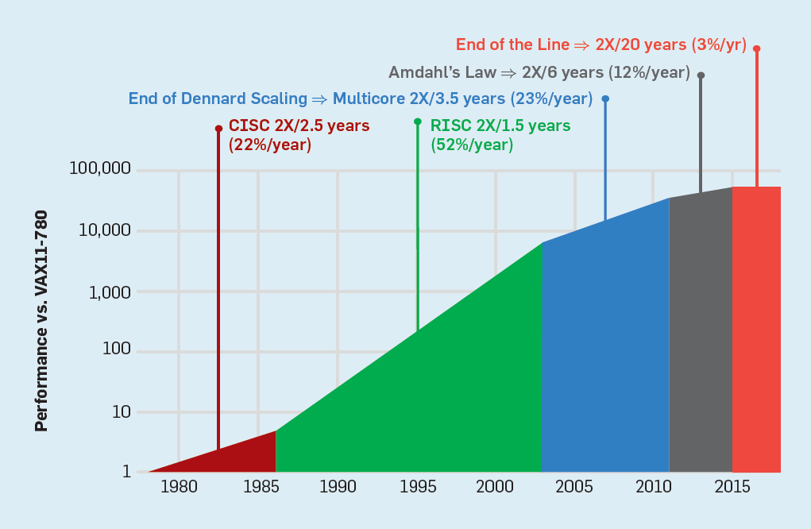

# 思考题解答 {#solution}

## 计算机性能的增长 {#performance-increase}

!!! tip "提示"

    本题在书中没有答案，并且计算机性能的时代也不存在十分明确的分界线。所以本题可算作一个开放题，并且鼓励各位读者自行查阅资料来形成自己的答案。

    本题与计算机的体系结构比较相关，建议读者查阅的时候可以以此为关键词。

??? info "解答"

    **(1)**

    计算机的指数增长时代大致可以认为由 2 个阶段构成：

    * 复杂指令集阶段：这个阶段是大规模集成电路阶段的开始。在这个阶段，得益于电路的集成度大幅度提升，计算机的性能也成指数级增长。这个阶段大致的时间范围是 1978 - 1986 年，平均每年性能提升 22%。

    * 精简指令集阶段：随着时间的推移，人们发现许多指令通常都用不到，但它们的存在让处理器不得不采用更复杂的结构，因此研究员开始提倡精简之前的指令集架构以简化处理器。在使用了精简后的指令集架构后，计算机的性能相较之前有了飞跃般的提升（最初在 IBM 360 指令集架构上是 3 倍）。同时，集成电路的密度依然在继续增加，且在这个阶段开发人员通过大力改进“指令级并行”以提升性能，因此此时计算机的性能以更快的速度增长。这个阶段大致的时间范围是 1986 - 2003 年，平均每年性能提升 52%，是计算机科技的黄金时代。

    **(2)**

    计算机指数增长的黄金年代之所以能长期保持，主要还是因为集成电路的密度可以稳定大幅度提升。罗伯特·丹纳德归纳了一个规律，被称之为丹纳德标度：“在晶体管的密度增加的时候，单个晶体管的功耗会下降，这样下来可以保持晶体管的功耗密度（每单位面积的功耗）不变”。根据这条规律，在晶体管密度增加的同时，计算机性能会提升（正比例于晶体管数目），但功耗不变，因此计算机的能量利用率会越来越高。

    不过，这条规律没有考虑到一些重要的问题。一个问题是晶体管的“漏电电流”（微安级别），即晶体管在工作时会有轻微漏电，这些漏电会导致处理器发热，如果不加以控制会造成严重的散热问题。当然，可以通过降低电压的方法来减少散热，但此时也出现了第二个问题，即是晶体管的“阈值电压”（大约是 0.7 ~ 0.8 伏），可以理解成最低工作电压，低于此电压晶体管不再工作。这两个问题导致了晶体管存在一个不可跨越的最低功率（以及最低发热功率），从而使得丹纳德标度失效。进一步增加密度将需要更多能耗而不再恒定，也会导致散热问题。因此，为了避免这个问题，芯片厂商研究了多核处理器来达到并行的效果，从而进入了多核时代。

    * 后丹纳德标度阶段：这是多核时代的第一个阶段，这个阶段计算机性能提升的主要因素是采用了多核处理器，通过并行的方式提升计算机的性能。这个阶段大致的时间范围是 2003 - 2011 年，平均每年性能提升 23%，相比之前的 52% 是一个巨大的跌落。

    **(3)**

    在多核时代，操作系统显然需要适应多核处理器，而其中一个最重要的能力就是进行并行任务调度，即将任务按合适的方式交付给不同的核来同时完成以尽可能充分利用并行的优势。

    **题外话**

    然而，核并不是越多越好的，因为一个任务总会有一些先后次序是不能颠倒的，所以这些部分就必须串行运行。就算假设一个任务能并行的部分可以被完美地平均切分而并行执行，剩余的串行部分也无法利用到并行的任何收益（而且往往过度的并行反而降低效率），因此增加更多核的收益会越来越低。这种规律被称之为阿姆达尔定律，核的数目越多，越受到阿姆达尔定律的限制。

    * 阿姆达尔定律阶段：这是多核时代的第二个阶段，这个阶段标志着多核所带来的性能提升已经越来越不明显了。这个阶段大致的时间范围是 2011 - 2015 年，平均每年性能提升只有 12%。

    在 2015 年以后，平均每年的性能提升更是暴跌至 3%，似乎大规模集成电路计算机的性能提升已经快到了尽头，因此又被称为终结阶段。

    

    大规模集成电路计算机性能的五个阶段
    {: .caption }

## 免费软件和自由软件 {#free-vs-free}

!!! tip "提示"

    要回答本题，需要明确了解“自由软件”的概念。依据自由软件基金会的定义，自由软件是一类可以不受限制地自由使用、复制、研究、修改和分发的，尊重用户自由的软件。[^1]可以注意到这里的定义和免费没有什么关系。

    为了更好地理解这两种定义之间的关系，最好从正反两面举出几个实际例子。

??? info "解答"

    免费软件并不一定自由，因为免费的软件可能只是软件的所有者提供了免费许可，但并不一定也会同时允许用户自由地去研究、修改和分发。一些反例诸如：

    * QQ: 腾讯公司推出的免费即时通讯软件，在中国十分主流，不过显然腾讯公司从来没公开过 QQ 的源代码，也不允许用户去自行修改它。

    * Adobe Reader：Adobe 公司推出的免费 PDF 阅读器，但该公司拥有该软件的所有权，并且此软件也不开源，不允许用户去修改。

    * WPS Office：金山办公旗下的一系列办公软件的组合，它是免费的，但同样不允许用户研究和修改。

    支持这个命题的例子不胜枚举，比如许多收费的专业软件的个人版、教育版或者社区版等都是免费但不自由的软件。

    自由软件也并不一定免费。虽然对于不少初接触的读者来说可能稍微难以想象：因为自由软件一般都是遵循自由软件协议开源的，谁都可以拿出去编译成自己的副本，似乎没有收费的余地。其实不然，一是自由软件的定义并不妨碍其收费，因此理论上想收费就可以收费；二是自由软件的发行商可以为顾客提供专业的技术服务，此时相当于买自由软件的这笔钱可以购买到专业技术支持。一个十分典型的例子就是本章中提到的 Red Hat 公司推出的 RHEL，它是收费的，但遵循 GPL 开源。使用 RHEL 源代码编译成的免费版本（再去掉 RHEL 本身包含的闭源软件和 Red Hat 商标信息）就是本章正文中提到的 CentOS 了。

## 著作传 {#copyleft}

!!! tip "提示"

    本题实质上仅要求读者了解“著作传”的定义和它与其它两种许可方式的区别，难度并不大。不过，本章正文中没有给出著作传的完整定义，因此本题鼓励读者自行查阅在线资料来掌握这个知识。

??? info "解答"

    著作传的概念源于自由软件运动，是一种利用现有的“著作权”的体制来保障用户软件自由使用权利的许可方式。通常来说，著作传保证了任何用户都可以自由地使用、复制、修改和传播所许可的软件，不过基于这个软件的复制传播和修改后的再分发通常还必须以著作传的方式发布，即后续的用户也能享受到同等的自由。

    由上面的解释可见，著作传许可比通常的著作权提供的使用许可要宽容、自由得多，因此可能部分初次接触这个概念的读者会觉得这个许可方式和直接放出去让大家随便使用没什么区别，然而这种想法是不对的。事实上，著作传和著作权、公有领域的关系和区别有以下几个显著的要点：

    * 著作传虽然允许软件可以以很自由的方式给用户使用，但用户依然需要遵守著作传的许可，而不是像公有领域的产品一样可以完全随心所欲。著作传许可的一个典型特性就是要求它的传播和衍生还是要继续采用著作传许可，而不可以申请自己的著作权，也不能重新赋予新的许可。这种方法保证了这个软件的权利完全由人类共同体充分享受，不过这种方式也得到了一些反对声音，因为这种许可的传播方式看起来太像是病毒传染。

    * 著作传是利用了现有的著作权体系设立的，这说明著作传许可虽然自由，但实际上也可以认为是对软件的一种保护，是另一种“著作权”。这也说明了著作传理论是一种受到法律保护的许可（如果当地法律兼容的话），而不是某种大家自发遵守的倡议。不过和普通的著作权不同，著作传许可面向用户下放了许多权利，这是通常的著作权许可不会做的。

## 引用来源 {#references .no-underline}

[^1]: 定义来自维基百科条目：[自由软件](https://zh.wikipedia.org/wiki/%E8%87%AA%E7%94%B1%E8%BD%AF%E4%BB%B6)。
