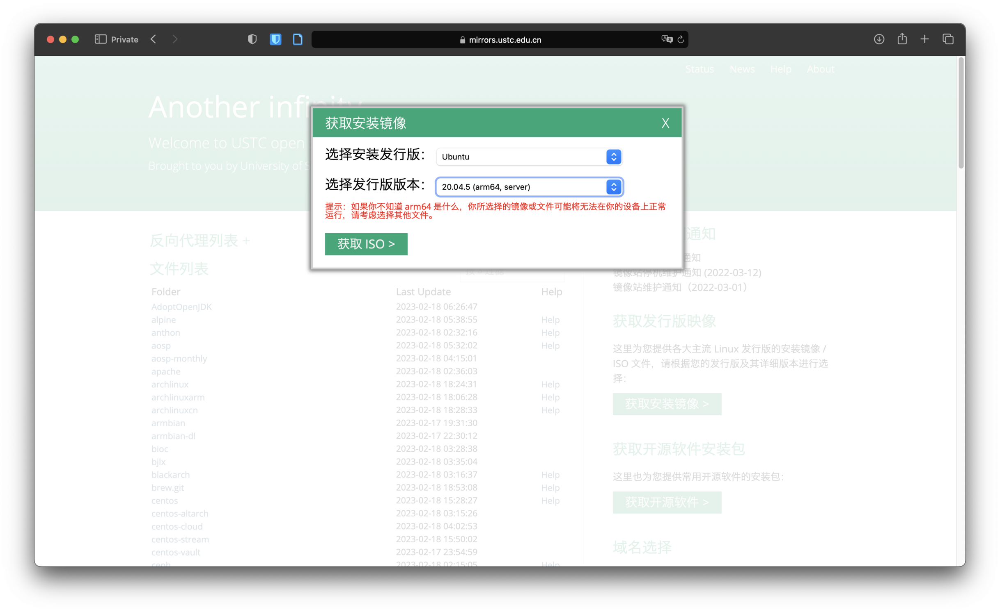
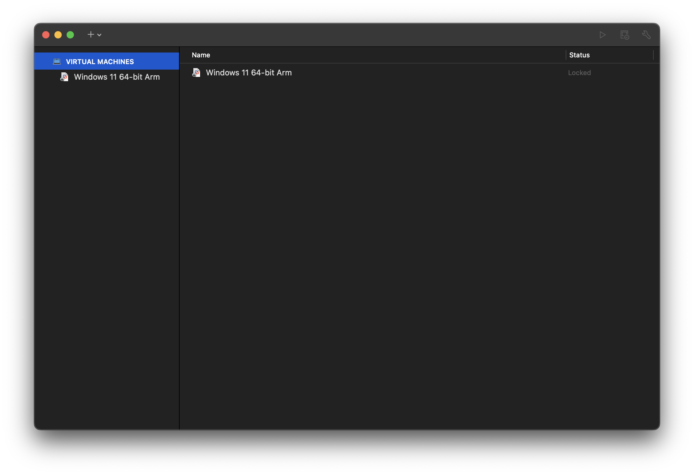
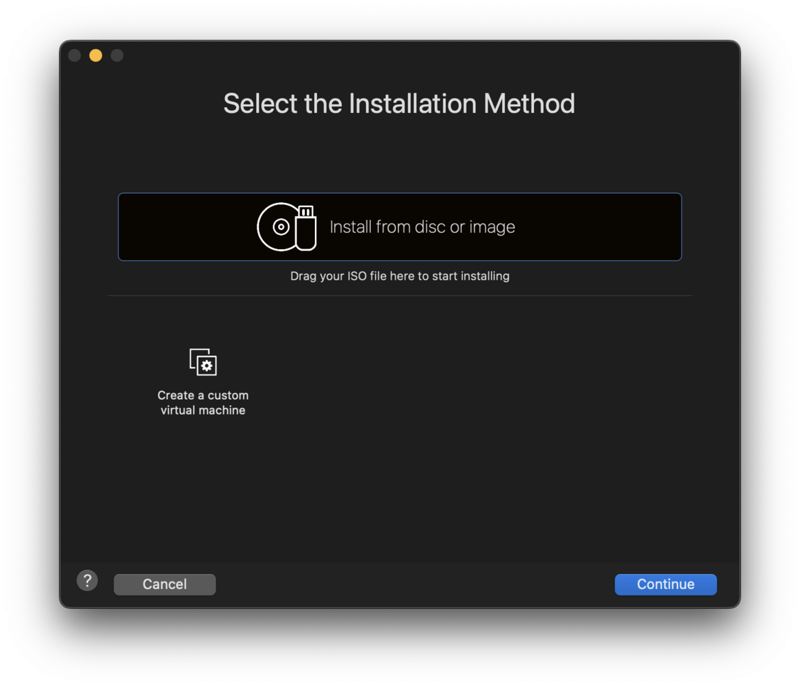
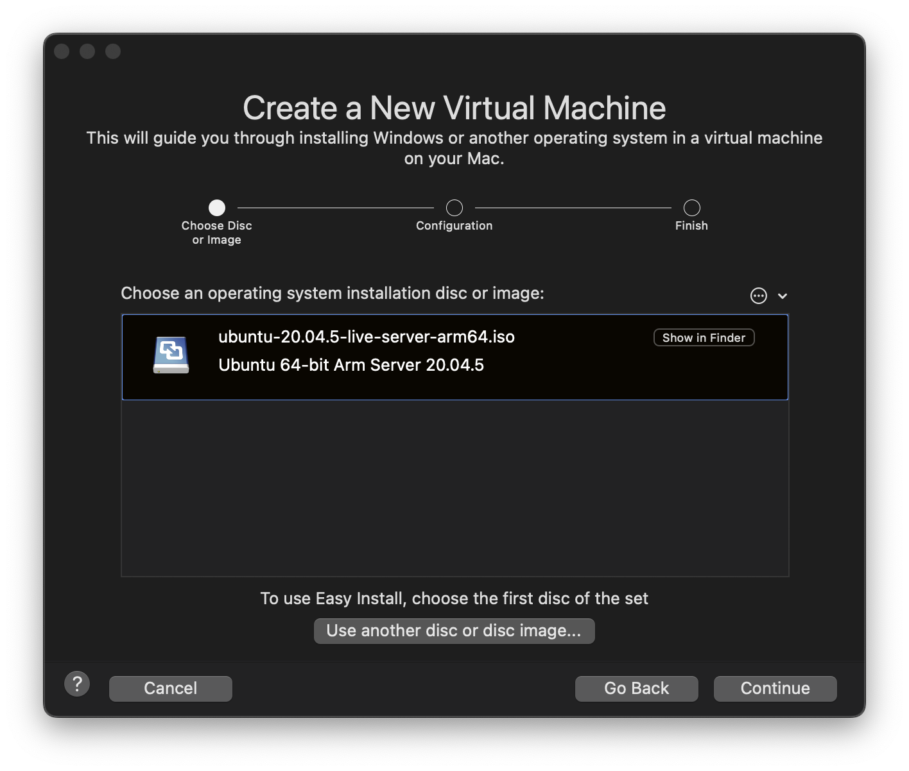
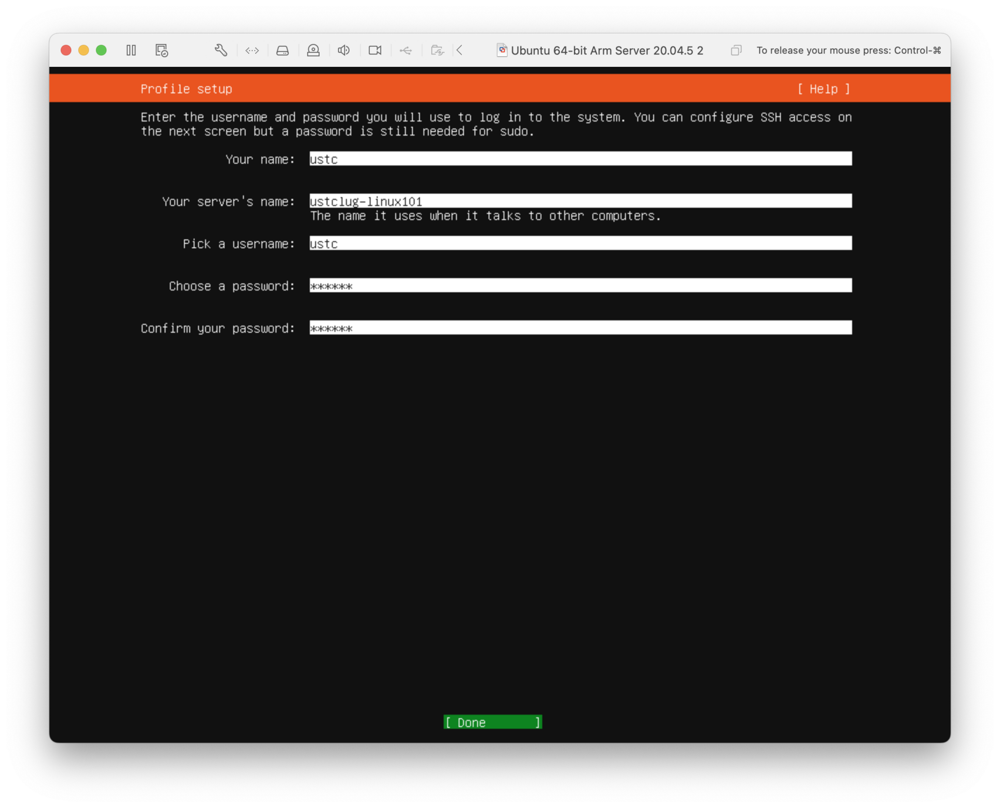
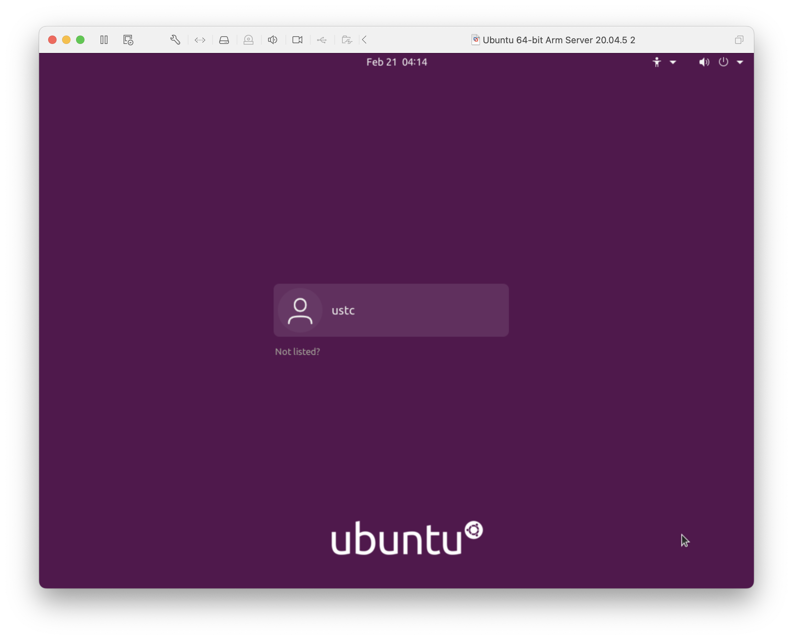

# 拓展阅读

!!! failure "本文目前尚未完稿，存在诸多未尽章节且未经审阅，不是正式版本。"

## Android/Linux {#android-linux}

Android 是 Linux 发行版，但它不是 GNU/Linux，Android 不使用 GNU 的一系列工具和库。Android 还大幅度修改了 Linux 内核以精简运行时开销、适应移动设备。

[AOSP (Android Open Source Project)](https://source.android.com/) 只使用了 GPL 许可证的 Linux Kernel，而在 Kernel 之上的 Dalvik 虚拟机、Bionic Libc 库、驱动透明化的 HAL 则作为用户态存在，避免 Android 系统框架、Google 移动应用服务框架（GMS）和各厂商的驱动程序被 GPL 感染而开源。

??? tip "GPL 感染，以及开源许可证的区别"

    简单而不太严谨地来说，如果你的程序使用了 GPL 许可证的代码，那么你的程序就必须以 GPL 许可证开源，这被称为「GPL 感染」。由于许多公司不希望自己的代码被感染开源，因而 Android 经过设计规避了相关的法律问题，只需要厂商将对 Linux 内核的修改开源即可。

    一个被 GPL 感染的例子是用于嵌入式路由器设备的 OpenWrt。由于 Linksys 在编写自己的无线路由器固件时使用了 GPL 的代码，因此不得不将相关的代码开源。OpenWrt 即由此发展而来。

    GPL 许可证是在第一章正文中提到的「著作传」（Copyleft）许可的代表。而另一类开源许可证则更加宽松，允许用户在署名等前提下将代码使用在闭源软件中。这样的许可证代表如 MIT 许可证、Apache 许可证等。

    目前，GitHub 网页版在创建 `LICENSE` 文件时，会给出一些开源许可证的选项以供选择。网络上也有相关的资料以供需要选择开源许可证的开发者们参考。

## 禁用 SELinux {#disable-selinux}

读者在使用 Fedora、CentOS、Scientific Linux、RHEL 等系统时，可能会遇到这样的错误：

-   SELinux is preventing XXXX from read access on the file YYYY.

这是因为有一个叫做 SELinux 的安全增强组件阻止了一些有潜在风险的操作。

SELinux 的全称是 Security-Enhanced Linux，起初是为了弥补 Linux 下没有强制访问控制（Mandatory Access Control, MAC）的缺憾。我们在[附录](../Appendix/distribution.md#selinux)中也对 SELinux 做了进一步的介绍。

但是 SELinux 的设置相当繁复，由于默认设置不可能尽善尽美，一些配置上的小问题可能会影响用户的正常使用，而初学者没有足够的技能去调试 SELinux 策略。因此在初学时，可以暂且关闭 SELinux，在掌握足够的技能后再启用它。

??? tip "AppArmor"

    在 Debian、Ubuntu 系发行版中，默认使用的是称作 AppArmor 的同类组件。与 SELinux 相比，AppArmor 更简单一些，且一般不会对用户的正常使用造成困扰。

SELinux 有 3 种工作模式：

1. `enforcing`：SELinux 根据安全策略，积极阻止有潜在风险的操作。
2. `permissive`：SELinux 仅记录会被阻止的操作在日志中，但不做任何事。
3. `disabled`：SELinux 被彻底禁用，日志也不记录。

因此，只需将 SELinux 置于 `permissive` 或 `disabled` 状态即可。

使用 `sestatus` 命令查看 SELinux 状态：

```
$ sestatus
SELinux status:                 enabled
SELinuxfs mount:                /sys/fs/selinux
SELinux root directory:         /etc/selinux
Loaded policy name:             targeted
Current mode:                   enforcing
Mode from config file:          enforcing
Policy MLS status:              enabled
Policy deny_unknown status:     allowed
Memory protection checking:     actual (secure)
Max kernel policy version:      31
```

使用 `setenforce 0` **临时** 改变 SELinux 状态到 `permissive`，这个状态在重启后将恢复为配置文件指定的默认值。

```
# setenforce 0
```

修改 SELinux 的配置文件可以永久改变 SELinux 的工作状态。

1. 使用 root 权限编辑 `/etc/selinux/config` 文件；
2. 将 `SELINUX=enforcing` 中的 `enforcing` 改为 `disabled` 或 `permissive`。

编辑完成后，使用 `sestatus` 可以看到修改效果：

```
[...]
Current mode:                   permissive  # <-
Mode from config file:          permissive  # <- 或 disabled
[...]
```

## 配置与使用 SSH 连接远程的 Linux 服务器 {#ssh}

在本章节正文中，我们介绍了如何在本地运行 Linux 操作系统。但是在实际操作时，一个非常常见的需求是连接到远程的服务器。Linux 提供了非常方便安全的 SSH 功能，可以让用户连接到远程的 Linux 服务器命令行执行操作。

在这里，我们将简单介绍在服务器上配置 SSH，以及如何使用 SSH 连接到远程的服务器。

!!! warning "安装前请务必修改弱密码"

    互联网上有着大量爆破用户名和弱密码的自动化程序，如果密码很弱（位数不够长，或者使用了常见的密码），那么黑客就能很快使用 SSH 登录到你的系统中获取控制权，使得你的电脑（服务器）成为肉鸡（被黑客利用攻击其他服务器），在你的电脑上安装挖矿软件等恶意软件，删除你的数据进行勒索。甚至在校园网中，服务器由于 SSH 弱密码被攻击的例子也屡见不鲜。

    由于 SSH 服务器默认不关闭密码验证，在安装前请务必使用 `passwd` 命令修改弱密码！

在服务器上首先安装 `openssh-server` 软件包，它提供了 SSH 服务器的功能。

```
$ sudo apt install openssh-server
```

启动并检查 SSH 服务状态：

```
$ sudo systemctl start ssh
$ sudo systemctl status ssh
● ssh.service - OpenBSD Secure Shell server
     Loaded: loaded (/lib/systemd/system/ssh.service; enabled; vendor preset: enabled)
     Active: active (running) since Thu 2022-02-24 16:47:39 CST; 1min 15s ago
       Docs: man:sshd(8)
             man:sshd_config(5)
   Main PID: 1689 (sshd)
      Tasks: 1 (limit: 2250)
     Memory: 2.0M
     CGroup: /system.slice/ssh.service
             └─1689 sshd: /usr/sbin/sshd -D [listener] 0 of 10-100 startups

2月 24 16:47:39 ustclug-linux101 systemd[1]: Starting OpenBSD Secure Shell server...
2月 24 16:47:39 ustclug-linux101 sshd[1689]: Server listening on 0.0.0.0 port 22.
2月 24 16:47:39 ustclug-linux101 sshd[1689]: Server listening on :: port 22.
2月 24 16:47:39 ustclug-linux101 systemd[1]: Started OpenBSD Secure Shell server.
```

我们可以使用 `ssh` 命令直接连接到本地（localhost）的 SSH 服务器。其中 `@` 符号前的是登录的用户名，后面的是服务器的域名或 IP 地址。

```
$ ssh ustc@localhost
The authenticity of host 'localhost (127.0.0.1)' can't be established.
ECDSA key fingerprint is SHA256:czt1KYx+RIkFTpSPQOLq+GqLbLRLZcD1Ffkq4Z3ZR2U.
Are you sure you want to continue connecting (yes/no/[fingerprint])? yes
Warning: Permanently added 'localhost' (ECDSA) to the list of known hosts.
ustc@localhost's password:
Welcome to Ubuntu 20.04.3 LTS (GNU/Linux 5.13.0-28-generic x86_64)

 * Documentation:  https://help.ubuntu.com
 * Management:     https://landscape.canonical.com
 * Support:        https://ubuntu.com/advantage

0 updates can be applied immediately.

Your Hardware Enablement Stack (HWE) is supported until April 2025.

The programs included with the Ubuntu system are free software;
the exact distribution terms for each program are described in the
individual files in /usr/share/doc/*/copyright.

Ubuntu comes with ABSOLUTELY NO WARRANTY, to the extent permitted by
applicable law.

ustc@ustclug-linux101:~$
```

??? note "第一次连接时的提示"

    在初次连接时会有类似于下面这样的提示，需要输入 `yes` 才能继续连接：

    ```
    The authenticity of host 'localhost (127.0.0.1)' can't be established.
    ECDSA key fingerprint is SHA256:czt1KYx+RIkFTpSPQOLq+GqLbLRLZcD1Ffkq4Z3ZR2U.
    Are you sure you want to continue connecting (yes/no/[fingerprint])?
    ```

    这是因为初次连接时，SSH 不知道连接到的服务器是否真的是我们指定要连接的服务器：网络中的「中间人」可能会截获我们与服务器之间的网络流量，将自己伪装成对应的服务器。所以，SSH 会要求你确认密钥的指纹是否与预期相一致，如果不一致，则说明可能出现安全问题，应该立刻断开连接。

    服务器的密钥信息会记录在本地，之后连接相同的服务器就不会再弹出这个提示。如果远程服务器的密钥和本地记录的信息不一致，会输出类似下面的错误信息：

    ```
    @@@@@@@@@@@@@@@@@@@@@@@@@@@@@@@@@@@@@@@@@@@@@@@@@@@@@@@@@@@
    @    WARNING: REMOTE HOST IDENTIFICATION HAS CHANGED!     @
    @@@@@@@@@@@@@@@@@@@@@@@@@@@@@@@@@@@@@@@@@@@@@@@@@@@@@@@@@@@
    IT IS POSSIBLE THAT SOMEONE IS DOING SOMETHING NASTY!
    Someone could be eavesdropping on you right now (man-in-the-middle attack)!
    It is also possible that a host key has just been changed.
    The fingerprint for the RSA key sent by the remote host is
    12:34:56:78:90:ab:cd:ef:12:23:34:45:56:67:78:89.
    Please contact your system administrator.
    Add correct host key in /home/ustc/.ssh/known_hosts to get rid of this message.
    Offending RSA key in /home/ustc/.ssh/known_hosts:12
    RSA host key for 127.0.0.1 has changed and you have requested strict checking.
    Host key verification failed.
    ```

    可能的原因是你连接到了错误的服务器、服务器的密钥被更换，或者最糟糕的可能性：有人在尝试对你进行网络攻击。

也可以测试一下从其他机器连接到服务器。

!!! tip "可以使用 `ip a` 命令获取到服务器的 IP 地址。"

!!! tip "如果无法连接，请检查服务器的防火墙是否放行了 TCP 22 端口。"

!!! tip "配置密钥登录"

    上面我们提到，弱密码会导致黑客能够轻而易举从 SSH 入侵服务器，但是每次登录输入复杂密码会很烦，怎么办呢？其实，SSH 提供了一种相当方便、简单、安全的连接方式：密钥认证。它的原理是，用户生成一对密钥，将公钥放在服务器上，登录时 SSH 自动使用私钥认证，两者相符则允许用户登录。

    首先在自己的机器上使用 `ssh-keygen` 生成密钥：

    ```
    $ ssh-keygen
    Generating public/private rsa key pair.
    Enter file in which to save the key (/home/ustc/.ssh/id_rsa):
    Enter passphrase (empty for no passphrase):
    Enter same passphrase again:
    Your identification has been saved in /home/ustc/.ssh/id_rsa
    Your public key has been saved in /home/ustc/.ssh/id_rsa.pub
    The key fingerprint is:
    SHA256:/+4tXnjnilyLQvwa+qEKx0IK2jOzHRj0Nbarr3Vot1E ustc@ustclug-linux101
    The key's randomart image is:
    +---[RSA 3072]----+
    |                 |
    |                 |
    |  .   +          |
    | . . o o         |
    |. . o . S.E      |
    |.o = . o oo  .   |
    |. B + B +.+.. + .|
    |   * O o =.=oB + |
    |  . +oo.+.o*O.+..|
    +----[SHA256]-----+
    ```

    这里的 passphrase 是密钥的密码，设置之后即使私钥被别人拿到也无法使用，可以不输入。最终得到的 `id_rsa` 是私钥（**千万不要分享给别人！**），`id_rsa.pub` 是公钥（可以公开）。

    在本地使用 `ssh-copy-id` 命令将公钥拷贝到服务器上：

    ```
    $ ssh-copy-id ustc@localhost
    /usr/bin/ssh-copy-id: INFO: attempting to log in with the new key(s), to filter out any that are already installed
    /usr/bin/ssh-copy-id: INFO: 1 key(s) remain to be installed -- if you are prompted now it is to install the new keys
    ustc@localhost's password:

    Number of key(s) added: 1

    Now try logging into the machine, with:   "ssh 'ustc@localhost'"
    and check to make sure that only the key(s) you wanted were added.
    ```

    如果服务器不允许使用密码登录，可以将用户目录下 `.ssh/id_rsa.pub` 文件的内容复制到机器对应用户的 `.ssh/authorized_keys` 文件中。

    配置完成后，可以考虑关闭 SSH 服务器的密码验证。做法是编辑 `/etc/ssh/sshd_config` 文件，将其中

    ```
    #PasswordAuthentication yes
    ```

    修改为

    ```
    PasswordAuthentication no
    ```

    然后让 SSH 服务器重新加载配置：

    ```
    $ sudo systemctl reload ssh
    ```

    我们建议除非有特殊原因，否则所有正式生产环境服务器（例如实验室服务器）都应该关闭 SSH 密码验证。

## 适用于 Linux 的 Windows 子系统 (Windows Subsystem for Linux，WSL) {#wsl}

如何将 Linux 下的软件与开发生态移植到 Windows 上？在 WSL 出现之前，开发者们进行了各种尝试。这也催生出了一些软件与方案，例如：

-   Cygwin。它包含了一大批 Linux 上的 GNU 和其他的开源工具。它的核心是一个程序库 (`cygwin1.dll`)，这个程序库在 Windows 环境下实现了 POSIX API 的功能。Linux 上的软件，可以通过**重新编译**，链接 Cygwin 的方式，在 Windows 上运行。
-   MinGW。它包含了 GCC 和 GNU Binutils 等工具的 Windows 移植。它不支持类似于 `fork()` 这样无法简单用 Windows API 实现的 POSIX API，但是相比于 Cygwin 来说更加轻量，甚至可以在 Linux 上使用 MinGW 交叉编译 Windows 程序。
-   MSYS2。使用 Cygwin 和 MinGW 组建的开发环境，并且使用 Pacman 作为包管理器。
-   Cooperative Linux。这个项目尝试让 Linux 内核和 Windows 内核同时运行在相同的硬件上。Linux 内核经过修改，以能够与 Windows 内核共享硬件资源。这个项目已经长期未活跃了。

当然，我们可以看到，没有一个稳定的方案可以不加修改地直接运行 Linux 程序，直到 WSL 出现。WSL 由微软开发，可以在 64 位的 Windows 10 和 Windows Server 2016 及以上的版本上运行原生（ELF 格式）的 Linux 程序。

??? tip "不要将 WSL 与 Windows Services for UNIX (SFU) 混淆"

    你可能会在老版本的 Windows 上注意到，在「添加与删除 Windows 组件」的地方，有一个「基于 UNIX 的应用程序子系统」。需要注意的是，这个选项和 WSL 没有任何关系。它也无法直接运行 Linux 或者其他 UNIX 的程序。并且，这个子系统目前也已经停止了开发。

### WSL1

第一代的 WSL (WSL1) 面向 Linux 应用程序提供了一套兼容的内核接口，在 Linux 程序运行的时候，WSL1 处理（Linux 使用的）ELF 可执行文件格式，将 Linux 的系统调用翻译为 Windows 的系统调用，从而运行 Linux 程序。WSL1 中可以访问到 Windows 下的文件，也与主机共享网络。

### WSL2

第二代的 WSL (WSL2) 尝试解决一些 WSL1 的方式难以解决的问题：

-   由于其是以翻译系统调用的方式实现 Linux 兼容，WSL1 无法运行依赖于内核复杂特性的程序（如 Docker），无法运行硬件驱动程序。
-   没有硬件加速，图形性能差。OpenCL 与 CUDA 也尚未在 WSL1 中实现。
-   受到各种因素的影响（如 Windows Defender），WSL1 的 I/O 性能远低于 Linux 内核的实现。

WSL2 使用微软的 Hyper-V 虚拟化技术，运行一个轻量的、完整的 Linux 内核。

## 在使用 Apple Silicon 处理器的机型上配置 Linux 虚拟机 {#configure-vm-in-apple-silicon}

正在查看 Linux 101 的你可能正在使用基于 Apple Silicon 处理器的 Mac。此时使用在文章正文中的教程是无法安装虚拟机的。本节将帮助你使用 VMWare Fusion 在基于 Apple Silicon 处理器的 Mac 上配置一个 Ubuntu 20.04 的虚拟机。

!!! tip "你也可以使用 [UTM](https://mac.getutm.app) 来配置你的 Ubuntu 虚拟机。"

### 什么是 Apple Silicon？ {#apple-silicon}

!!! quote "Apple Silicon（苹果硅）是对苹果公司使用 ARM 架构设计的单芯片系统（SoC）和封装体系（SiP）处理器之总称。它广泛运用在 iPhone、iPad、Mac 和 Apple Watch 以及 HomePod 和 Apple TV 等苹果公司产品。 - Wikipedia"

若想查看你的 Mac 是否使用了 Apple Silicon，请参照[这个网页](https://support.apple.com/en-us/HT211814)。

### X86_64 架构和 ARM64 两种架构都是什么？它们有什么区别？ {#x86_64-arm64}

ARM64（也被称为 AArch64），是 ARM 公司推出的 64 位处理器架构。它被广泛用于移动设备、嵌入式系统和服务器领域。与之前的 32 位架构相比，它具有更高的性能和更好的功耗管理。

x86_64 也被称为 x64 或者 AMD64。它广泛应用于 PC 和服务器领域，并且兼容大部分之前的 32 位 x86 应用程序。

在使用上，这两种架构是不兼容的，即针对一种架构编译的程序无法直接在另一种架构上运行。这也是使用 Apple Silicon 处理器的 Mac 无法通过正文中的流程配置 Ubuntu 虚拟机的原因。

### 使用 VMWare Fusion 配置你的第一个 Ubuntu 虚拟机 {#first-vm-on-vmware}

!!! warning "本节内容涉及到尚未完善的系统及软件，实际操作随时会发生变化。本次更新在 2023 年 2 月。"

可供参考的内容：

[Fusion 22H2 Tech Preview Testing Guide](https://communities.vmware.com/t5/Fusion-22H2-Tech-Preview/Fusion-22H2-Tech-Preview-Testing-Guide/ta-p/2867908)

[Tips and Techniques for the Apple Silicon Tech Preview 22H2](https://communities.vmware.com/t5/Fusion-22H2-Tech-Preview/Tips-and-Techniques-for-the-Apple-Silicon-Tech-Preview-22H2/ta-p/2893986)

[The Unofficial Fusion 13 for Apple Silicon Companion Guide](https://communities.vmware.com/t5/Fusion-22H2-Tech-Preview/Tips-and-Techniques-for-the-Apple-Silicon-Tech-Preview-22H2/ta-p/2893986?attachment-id=110181)

#### 下载 VMWare Fusion 22H2 Tech Preview {#download-vmware-fusion}

在 [VMWare Customer Connect](https://customerconnect.vmware.com/downloads/get-download?downloadGroup=FUS-PUBTP-22H2) 上下载 VMware Fusion Public Tech Preview 22H2，需要注册。

#### 下载 Ubuntu ARM on Server {#download-ubuntu-arm}

首先你需要选择 Ubuntu 发行版。截止到 2023 年 2 月，各个较新的发行版在 VMWare Fusion 上的支持情况为：

-   Ubuntu 20.04.5 LTS (Focal Fossa)：可以使用，需要经过改动才能修改图形界面的分辨率。
-   Ubuntu 22.04.1 LTS (Jellyfish)：2022 年 9 月 20 日之后的 daily development builds 可以使用。官方常规 release 的版本无法运行。
-   Ubuntu 22.10 (Kinetic Kudu)：需要进行修改才可以运行，详情请参见上面提到的 [The Unofficial Fusion 13 for Apple Silicon Companion Guide](https://communities.vmware.com/t5/Fusion-22H2-Tech-Preview/Tips-and-Techniques-for-the-Apple-Silicon-Tech-Preview-22H2/ta-p/2893986?attachment-id=110181)。
-   Ubuntu 23.04 (Lunar Lobster) daily development builds：下载链接已失效，无法获取。

本节选用 Ubuntu 20.04.5 (arm64, server) 作为接下来安装的系统。



你可以在 [mirrors.ustc.edu.cn](mirrors.ustc.edu.cn) 上获取安装镜像。
{: .caption }

#### 在 VMWare Fusion 上安装 Ubuntu on ARM {#install-ubuntu-arm-on-vmware}

下载好安装镜像后，打开 VMWare Fusion，导入你下载的镜像：



点击左上角的加号创建新的虚拟机
{: .caption }



将你下载好的镜像拖入框中
{: .caption }



导入完成之后使用默认配置即可，你也可以按照自己的需求对 configuration 进行对应的改动。
{: .caption }



用键盘对命令行界面进行操作，在配置用户名前的配置一般可以选择默认配置。本页面中你需要配置你的用户名，服务器名称和密码。
{: .caption }

如果你不需要远程连接你的虚拟机，你可以不安装 open-ssh 包（当然，你可以在之后自行安装）。

Featured Server Snaps 一样可以选择不安装，可以之后自行配置。

安装完成之后会重启，之后你会进入命令行界面。这就是一个没有图形界面的虚拟机，你可以对它进行任何你想做的尝试了！

如果你需要带图形界面的虚拟机，只需要安装 `ubuntu-desktop` 即可。

```bash
$ sudo apt-get install ubuntu-desktop
```

安装好之后需要重新启动虚拟机，这时你应该可以看到你的登陆界面了：



虚拟机的图形界面
{: .caption }

!!! bug "在 VMWare Fusion 22H2 Tech Preview 上安装的 Ubuntu 20.04.5 (arm64, server) 虚拟机并不原生支持修改分辨率"

    如果你通过上面的步骤安装好了带有图形界面的 Ubuntu 虚拟机，你可能会发现在设置中并不能调整图形界面的分辨率（它被限制在了 1024*768）。简而言之，这是因为 VMWare 为 Linux 适配的图形驱动 `vmwgfx` 在 5.14 版本之后的内核才被包含。而 Ubuntu 20.04 原生 Linux 内核是 5.4 版本的，并不包含 VMWare 适配的驱动。所以如果你想修改 Ubuntu 虚拟机的分辨率的话，有两种选择：

    * 使用 Ubuntu 22.04 或 22.10：目前只有部分 daily build 版本可用。
    * 在 Ubuntu 20.04 上**禁用 Wayland 后**，自行升级 Ubuntu 20.04 的内核：你可能需要自行编译 5.14 版本的 kernel（可以参考[这篇问答](https://askubuntu.com/questions/1334633/mainline-kernel-now-depends-on-libc6-2-33-non-installable-in-focal)以及[这篇问答](https://askubuntu.com/questions/1389126/trying-to-update-kernel-to-5-14-on-20-04-for-arm64)）。
