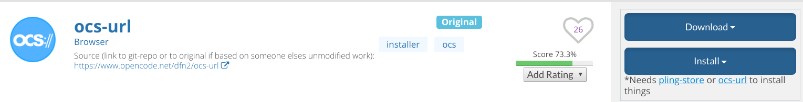

# 个性化配置与建站体验

## 使用插件直接在网页中安装主题

在 https://www.pling.com/p/1136805/ 中，下载ocs-url，下载时选择deb后缀的安装包。



命令行进入下载好的安装包所在文件夹，输入以下命令，注意替换「下载的包」为你的安装包名。

```shell
sudo dpkg -i 下载的包.deb
sudo apt-get install --fix-broken
```

即可完成安装。

接下来在https://www.gnome-look.org/ 中所有的主题只需要点击install即可自动安装到相应的目录。你只需要在gnome-tweaks 中更换主题即可。

## 参考资料
https://askubuntu.com/questions/101651/how-to-install-themes-with-gnome-tweak-tool/1128098#1128098