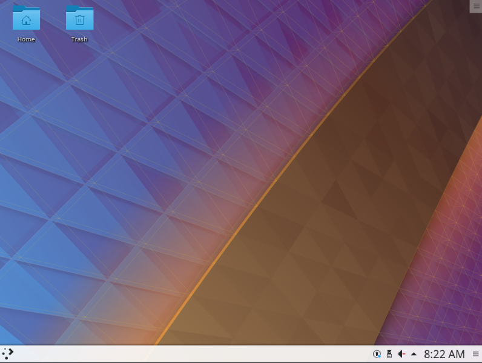

# 个性化配置与建站体验

!!! abstract "导言"
	Linux 是一个可以高度个性化定制的系统，当然也包括界面的个性化，因此本章节将带大家解决这些问题：

	* 如何选择并安装桌面环境。
	* 如何打造自己独特的桌面。
	* 如何配置美化命令行终端。
	* 如何简单快速地搭建网站。

## 桌面环境

早期的 Linux 是不带图形界面的，只能通过命令行管理。随着时代的发展，人们不再满足于黑底白字的命令行界面，开发出来了 Linux 图形环境。
Linux 中的桌面环境也是一个程序，它和内核不是绑定的，两者的开发也不是同步的；给不带界面的 Linux 系统安装上一个桌面环境，你就能看到各种漂亮的窗口，并能用鼠标点击它们了。

### 桌面环境的选择

Linux的桌面环境可不止一种，下面介绍几个流行的桌面环境。

#### KDE Plasma

KDE软件社区提供的Plasma Linux桌面环境是最可定制的图形桌面环境之一。此功能丰富且功能强大的桌面环境还拥有许多小部件。它允许用户自由地添加桌面的控制面板。
[Plasma官方网站](https://www.kde.org/plasma-desktop)

#### GNOME

GNOME的设计目标是为用户提供简单性，易于访问性和可靠性。正因为这些，GNOME得到了普及。
[GNOME官网](https://www.gnome.org/)

!!! info ""
	除了上面两款常见的桌面环境，还有Xfce，CINNAMON，Unity等，可以自行了解。


### 桌面环境的安装

Ubuntu 18.04 LTS Desktop 系统中已经预先安装好了 GNOME 桌面环境。如果你安装的系统没有预装桌面环境，或者你想要更换其他桌面环境，我们就要自己安装桌面环境。

下面就来介绍如何手动安装桌面环境。

以在 Ubuntu Server 18.04.3 (未包含图形环境的系统) 上安装桌面环境为例。只需要执行以下步骤：

安装 kde-plasma-desktop 软件

```bash
~ $ sudo apt install kde-plasma-desktop
```

接下来的提示中按输入Y回车即安装

!!! tip "注意"
	若安装非常缓慢可以尝试更换国内源。[科大源更换教程](http://mirrors.ustc.edu.cn/help/ubuntu.html)

安装完成后输入

```bash
~ $ sudo reboot
```

重启后可以看到，KDE Plasma 桌面已经安装完成。我们拥有了图形界面。



可以看到，通过简单几步，我们的桌面环境就安装成功了。
??? example "安装Gnome桌面"
	同理，如果你喜欢Gnome桌面，只需要执行
	```bash
	~ $ sudo apt install ubuntu-gnome-desktop
	~ $ sudo reboot
	```
我们将在下一小节给大家介绍桌面的个性化。

### 桌面环境的个性化

大部分桌面环境都支持主题的个性化。例如：窗口样式，按钮样式，dock样式，指针样式等等。

#### 主题更换

在GNOME桌面下用户可以轻松更换主题
首先安装 gnome-tweak-tool 软件
```
sudo apt install gnome-tweak-tool
```

在 [ubuntu-look](https://www.gnome-look.org/) 中找到自己喜欢的主题。

!!! tip "注意"
	不同类型的主题有不同的安装方法，一般在主题介绍页面有显示。

点击download下载一个压缩包

解压后放到```~./themes```
文件夹，若不存在该文件夹则创建一个。

```bash
~ $ mkdir ~./themes
```

输入
```bash
~ $ gnome-tweak-tool
```
打开gnome-tweak-tool，在外观选项中选中想要的主题。

最后alt+F2 在弹出的输入框输入r确定，重启GNOME即可完成主题更换。

如果你觉得商店中的主题都丑爆了，完全不符合你的美学，你也可以自己制作一款独一无二的主题。下面将给大家详细讲解如何自己制作主题。

#### 主题定制

(待补充)

### 终端的个性化

使用 Linux 系统时，不可避免接触终端命令行操作，但是默认的终端黑底白字。有什么办法可以既美化终端，又提高工作效率呢？下面我们介绍一些美化终端的方法。

#### 更换shell

在那之前我们可以通过
```bash
~ $ echo $SHELL
```
检查目前我们正在用的是什么 shell

ubuntu 默认会使用

	/bin/bash
在这里推荐一个更加强大的shell工具—— zsh
##### zsh
首先通过apt安装 zsh

```bash
~ $ sudo apt install zsh
```
将zsh设定为默认 shell

```bash
~ $ chsh -s /bin/zsh
```
重启后打开终端就会发现shell已经变成了zsh。
第一次打开zsh会有首次使用提示，这里我们按0跳过。

接下来的提示中按输入 `Y` 回车即安装

然而这时的zsh仍然是黑底白字，要让它变好看，我们需要对zsh进行配置。

##### oh-my-zsh
oh-my-zsh 是一个管理 zsh 配置的框架，评价也非常好。
```bash
sh -c "$(curl -fsSL https://raw.githubusercontent.com/ohmyzsh/ohmyzsh/master/tools/install.sh)"
```
安装完成后就可以看到shell不再是黑底白字，让人感到焕然一新，然而也许这样并不能让你满足。
我们可以修改```~/.zshrc```里的一行

	ZSH_THEME="robbyrussell"
中引号部分切换主题，具体主题可以在[oh-my-zsh官网](https://github.com/ohmyzsh/ohmyzsh/wiki/Themes)中找到。
当然你也可以自己尝试自己做一个主题。

## 其它的个性化

上面内容都是外观上的个性化，更多地，Linux系统的可客制化还体现在一些配置文件上。

### etc目录

``/etc``目录是包含几乎所有 Linux 系统配置的一个文件夹。

!!! info "tips"
	etc 是"etcetera" 的全称，意思是 "and so on"，在UNIX初期人们实现 "etc" 文件夹就是为了保留配置文件，数据文件，套接字文件或其他文件用的。随着时间流逝，文件夹的含义已经更改，但是名字 "etc" 没有更改。现在 "etc" 目录是所有配置文件的集中地，可以看作 Linux 系统的神经中枢。

下面介绍几个常用的配置文件

- /etc/profile 系统全局环境变量设置，里面可以添加对所有用户有效的环境变量，系统配置
- /etc/bashrc 启动bash时读取的环境
- /etc/sudoers sudo 权限的配置
- /etc/protocols 网络协议簇的配置

??? example "example"
	当我们登录用户成功时
	```
	~ $ sudo login
	```
	会提示以下信息
	```
	Welcome to Ubuntu 18.04.3 LTS (GNU/Linux 5.3.0-28-generic x86_64)
	 * Documentation:  https://help.ubuntu.com
	 * Management:     https://landscape.canonical.com
	 * Support:        https://ubuntu.com/advantage
	 * Canonical Livepatch is available for installation.
	   - Reduce system reboots and improve kernel security. Activate at:
	     https://ubuntu.com/livepatch
	125 个可升级软件包。
	0 个安全更新。
	Your Hardware Enablement Stack (HWE) is supported until April 2023.
	*** 需要重启系统 ***
	The programs included with the Ubuntu system are free software;
	the exact distribution terms for each program are described in the
	individual files in /usr/share/doc/*/copyright.
	
	Ubuntu comes with ABSOLUTELY NO WARRANTY, to the extent permitted by
	applicable law.
	```
	
	ubuntu 下这些提示信息都可以在/etc/update-motd.d/目录下修改, 登录后，将会在该目录依数字递增顺序执行该目录下的脚本。
	!!! info "提示"
		有的 Linux 发行版的motd配置在/etc/motd
	我们在```/etc/update-motd.d/```目录下新建一个文件，写入下面内容
	```
	#!/bin/sh
	echo helloworld
	```
	通过
	```bash
	~ $ sudo chmod +x /etc/update-motd.d/99-test
	```
	设置好权限。
	
	登录后就可以看到在末尾加上了我们在```99-test```文件中echo的内容。
	
	当然如果你不希望显示上面的更新提示内容，也可以直接找到对应的文件删除或修改。

##  搭建简易的网站

Linux 中环境较 Windows 更加容易搭建，仅需一两行命令，即可搭建成型的网站。

### wordpress
WordPress 是一个以 PHP 和 MySQL 为平台的自由开源的博客软件和内容管理系统。
下面我们直接安装
```bash
~ $ sudo apt install wordpress 
```
这样就已经把 wordpress 所依赖的环境搭建好了。我们只需要稍微配置一下它。

创建一个 ```/etc/apache2/sites-available/wordpress.conf``` 文件

把下面内容填入

```
Alias /blog /usr/share/wordpress
<Directory /usr/share/wordpress>
    Options FollowSymLinks
    AllowOverride Limit Options FileInfo
    DirectoryIndex index.php
    Order allow,deny
    Allow from all
</Directory>
<Directory /usr/share/wordpress/wp-content>
    Options FollowSymLinks
    Order allow,deny
    Allow from all
</Directory>
```

保存后输入命令来重启 apache2

```bash
~ $ sudo a2ensite wordpress
~ $ sudo a2enmod rewrite
~ $ sudo service apache2 reload
```

再配置数据库相关内容

```bash
~ $ sudo mysql -u root
```
出现以下信息时

	Welcome to the MySQL monitor.  Commands end with ; or \g.
	Your MySQL connection id is 2
	Server version: 5.7.29-0ubuntu0.18.04.1 (Ubuntu)
	Copyright (c) 2000, 2020, Oracle and/or its affiliates. All rights reserved.
	Oracle is a registered trademark of Oracle Corporation and/or its affiliates. Other names may be trademarks of their respective owners.
	Type 'help;' or '\h' for help. Type '\c' to clear the current input statement.

输入 **其中<your-password\>为你自己创建的密码**
```mysql
mysql> CREATE DATABASE wordpress;
mysql> GRANT SELECT,INSERT,UPDATE,DELETE,CREATE,DROP,ALTER
    -> ON wordpress.*
    -> TO wordpress@localhost
    -> IDENTIFIED BY '<your-password>';
mysql> FLUSH PRIVILEGES;
```

这里每次执行成功都会得到得到

	Query OK, 1 row affected (0,00 sec)


退出

```mysql
mysql> quit
```

编辑我们的wordpress配置```/etc/wordpress/config-localhost.php```

写入以下内容 **其中<your-password\>为你自己创建的密码**

```php
<?php
define('DB_NAME', 'wordpress');
define('DB_USER', 'wordpress');
define('DB_PASSWORD', '<your-password>');
define('DB_HOST', 'localhost');
define('DB_COLLATE', 'utf8_general_ci');
define('WP_CONTENT_DIR', '/usr/share/wordpress/wp-content');
?>
```

最后输入

```
~ $ sudo service mysql start
```
启动 mysql 数据库，即可在浏览器输入地址

	localhost/blog
来完成安装。


### jekyll

jekyll 是一个将纯文本转化为静态博客和网站的工具。
我们只需要安装它。

```
~ $ apt install bundler jekyll
```
再输入几行命令用于创建网站
```
~ $ jekyll new my-awesome-site
~ $ cd my-awesome-site
~ $ mkdir .bundle
~/my-awesome-site $ bundle exec jekyll serve
```

打开浏览器，在浏览器中输入 并打开

	localhost:4000
即可打开我们搭建的网站。
