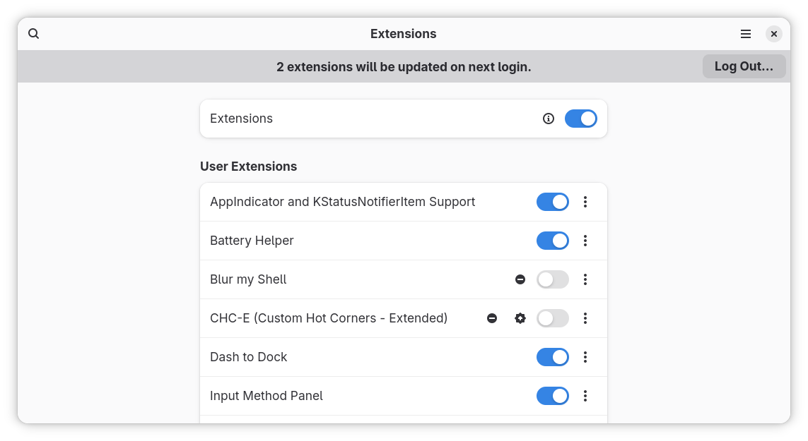

# 个性化配置与建站体验

!!! abstract "导言"

	Linux 是一个可以高度个性化定制的系统，当然也包括界面的个性化，因此本章节将带大家解决这些问题：
	
	* 如何选择并安装桌面环境
	* 如何打造自己独特的桌面
	* 如何配置美化命令行终端
	* 如何简单快速地搭建网站

## 桌面环境

早期的 Linux 是不带图形界面的，只能通过命令行管理。随着时代的发展，人们不再满足于黑底白字的命令行界面，开发出来了 Linux 图形环境。
Linux 中的桌面环境也是一个程序，它和内核不是绑定的，两者的开发也不是同步的；给不带界面的 Linux 系统安装上一个桌面环境，你就能看到各种漂亮的窗口，并能用鼠标点击它们了。

### 桌面环境的选择

Linux 的桌面环境可不止一种，下面介绍几个流行的桌面环境。

#### KDE Plasma

KDE 软件社区提供的 Plasma Linux 桌面环境是最可定制的图形桌面环境之一。此功能丰富且功能强大的桌面环境还拥有许多小部件。它允许用户自由地添加桌面的控制面板。
[Plasma 官方网站](https://www.kde.org/plasma-desktop)

#### GNOME

GNOME 的设计目标是为用户提供简单性，易于访问性和可靠性。正因为这些，GNOME 得到了普及。
[GNOME 官网](https://www.gnome.org/)

!!! info ""

	除了上面两款常见的桌面环境，还有 Xfce, Cinnamon, Unity 等，同学们可以自行了解。

### 桌面环境的安装

Ubuntu 18.04 LTS Desktop 系统中已经预先安装好了 GNOME 桌面环境。如果你安装的系统没有预装桌面环境，或者你想要更换其他桌面环境，我们就要自己安装桌面环境。

下面就来介绍如何手动安装桌面环境。

以在 Ubuntu Server 18.04.3 (未包含图形环境的系统) 上安装桌面环境为例。只需要执行以下步骤：

安装 ubuntu-gnome-desktop 软件

```shell
$ sudo apt install ubuntu-gnome-desktop
```

接下来的提示中按输入Y回车即安装

!!! tip "注意"

	若安装非常缓慢，可以尝试更换国内源。[科大源更换教程](http://mirrors.tuna.tsinghua.edu.cn/help/ubuntu/)

安装完成后输入

```shell
$ sudo reboot
```

重启后可以看到，GNOME 桌面已经安装完成。我们拥有了图形界面。


可以看到，通过简单几步，我们的桌面环境就安装成功了。

??? example "安装 Plasma 桌面"

	同理，如果你喜欢 KDE plasma 桌面，只需要执行
	
	```shell
	$ sudo apt install kde-plasma-desktop
	$ sudo reboot
	```

我们将在下一小节给大家介绍桌面的个性化。

### 桌面环境的个性化

大部分桌面环境都支持主题的个性化。例如：窗口样式，按钮样式，Dock 样式，指针样式等等。

在 GNOME 桌面下用户可以轻松更换主题。
首先安装 gnome-tweak-tool 软件

```
sudo apt install gnome-tweak-tool
```

在 [ubuntu-look](https://www.gnome-look.org/) 中找到自己喜欢的主题。

!!! tip "注意"

	不同类型的主题有不同的安装方法，一般在主题介绍页面有显示。

点击 Download 下载一个压缩包


解压后放到 ```~/.themes``` 文件夹，若不存在该文件夹则创建一个。

```shell
$ mkdir ~/.themes
```

输入

```shell
$ gnome-tweak-tool
```

打开 gnome-tweak-tool，在外观选项中选中想要的主题。

重启 GNOME 即可完成主题更换。

!!! tip "提示"

	你也可以使用ocs-url软件，在网页中直接安装主题，参考本章附录

如果你觉得商店中的主题不符合你的审美，你也可以自己制作一款独一无二的主题，或者直接修改现有的主题。

### GNOME 的拓展程序

GNOME支持很多拓展的程序，并且有一个专门用于扩展的网站。https://extensions.gnome.org/

要使用Gnome拓展程序我们要先安装 gnome-shell-extensions

```shell
$ sudo apt install gnome-shell-extensions
```

接下来进入拓展插件的网站并选择其中一款拓展。


Caffeine是一款可以允许用户在开关时保持其计算机屏幕不会自动暂停的插件。

我们可以输入

```bash
$ gnome-shell --version
```

查看版本。

在插件网页中下载对应版本的压缩包。并解压到一个文件夹里。

这时我们打开文件夹里的```meta.json```文件。

将文件夹的名字改为```metadata.json```中的uuid


uuid为caffeine@patapon.info


并将该文件夹放到```~/.local/share/gnome-shell/extensions/```中。

打开gnome-tweaks

```shell
$ gnome-tweaks
```

在拓展一栏即可启用我们刚刚装的caffeine



!!! tip "提示"
	
	手动安装显然过于复杂，我们完全可以只使用浏览器来完成拓展插件的管理和安装。
	
	首先安装浏览器插件：
	
	对于 Google Chrome、Chromium 和 Vivaldi： [Chrome Web 商店](https://chrome.google.com/webstore/detail/gnome-shell-integration/gphhapmejobijbbhgpjhcjognlahblep)
	
	对于 Firefox： [Mozilla Addons](https://addons.mozilla.org/en-US/firefox/addon/gnome-shell-integration/)
	
	再安装本地连接器
	```shell
	$ sudo apt install chrome-gnome-shell
	```
	
	即可在 https://extensions.gnome.org/ 网页中管理、安装插件。
	
	


### 桌面小部件的应用 *

如果你觉得你的桌面平平无奇，总是觉得缺了什么东西，也许桌面的小部件可以画龙点睛。

Conky 是一个用于X窗口系统的系统监视软件。它可以运行在 GNU/Linux 和 FreeBSD 上，是一个基于GPL协议的免费软件。Conky 可以监控许多系统变量，包括 CPU，内存，交换分区，磁盘空间，温度，top，上传，下载，系统消息，以及更多。它具有很高的可配置性，但配置有一些难于理解

首先，当然是安装 Conky

```shell
$ sudo apt install conky
```

运行 Conky

```shell
$ conky
```

我们的桌面就多了这个东西


这里显示了系统的状态各种状态。

我们可以通过修改```.conkyrc```文件自由配置显示的内容、方式。

!!! info "注意"

	该软件配置文件是用lua语法编写的，比较复杂。这里我们不详细说明。有兴趣的同学可以参考附加文件中的样例配置文件写入你的配置文件中，

### 终端的个性化

使用 Linux 系统时，不可避免接触终端命令行操作，但是默认的终端黑底白字。有什么办法可以既美化终端，又提高工作效率呢？下面我们介绍一些美化终端的方法。

#### 更换 Shell

在那之前我们可以通过

```shell
$ echo $SHELL
```

检查目前我们正在用的是什么 Shell。Ubuntu 默认使用 Bash，在这里推荐一个更加强大的 Shell 工具—— zsh。

##### Zsh

首先通过 apt 安装 zsh

```shell
$ sudo apt install zsh
```

将 zsh 设定为默认 shell

```shell
$ chsh -s /bin/zsh
```

重启后打开终端就会发现 shell 已经变成了 zsh。

第一次打开 zsh 会有首次使用提示，这里我们按 0 跳过。

接下来的提示中按 Y 回车即安装

然而这时的 zsh 仍然是黑底白字，要让它变好看，我们需要对 zsh 进行配置。

##### oh-my-zsh

oh-my-zsh 是一个管理 zsh 配置的框架，评价也非常好。

```shell
sh -c "$(curl -fsSL https://raw.githubusercontent.com/ohmyzsh/ohmyzsh/master/tools/install.sh)"
```

安装完成后就可以看到 shell 不再是黑底白字，让人感到焕然一新，然而也许这样并不能让你满足。

我们可以修改 `~/.zshrc`里的一行

    ZSH_THEME="robbyrussell"

中引号部分切换主题，具体主题可以在 [oh-my-zsh 官网](https://github.com/ohmyzsh/ohmyzsh/wiki/Themes)中找到。
当然你也可以自己尝试自己做一个主题。

## 其它的个性化

上面内容都是外观上的个性化，更多地，Linux系统的可客制化还体现在一些配置文件上。

### etc目录

`/etc` 目录是包含几乎所有 Linux 系统配置的一个文件夹。

!!! info "tips"

	etc 是 "et cetera" 的简称，意思是 "and so on"，在 Unix 初期人们实现 `etc` 文件夹就是为了保留配置文件，数据文件，套接字文件或其他文件用的。随着时间流逝，文件夹的含义已经更改，但是名字 etc 没有更改。现在 `/etc` 目录是所有配置文件的集中地，可以看作 Linux 系统的神经中枢。

下面介绍几个常用的配置文件

- `/etc/profile` 系统全局环境变量设置，里面可以添加对所有用户有效的环境变量，系统配置
- `/etc/bash.bashrc` 启动 Bash 时读取的环境
- `/etc/sudoers` sudo 权限的配置
- `/etc/protocols` 网络协议簇的配置

??? example "示例"

	当我们登录用户成功时
	
	```shell
	$ sudo login
	```
	
	会提示以下信息
	
	```text
	Welcome to Ubuntu 18.04.3 LTS (GNU/Linux 5.3.0-28-generic x86_64)
	 * Documentation:  https://help.ubuntu.com
	 * Management:     https://landscape.canonical.com
	 * Support:        https://ubuntu.com/advantage
	 * Canonical Livepatch is available for installation.
	   - Reduce system reboots and improve kernel security. Activate at:
	     https://ubuntu.com/livepatch
	125 个可升级软件包。
	0 个安全更新。
	Your Hardware Enablement Stack (HWE) is supported until April 2023.
	*** 需要重启系统 ***
	The programs included with the Ubuntu system are free software;
	the exact distribution terms for each program are described in the
	individual files in /usr/share/doc/*/copyright.
	
	Ubuntu comes with ABSOLUTELY NO WARRANTY, to the extent permitted by
	applicable law.
	```
	
	Ubuntu 下这些提示信息都可以在 `/etc/update-motd.d/` 目录下修改, 登录后，将会在该目录依数字递增顺序执行该目录下的脚本。
	
	!!! info "提示"
	
		有的 Linux 发行版的 MOTD (Message Of The Day) 配置在 `/etc/motd`
	
	我们在 `/etc/update-motd.d/` 目录下新建一个文件 `99-test`，写入下面内容
	
	```shell
	#!/bin/sh
	echo helloworld
	```
	
	然后
	
	```shell
	$ sudo chmod +x /etc/update-motd.d/99-test
	```
	
	设置好权限，登录后就可以看到在末尾加上了我们在 `99-test` 文件中 echo 的内容。
	
	当然如果你不希望显示上面的更新提示内容，也可以直接找到对应的文件删除或修改。

## 搭建简易的网站

Linux 环境中较 Windows 更加容易搭建，仅需一两行命令，即可搭建成型的网站。

### WordPress

WordPress 是一个以 PHP 和 MySQL 为平台的自由开源的博客软件和内容管理系统。下面我们直接安装

```shell
$ sudo apt install wordpress 
```
这样就已经把 WordPress 所依赖的环境搭建好了，我们只需要稍微配置一下它。

创建一个 `/etc/apache2/sites-available/wordpress.conf` 文件，把下面内容填入

```
Alias /blog /usr/share/wordpress
<Directory /usr/share/wordpress>
    Options FollowSymLinks
    AllowOverride Limit Options FileInfo
    DirectoryIndex index.php
    Order allow,deny
    Allow from all
</Directory>
<Directory /usr/share/wordpress/wp-content>
    Options FollowSymLinks
    Order allow,deny
    Allow from all
</Directory>
```

保存后输入命令来重启 apache2

```shell
$ sudo a2ensite wordpress
$ sudo a2enmod rewrite
$ sudo service apache2 reload
```

再配置数据库相关内容

```shell
$ sudo mysql -u root
```
出现以下信息时

```text
Welcome to the MySQL monitor.  Commands end with ; or \g.
Your MySQL connection id is 2
Server version: 5.7.29-0ubuntu0.18.04.1 (Ubuntu)
Copyright (c) 2000, 2020, Oracle and/or its affiliates. All rights reserved.
Oracle is a registered trademark of Oracle Corporation and/or its affiliates. Other names may be trademarks of their respective owners.
Type 'help;' or '\h' for help. Type '\c' to clear the current input statement.
```

参照下面的命令，输入，其中 `<your-password>` 替换为你自己设定的密码

```mysql
mysql> CREATE DATABASE wordpress;
mysql> GRANT SELECT,INSERT,UPDATE,DELETE,CREATE,DROP,ALTER
    -> ON wordpress.*
    -> TO wordpress@localhost
    -> IDENTIFIED BY '<your-password>';
mysql> FLUSH PRIVILEGES;
```

这里每次执行成功都会得到

```text
Query OK, 1 row affected (0,00 sec)
```

退出

```mysql
mysql> quit
```

编辑我们的 WordPress 配置 `/etc/wordpress/config-localhost.php`

写入以下内容，其中 `<your-password>` 为刚才设定的数据库密码。

```php
<?php
define('DB_NAME', 'wordpress');
define('DB_USER', 'wordpress');
define('DB_PASSWORD', '<your-password>');
define('DB_HOST', 'localhost');
define('DB_COLLATE', 'utf8_general_ci');
define('WP_CONTENT_DIR', '/usr/share/wordpress/wp-content');
?>
```

最后输入

```shell
$ sudo service mysql start
```

启动 mysql 数据库，即可在浏览器输入地址

```text
http://localhost/blog
```

来完成安装。


### Jekyll

Jekyll 是一个将纯文本转化为静态博客和网站的工具。我们只需要安装它。

```shell
$ apt install jekyll
```

再输入几行命令用于创建网站

```shell
~ $ jekyll new my-awesome-site
~ $ cd my-awesome-site
~/my-awesome-site $ jekyll serve
```

打开浏览器，在浏览器中输入 并打开

```text
http://localhost:4000
```

即可打开我们搭建的网站。


## 思考题
## 引用来源