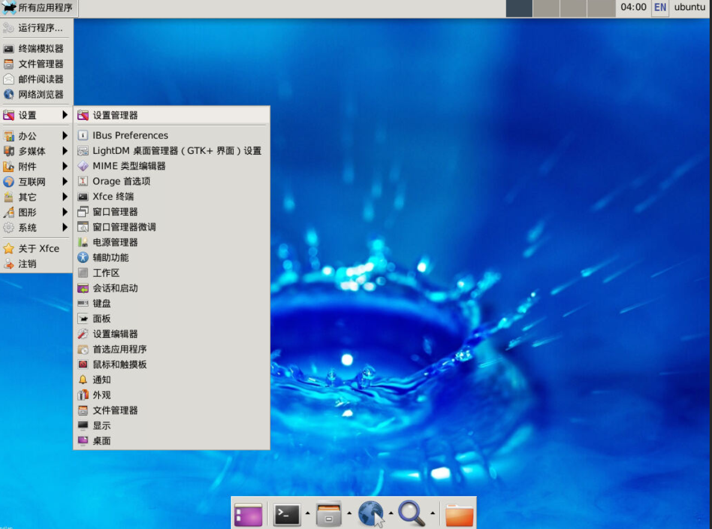
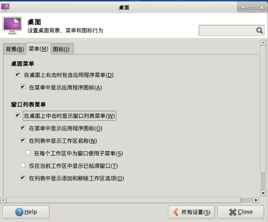
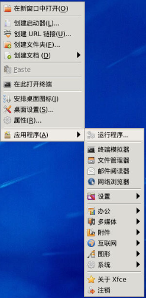
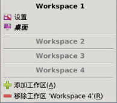
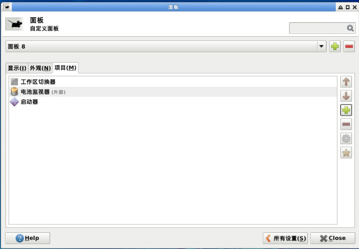
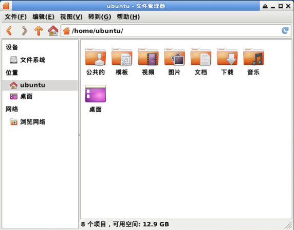
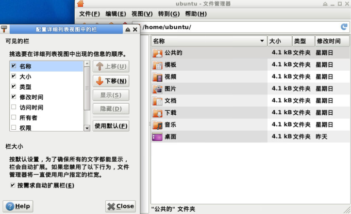
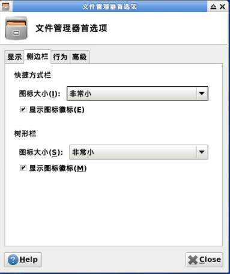
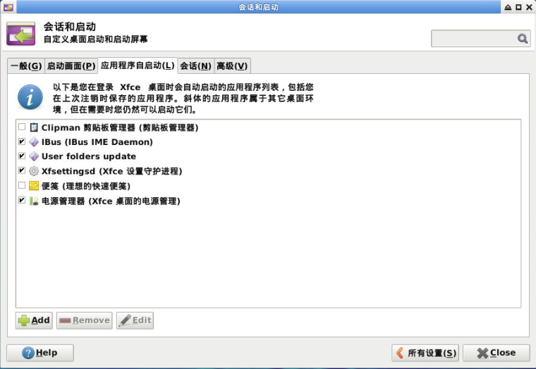
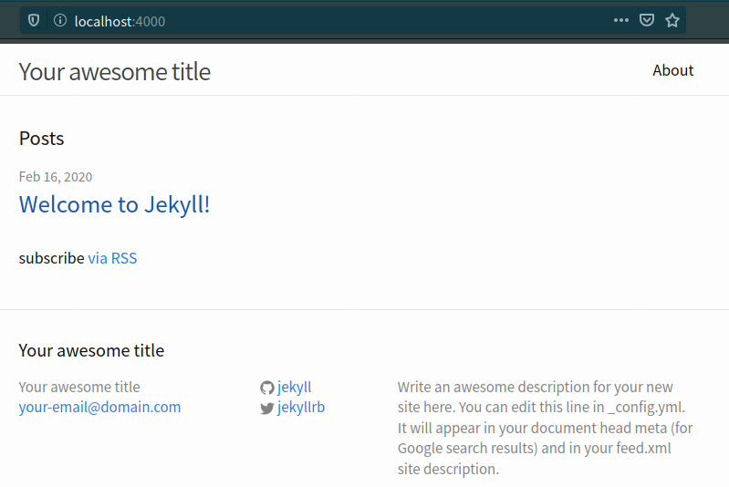

# 个性化配置与建站体验

!!! Failure "本文目前尚未完稿，存在诸多未尽章节且未经审阅，不是正式版本。"

!!! abstract "导言"

	Linux 是一个可以高度个性化定制的系统，当然也包括界面的个性化，因此本章节将带大家解决这些问题：

	* 如何选择并安装桌面环境
	* 如何打造自己独特的桌面
	* 如何配置美化命令行终端
	* 如何简单快速地搭建网站

## 桌面环境 {#desktop-environment}

早期的 Linux 是不带图形界面的，只能通过命令行管理。随着时代的发展，人们不再满足于黑底白字的命令行界面，开发出来了 Linux 图形环境。
Linux 中的桌面环境也是一个程序，它和内核不是绑定的，两者的开发也不是同步的；给不带界面的 Linux 系统安装上一个桌面环境，你就能看到各种漂亮的窗口，并能用鼠标点击它们了。

### 桌面环境的选择

Linux 的桌面环境可不止一种，下面介绍几个流行的桌面环境。

#### KDE Plasma

KDE 软件社区提供的 Plasma Linux 桌面环境是最可定制的图形桌面环境之一。此功能丰富且功能强大的桌面环境还拥有许多小部件。它允许用户自由地添加桌面的控制面板。
[Plasma 官方网站](https://www.kde.org/plasma-desktop)

#### GNOME

GNOME 的设计目标是为用户提供简单性，易于访问性和可靠性。正因为这些，GNOME 得到了普及。
[GNOME 官网](https://www.gnome.org/)

!!! info ""

	除了上面两款常见的桌面环境，还有 Cinnamon, Unity 等，同学们可以自行了解。


#### Xfce

Xfce 是一款快速、轻量，界面美观和对用户友好的桌面环境。

本次所用的系统预先安装了 Xfce 桌面环境，因此本章将主要围绕 Xfce 的个性化来开展。实际上无论是哪一款桌面系统，个性化方式大同小异。

!!! tip "提示"

	如果你想要安装其它桌面系统（如 Gnome）或者你的系统未预装好桌面环境，可以参阅拓展阅读的内容。

### 常用外观个性化 {#appearance-settings}

跟 Windows 系统一样，大部分 Linux 桌面环境个性化功能并不比 Windows 差。

我们直接打开 Xfce 中的设置管理器，如图所示。



图 1. 设置管理器的位置
{: .caption }

这里最常见的设置，都可以找得到。


图 2. 设置管理器
{: .caption }

#### 桌面 {#desktop}

xfdesktop 桌面管理器是 Xfce 中的一个主要模块，它负责在桌面上设置背景图像/颜色和绘制图标。当您分别用鼠标右键或鼠标中键单击桌面时，它可以显示应用程序菜单和所有正在运行的应用程序的列表。

##### 背景 {#desktop-background}


图 3. 桌面背景首选项
{: .caption }

背景设置是对壁纸的更改和个性化。

下表是一些配置的补充说明。

| 字段     | 功能                                                         |
| -------- | ------------------------------------------------------------ |
| 目录     | 存放壁纸的目录，默认文件夹在 `/usr/share/backgrounds/xfce/`。 |
| 样式     | 壁纸的显示样式、包括居中、平铺等。                           |
| 颜色     | 用于填充背景空缺部分的颜色，可以设置纯色、渐变、透明。       |
| 修改背景 | 如果一个位置包含多张图像，则 Xfce 允许你通过循环浏览可用图像来自动更改背景。您可以通过选中**更改背景**框来启用此选项。 |

##### 菜单 {#desktop-menus}



图 4. 桌面菜单首选项
{: .caption }

Xfce 允许用户自定义右键菜单和中键菜单的行为。这里可以对在桌面右键和中键的菜单进行设置。

若「在桌面上右击时包含应用程序菜单」选项被选中，则在桌面右键时会显示下面的菜单，用于快速打开应用程序。



图 5. 桌面应用程序菜单
{: .caption }

若「在桌面上中击时显示窗口列表菜单」选项被选中时，中击桌面可以弹出工作区的菜单，可以显示所有工作区正在运行的应用程序。



图 6. 桌面工作区菜单
{: .caption }

##### 图标 {#desktop-icons}


图 7. 桌面图标首选项
{: .caption }

Xfce 允许用户绘制桌面图标并且设置其外观。

在图标类型项，你可以下拉菜单选择「无」来选择具有无图标的桌面，或者选择「文件/启动器图标」来选择有图标的桌面。若选择了「已最小化应用程序的图标」，桌面就会把最小化的程序变成桌面上的图标。

#### 外观 {#appearance}

##### 样式 {#appearance-styles}


图 8. 外观样式首选项
{: .caption }

这些就是 Xfce 的样式，这些样式可以控制控件（如按钮和菜单）的外观，直接在列表中选择即可切换样式。

!!! tip "提示"

	除了列表中已有的样式，我们可以自己下载更多更炫酷的样式。我们将在扩展内容中提及具体操作方法。

##### 图标 {#appearance-icons}


图 9. 外观图标首选项
{: .caption }

这个列表控制图标的视觉外观，这些图标将会被显示在面板上，桌面上，文件管理器和菜单中。

!!! tip "提示"

	同样式一样，我们也可以自己下载安装图标。我们将在扩展内容中提及具体操作方法。

##### 字体 {#appearance-fonts}


图 10. 外观字体首选项
{: .caption }

在「默认字体」和「默认等宽字体」中下拉菜单可以选择字体的 Family，Style 和 Size。

「启动抗锯齿」选项可消除锯齿字体，使字符具有平滑的边缘。

「提示」是一种字体渲染技术，可提高小尺寸和低屏幕分辨率时的字体质量。选择一个选项以指定如何应用提示字体。

#### 窗口管理器 {#WM}

xfwm4 窗口管理器也是 Xfce 桌面环境的核心模块。窗口管理器负责窗口在屏幕上的放置，提供窗口装饰，并允许它们移动，调整大小或关闭。

##### 样式 {#WM-styles}


图 11. 窗口管理器样式首选项
{: .caption }

Xfce 允许用户自定义窗口的样式，「样式」对话框是用来控制窗口本身的，包括窗口的主题、标题和布局。

##### 键盘 {#WM-keyboard}


图 12. 窗口管理器键盘首选项
{: .caption }

在「键盘」对话框，我们可以双击列表中的动作选项来设置或更改快捷键。

#### 面板 {#panels}

Xfce-panel 也是 Xfce 的核心模块，具有应用程序启动器，面板菜单，工作区切换器等功能。


图 13. 默认的顶部面板
{: .caption }

##### 显示 {#panels-display}


图 14. 面板显示首选项
{: .caption }

面板选项的顶部可以选择要控制的面板对象。下拉选单我们可以发现，默认的「面板 2」是底部显示应用程序的 Dock。我们可以轻松得添加、删除面板（理论上可以添加无数个面板，取决与你的喜好）。

在「显示」选项卡中，我们可以修改面板的「模式」，可以使将面板设置为水平或者垂直于桌面栏。

「锁定面板」选项选中后，面板将不能被鼠标拖拽移动。

「自动隐藏」当设置为「聪明地」时，会在聚焦的窗口与面板重叠时隐藏面板。

下方的尺寸栏允许我们轻易地改变面板的尺寸。

##### 项目 {#panels-items}



图 15. 面板项目首选项
{: .caption }

项目（Items）是一项非常实用的功能，实际上就是小部件，不仅可以在面板中显示内部信息（如窗口、工作区、邮件等），还可以显示外部硬件信息（如 CPU, 磁盘等）。我们可以在「项目」选项卡中管理它们。 另外我们也可以直接在对应的面板直接右键添加项目。

### 常用功能个性化 {#basic-settings}

#### 文件管理器 {#FM}

文件管理器是 Linux 桌面环境重要的模块之一。

Thunar 是 Xfce 桌面环境的现代文件管理器。Thunar 从一开始就被设计为快速且易于使用。它的用户界面干净直观，默认情况下不包含任何令人困惑或无用的选项。Thunar 可以快速启动，并且浏览文件和文件夹的过程非常快速且响应迅速。

##### 布局 {#FM-layout}



图 16. 文件管理器
{: .caption }

左边的侧边栏主要显示三类对象：设备、位置和网络。我们可以通过上方菜单栏的`视图-侧边栏`选择侧边栏显示方式是「快捷方式」或者是「树形」。通过直接右键侧边栏的空白处也可有隐藏不想显示的设备、位置或是网络中的东西。

菜单栏下方的地址栏显示目前的目录地址，可以通过菜单栏「视图」 ->「位置选择器」选择「工具栏样式」或者是路径栏样式。	

如果不喜欢主界面的图标显示，我们还可以选择「视图」-> 「以详细列表查看来以列表显示」。在列表显示的时候，我们可以通过「视图」 -> 「配置栏」管理列表显示的属性。



图 17. 文件管理器列表显示
{: .caption }

还有更多可以配置的选项，可以在「编辑」-> 「首选项」中配置。



图 18. 文件管理器首选项
{: .caption }

##### 插件 {#FM-plugins}

Thunar 提供了一套插件接口，Thunar 插件可以作为单独的软件包安装。详细按照方式将在拓展资料讲解。

#### 会话管理器 {#sessions}

Xfce4-session 是 Xfce 的会话管理器。它的任务是保存桌面的状态（打开的应用程序及其位置），并在下次启动时将其还原。您可以创建几个不同的会话，并在启动时选择其中一个。

在「设置管理器」的「会话和启动」中可以配置它。


图 19. 会话与启动
{: .caption }

##### 应用程序自启动 {#autostart}



图 20. 自启动首选项
{: .caption }

在这个列表中我们可以轻松管理自启动执行的程序。

## 命令行操作 {#shell}

### 为什么要用命令行 {#why-shell}

图形界面非常方便，为什么 Linux 的用户还热衷于命令行的使用呢？

#### 效率

使用命令行操作可以减少鼠标操作，我们经常可以使用一条命令来代替好几次的鼠标单击。例如如果我们想要移动某一个文件，我们要执行下面步骤：

- 打开文件所在的文件夹 `../source/`
- 打开目标文件夹 `../dest/`
- 从 `../source/` 文件夹拖拽文件 `file.txt` 到 `../dest/` 文件夹中

然而使用命令行，我们只需要执行一条指令。

```shell
$ mv ../source/file.txt ../dest/
```

可能在初学者看来，熟记这条指令并不容易，但是从长远上看，熟悉了命令行之后再加上有自动补全的 shell 程序，使用命令行可以节省大量时间。

#### 自动化脚本

Shell 脚本可以帮助程序员自动执行重复的任务。例如我们想自动编译运行一个 C 语言程序 `main.c`，我们可以在该文件的目录新建一个脚本 `run.sh`.

两个文件分别下如内容。

```c
// main.c

#include <stdio.h>
int main() {
	printf("Hello world!\n");
	return 0;
}
```

```shell
# run.sh

gcc main.c -o main.out
./main.out
rm main.out
```

之后我们直接输入

```shell
$ sh run.sh
```

即可看到程序输出结果。

#### 节省资源

图形界面对资源的消耗是不可忽略的，在绝大部分的服务器中都没有使用图形节目，节约资源。

#### 使用命令行看上去很酷

影视作品中，操作命令行的总是技术高超的黑客。现在轮到你来操作命令行了，难道不是很酷的一件事情吗？

### 什么是 shell {#what-shell}

上面所说的命令行，实际上指的就是 shell。shell 其实就是一个程序，它可以接受键盘输入的命令，然后把命令交给系统执行。现在几乎所有的 Linux 发行版都提供了一个叫 bash 的 shell 程序，相当于传统 shell 的增强版。

### 如何打开 shell {#how-shell}

在图形界面中，我们需要另一个和 shell 交互的程序，叫做终端模拟器，简称「终端 (terminal)」。我们可以在「所有程序」找到它。


图 21. 终端在菜单的位置
{: .caption }

打开后如下图。


图 22. 终端界面
{: .caption }

### 几条简单的命令 {#shell-commands}

- `ls`: 列出目录的内容
- `cd`: 更改目录
- `pwd`: 查看当前所在的目录

更多的命令行操作我们将在第三章详细介绍。

#### 示例 1

```shell
$ pwd
```

会打印出当前所在的目录

```
/home/ustc
```

#### 示例 2

```shell
$ ls
```

会打印出当前目录的内容

```
Desktop Documents Music Pictures Public Templates Videos
```

#### 示例 3

```shell
$ cd Desktop
$ ls
```

进入桌面，并打印出桌面的内容。

```
hi.txt
```

!!! info "注意"

    显示内容与计算机文件状态有关，并不是每个人都会显样同的内容。

## 搭建简易的网站 {#website}

Linux 环境中较 Windows 更加容易搭建，仅需一两行命令，即可搭建成型的网站。

### WordPress

WordPress 是一个以 PHP 和 MySQL 为平台的自由开源的博客软件和内容管理系统。

由于 WordPress 是一个动态的博客软件，它需要涉及到一些数据库相关的配置和 HTTP 服务器的配置，这里我们给大家准备了一个 Ubuntu 安装 WordPress 的[自动配置脚本](wordpress.sh)。

!!! tips "提示"

	有兴趣自己配置的同学可以参阅补充材料。

打开终端并运行

```shell
$ curl -fsSL https://101.ustclug.org/Ch02/wordpress.sh | sudo bash
```

等待片刻即可完成安装。

!!! warning "注意"

	这个脚本随机生成了 WordPress 数据库的密码并储存在了 `/root` 目录下。

最后我们打开浏览器并进入 `http://localhost/blog`

来完成最后的配置。


### Jekyll

Jekyll 是一个将纯文本转化为静态博客和网站的工具。

我们只需要通过命令行安装它。

```shell
$ sudo apt install jekyll
```

再输入几行命令用于创建网站

```shell
$ jekyll new my-awesome-site
$ cd my-awesome-site
$ jekyll serve
```

打开浏览器，在浏览器中输入 `localhost:4000` 进入我们搭建的网站。



## 思考题
## 引用来源

- [Xfce 文档](https://docs.xfce.org/xfce/start)
- [Ubuntu 下安装 WordPress](https://ubuntu.com/tutorials/install-and-configure-wordpress)
