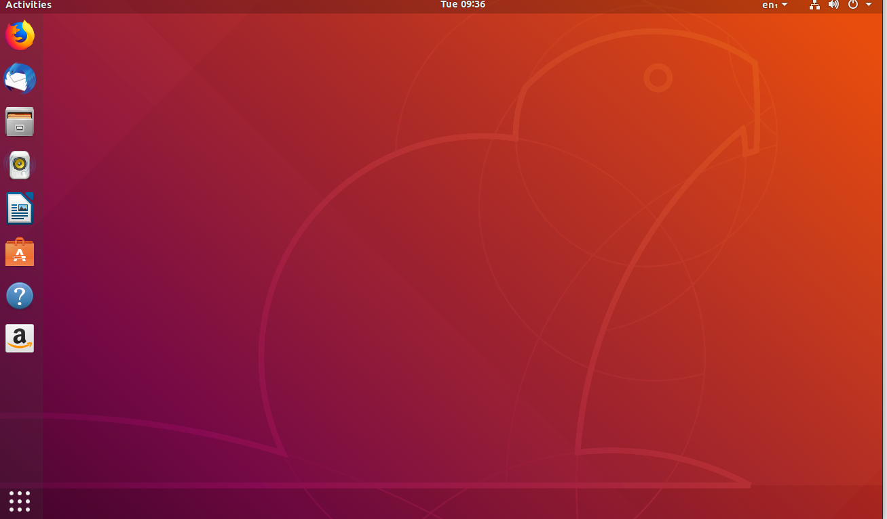
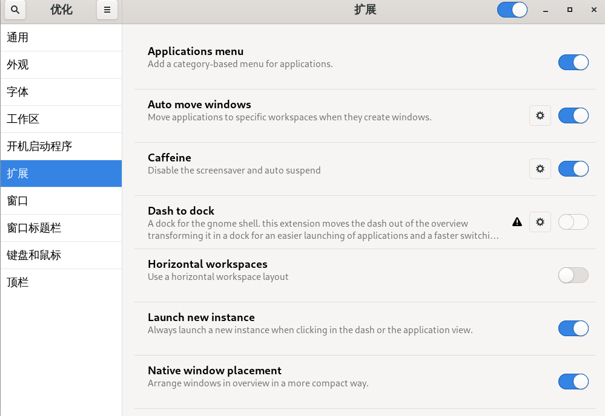
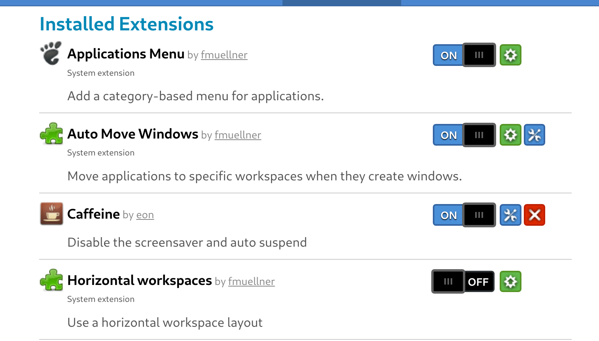
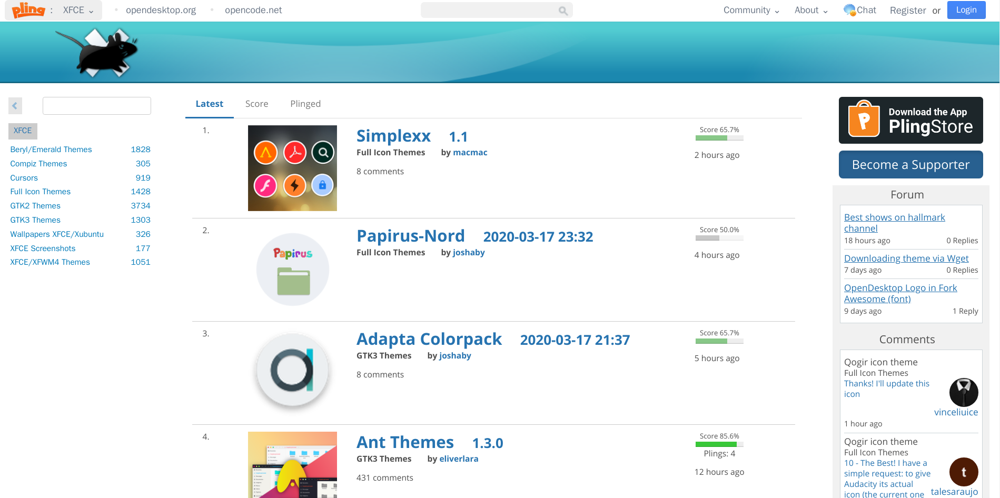
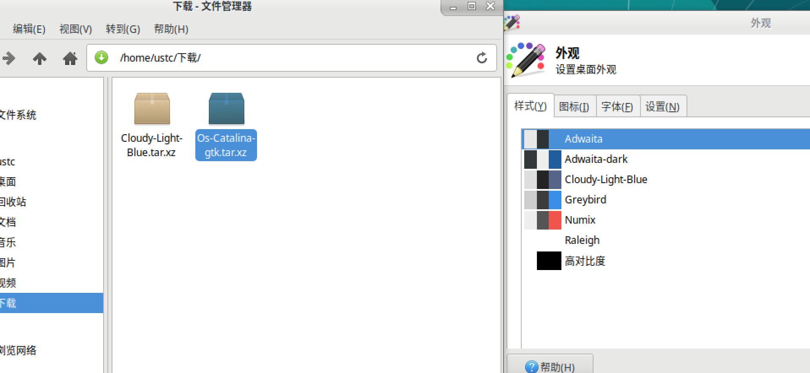
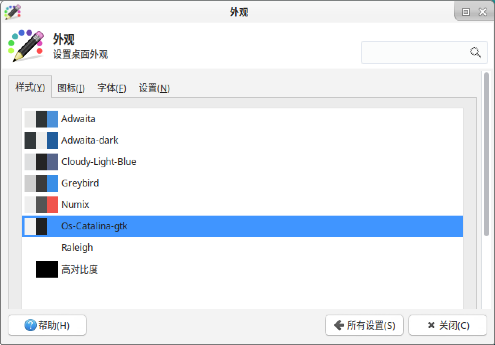
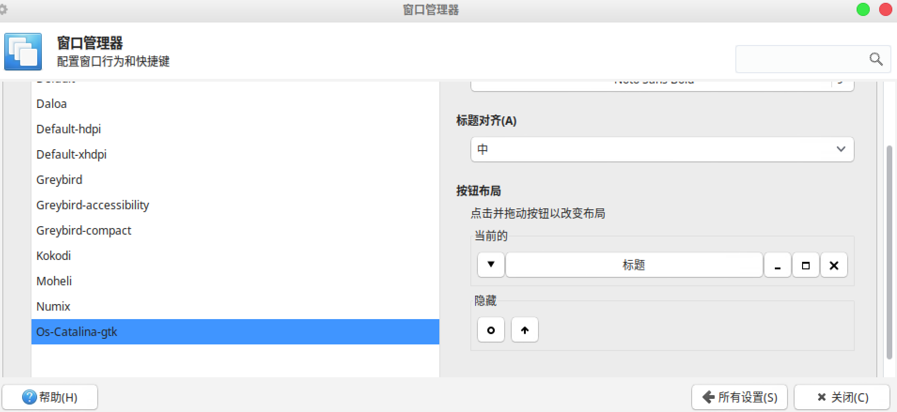

# 拓展阅读 {#supplement}

!!! Failure "本文目前尚未完稿，存在诸多未尽章节且未经审阅，不是正式版本。"

## 桌面环境的安装 {#desktop-install}

如果你安装的系统没有预装桌面环境，或者你想要更换其他桌面环境，我们就需要自己安装桌面环境。

下面就来介绍如何手动安装桌面环境。

以在 Ubuntu Server 24.04（未包含图形环境）上安装桌面环境为例。只需要执行以下步骤：

安装 `ubuntu-desktop` 软件：

```console
$ sudo apt install ubuntu-desktop
```

接下来的提示中按输入 Y 回车即安装。

!!! tip "注意"

    若安装非常缓慢，可以尝试更换国内的软件源，参考[科大源更换教程](https://mirrors.ustc.edu.cn/help/ubuntu.html)。

!!! tip "减小安装大小"

    如果你觉得 `ubuntu-desktop` 安装的包过大，可以选择安装 `ubuntu-desktop-minimal`，它只包含最基本的 GNOME 桌面环境，安装包更小。

    如果你很熟悉桌面环境与软件包的关系，还可以添加 `--no-install-recommends` 选项来进一步减小安装大小，例如：

    ```console
    $ sudo apt install --no-install-recommends ubuntu-desktop-minimal
    ```

安装完成后输入：

```console
$ sudo reboot
```

重启后可以看到，GNOME 桌面已经安装完成。我们拥有了图形界面。



可以看到，通过简单几步，我们的桌面环境就安装成功了。

??? example "安装 Plasma 桌面"

    同理，如果你喜欢 KDE plasma 桌面，只需要执行

    ```console
    $ sudo apt install kde-plasma-desktop
    $ sudo reboot
    ```

## 桌面环境个性化 {#desktop-personalization}

### GNOME

#### GNOME 主题 {#gnome-themes}

大部分桌面环境都支持主题的个性化。例如：窗口样式，按钮样式，Dock 样式，指针样式等等。

在 GNOME 桌面下用户可以轻松更换主题。
首先安装 `gnome-tweaks` 软件：

```console
$ sudo apt install gnome-tweaks
```

在 [GNOME Look](https://www.gnome-look.org/) 中找到自己喜欢的主题。

!!! info "注意"

    不同类型的主题有不同的安装方法，一般在主题介绍页面有显示。

点击 Download 下载一个压缩包：


解压后放到 `~/.themes` 文件夹，若不存在该文件夹则创建一个。

```console
$ mkdir ~/.themes
```

!!! tip "家目录与隐藏文件"

    `~` 是用来简单表示用户的家目录（主目录）的符号，普通用户的家目录一般位于 `/home/用户名/`。`~/.themes` 即代表家目录下的 `.themes` 文件夹。

    以 `.` 开头的文件和文件夹是隐藏的。如果使用图形界面解压缩，有可能看不到 `.themes` 目录。此时可以按下 Ctrl + H 快捷键显示隐藏文件夹。

输入：

```console
$ gnome-tweaks
```

打开 gnome-tweaks，在外观选项中选中想要的主题。

重启 GNOME 即可完成主题更换。

!!! tip "提示"

    你也可以使用 ocs-url 软件，在网页中直接安装主题，参考本章附录

如果你觉得商店中的主题不符合你的审美，你也可以自己制作一款独一无二的主题，或者直接修改现有的主题。

#### GNOME 的 Shell 扩展 {#gnome-extensions}

GNOME 支持很多扩展，并且有一个专门用于扩展的网站：<https://extensions.gnome.org/>。

要使用 GNOME 扩展，我们要先安装下面的软件包：

```console
$ sudo apt install gnome-shell-extensions gnome-shell-extension-prefs
```

接下来进入扩展插件的网站并选择其中一款扩展：[Caffeine: 允许用户停用系统屏幕保护和自动休眠。](https://extensions.gnome.org/extension/517/caffeine/)


先来查看我们正在使用的 GNOME 版本：

```console
$ gnome-shell --version
```

在插件网页中下载对应版本的压缩包，然后：

```console
$ # 假设下载的文件名为 caffeinepatapon.info.v58.shell-extension.zip
$ gnome-extensions install ./caffeinepatapon.info.v58.shell-extension.zip
```

扩展会被安装到 `~/.local/share/gnome-shell/extensions/` 目录下。这样安装的扩展只会在注销再登录之后才会展示，同时会被自动激活。

也有图形界面可以管理扩展。打开 `gnome-extensions-app`：

```console
$ gnome-extensions-app
```

这里可以看到已经安装的扩展，点击开关即可启用或禁用扩展。



!!! tip "其他安装方法"

    手动安装显然过于复杂，我们完全可以只使用浏览器来完成扩展插件的管理和安装。

    首先安装浏览器插件：

    对于 Google Chrome、Chromium 和 Vivaldi：[Chrome Web 商店](https://chrome.google.com/webstore/detail/gnome-shell-integration/gphhapmejobijbbhgpjhcjognlahblep)

    对于 Firefox： [Mozilla Addons](https://addons.mozilla.org/en-US/firefox/addon/gnome-shell-integration/)

    再安装本地连接器：

    ```console
    $ sudo apt install chrome-gnome-shell
    ```

    即可在 https://extensions.gnome.org/ 网页中管理、安装插件。

    

    同时也可以使用 `gnome-shell-extension-manager` 软件来管理扩展：

    ```console
    $ sudo apt install gnome-shell-extension-manager
    ```

    这是一款[第三方开发](https://github.com/mjakeman/extension-manager)的 GNOME 扩展管理工具，功能更强大。

### Xfce

除了系统自带的外观样式和图标外，网络上有更多的主题提供下载。例如在 [Xfce-look](https://www.xfce-look.org/) 上，就有上万个不同类型的主题。安装方法也十分简单。



我们可以选中任意一款主题。我们以下面这个为例。


点击 Download 按钮下载它，一般会得到压缩包格式的文件。我们打开设置管理器中的「外观」首选项，把下载好的压缩包文件直接拖拽到样式列表中。



选中刚刚拖拽进去的主题即可更换。



!!! tip "提示"

    有些主题包是很多样式（包括窗口、图标和外观样式）成套出现的，如果安装的主题包括了 Xfwm4 窗口管理器主题的话，我们会发现在「窗口管理器」首选项中，该主题也会出现：

    

    选中后，窗口样式就变了。

更换主题包后，是不是整个系统变得高大上了起来？

!!! tip "提示"

    我们可以安装插件在网页上直接安装主题。

    在 <https://www.pling.com/p/1136805/> 中，下载 ocs-url，下载时选择 deb 后缀的安装包。

    

    命令行进入下载好的安装包所在文件夹，输入以下命令。注意替换「下载的包」为你的安装包名，例如如果下载的安装包名为 `ocs-url_3.1.0-0ubuntu1_amd64.deb`，则 `install` 后面的参数为 `./ocs-url_3.1.0-0ubuntu1_amd64.deb`。

    ```console
    $ sudo apt install ./下载的包.deb
    ```

    即可完成安装。

    接下来在 <https://www.xfce-look.org/> 中所有的主题只需要点击 Install 即可自动安装到相应的目录。你只需要在 gnome-tweaks 中更换主题即可。

## 终端的个性化 {#terminal-personalization}

使用 Linux 系统时，不可避免接触终端命令行操作，但是默认的终端黑底白字。有什么办法可以既美化终端，又提高工作效率呢？下面我们介绍一些美化终端的方法。

### 更换 Shell {#chsh}

在此之前我们可以通过：

```console
$ echo $SHELL
```

检查目前我们正在用的是什么 Shell。Ubuntu 默认使用 Bash，但是可以使用 `chsh` 命令来更换 Shell。

```console
$ # 列出系统中可用的 shell
$ chsh -l
$ # 更换到 zsh
$ chsh -s /bin/zsh
$ # 更换到 fish
$ chsh -s /bin/fish
$ # 更换回 bash
$ chsh -s /bin/bash
```

### Zsh 与 oh-my-zsh {#zsh-ohmyzsh}

Z shell（Zsh）是一个功能强大的 shell。首先通过 apt 安装 `zsh`：

```console
$ sudo apt install zsh
```

将 zsh 设定为默认 shell：

```console
$ chsh -s /bin/zsh
```

重启后打开终端就会发现 shell 已经变成了 zsh。然而这时的 zsh 仍然是黑底白字，要让它变好看，我们需要对 zsh 进行配置。

oh-my-zsh 是一个管理 zsh 配置的框架，评价也非常好。

```console
$ sh -c "$(curl -fsSL https://raw.githubusercontent.com/ohmyzsh/ohmyzsh/master/tools/install.sh)"
```

!!! info "如果无法下载安装脚本"

    如果遇到了网络连通性问题，可以使用以下替换命令：

    ```console
    $ REMOTE=https://mirrors.tuna.tsinghua.edu.cn/git/ohmyzsh.git sh -c "$(curl -fsSL https://mirrors.ustc.edu.cn/misc/ohmyzsh-install.sh)"
    ```

安装完成后就可以看到 shell 不再是黑底白字，让人感到焕然一新，然而也许这样并不能让你满足。

我们可以修改 `~/.zshrc` 里的这一行中的引号部分切换主题：

    ZSH_THEME="robbyrussell"

如果只想试用某个主题，可以使用以下命令：

    omz theme use robbyrussell

来临时试用某主题。
具体主题可以在 [oh-my-zsh 的项目 Wiki](https://github.com/ohmyzsh/ohmyzsh/wiki/Themes) 中找到。
当然你也可以尝试自己做一个主题。

### Fish {#fish}

Fish 是一个用户友好的命令行 shell，安装也非常简单：

```console
$ sudo apt install fish
```

将 fish 设定为默认 shell：

```console
$ chsh -s /bin/fish
```

Fish 基本不需要配置，开箱即用。需要注意的是，**Fish 不兼容 POSIX 标准**，因此 Bash 等 POSIX shell 下的脚本在 Fish 下是无法运行的。

### Bash 的个性化 {#bash-personalization}

即使不想更换 shell，我们也可以对 Bash 进行个性化配置。以下提供一种配置的选择，以供参考。

首先使用 [starship](https://starship.rs/) 来美化 Bash 的提示符：

```console
$ curl -sS https://starship.rs/install.sh | sh
```

然后在 `~/.bashrc` 文件的末尾添加以下内容：

```shell
eval "$(starship init bash)"
```

可以使用以下命令添加（注意，`>>` 是追加到文件末尾，因此这条命令只要执行一次即可）：

```console
$ echo 'eval "$(starship init bash)"' >> ~/.bashrc
```

重新打开一个终端就可以看到效果了。更进一步的修改请参考[starship 的配置文档](https://starship.rs/config/)。

之后我们配置按下 Ctrl + R 时搜索历史命令的功能。尽管 bash 已经内置了该功能，但是它的交互性非常差，难以使用，因此我们使用 [fzf](https://junegunn.github.io/fzf/) 来增强该功能。

```console
$ sudo apt install fzf
```

之后同样在 `~/.bashrc` 文件的末尾添加以下内容：

```shell
eval "$(fzf --bash)"
```

同样可以使用以下命令添加：

```console
$ echo 'eval "$(fzf --bash)"' >> ~/.bashrc
```

重新打开一个终端，按下 Ctrl + R 即可使用该功能。

## 其它的个性化 {#other-personalizations}

上面内容都是外观上的个性化，更多地，Linux 系统的可客制化还体现在一些配置文件上。

### etc 目录

`/etc` 目录是包含几乎所有 Linux 系统配置的一个文件夹。

!!! info "tips"

    etc 是 "et cetera" 的简称，意思是 "and so on"，在 Unix 初期人们实现 `etc` 文件夹就是为了保留配置文件，数据文件，套接字文件或其他文件用的。随着时间流逝，文件夹的含义已经更改，但是名字 etc 没有更改。现在 `/etc` 目录是所有配置文件的集中地，可以看作 Linux 系统的神经中枢。

下面介绍几个常用的配置文件：

- `/etc/fstab` 系统磁盘挂载相关配置；
- `/etc/bash.bashrc` 启动 Bash 时读取的配置脚本；
- `/etc/sudoers` sudo 权限的配置；
- `/etc/hosts` 主机名与 IP 映射关系的配置。

??? example "示例"

    当我们登录用户成功时：

    ```console
    $ sudo login
    ```

    会提示以下信息：

    ```text
    Welcome to Ubuntu 18.04.3 LTS (GNU/Linux 5.3.0-28-generic x86_64)
     * Documentation:  https://help.ubuntu.com
     * Management:     https://landscape.canonical.com
     * Support:        https://ubuntu.com/advantage
     * Canonical Livepatch is available for installation.
       - Reduce system reboots and improve kernel security. Activate at:
         https://ubuntu.com/livepatch
    125 个可升级软件包。
    0 个安全更新。
    Your Hardware Enablement Stack (HWE) is supported until April 2023.
    *** 需要重启系统 ***
    The programs included with the Ubuntu system are free software;
    the exact distribution terms for each program are described in the
    individual files in /usr/share/doc/*/copyright.

    Ubuntu comes with ABSOLUTELY NO WARRANTY, to the extent permitted by
    applicable law.
    ```

    Ubuntu 下这些提示信息都可以在 `/etc/update-motd.d/` 目录下修改, 登录后，将会在该目录依数字递增顺序执行该目录下的脚本。

    !!! info "提示"

    	有的 Linux 发行版的 MOTD (Message Of The Day) 配置在 `/etc/motd`

    我们在 `/etc/update-motd.d/` 目录下新建一个文件 `99-test`，写入下面内容：

    ```shell
    #!/bin/sh
    echo helloworld
    ```

    然后：

    ```console
    $ sudo chmod +x /etc/update-motd.d/99-test
    ```

    设置好权限，登录后就可以看到在末尾加上了我们在 `99-test` 文件中 echo 的内容。

    当然如果你不希望显示上面的更新提示内容，也可以直接找到对应的文件删除或修改。

## 搭建简易的网站 {#website}

### WordPress 的手动配置

```console
$ sudo apt install -y wordpress php libapache2-mod-php mysql-server php-mysql
```

这样就已经把 WordPress 所依赖的环境搭建好了，我们只需要稍微配置一下它。

创建一个 `/etc/apache2/sites-available/wordpress.conf` 文件，填入下面内容：

```apache
Alias /blog /usr/share/wordpress
<Directory /usr/share/wordpress>
    Options FollowSymLinks
    AllowOverride Limit Options FileInfo
    DirectoryIndex index.php
    Order allow,deny
    Allow from all
</Directory>
<Directory /usr/share/wordpress/wp-content>
    Options FollowSymLinks
    Order allow,deny
    Allow from all
</Directory>
```

保存后输入命令来重启 `apache2`：

```console
$ sudo a2ensite wordpress
$ sudo a2enmod rewrite
$ sudo service apache2 reload
```

再配置数据库相关内容：

```console
$ sudo mysql -u root
```

出现以下信息时：

```text
Welcome to the MySQL monitor.  Commands end with ; or \g.
Your MySQL connection id is 2
Server version: 5.7.29-0ubuntu0.18.04.1 (Ubuntu)
Copyright (c) 2000, 2020, Oracle and/or its affiliates. All rights reserved.
Oracle is a registered trademark of Oracle Corporation and/or its affiliates. Other names may be trademarks of their respective owners.
Type 'help;' or '\h' for help. Type '\c' to clear the current input statement.
```

Ubuntu 18.04 默认安装的是 MySQL 5.7。参照下面的命令，输入，其中 `<your-password>` 替换为你自己设定的密码：

```mysql
mysql> CREATE DATABASE wordpress;
mysql> GRANT SELECT,INSERT,UPDATE,DELETE,CREATE,DROP,ALTER
    -> ON wordpress.*
    -> TO wordpress@localhost
    -> IDENTIFIED BY '<your-password>';
mysql> FLUSH PRIVILEGES;
```

Ubuntu 20.04 默认安装的是 MySQL 8.0。由于其不再支持使用 `GRANT` 直接创建用户，命令需要小幅修改：

```mysql
mysql> CREATE DATABASE wordpress;
mysql> CREATE USER wordpress@localhost IDENTIFIED BY '<your-password>';
mysql> GRANT SELECT,INSERT,UPDATE,DELETE,CREATE,DROP,ALTER
    -> ON wordpress.*
    -> TO wordpress@localhost;
mysql> FLUSH PRIVILEGES;
```

这里每次执行成功都会得到：

```text
Query OK, 1 row affected (0,00 sec)
```

退出 MySQL 命令行：

```mysql
mysql> quit
```

编辑我们的 WordPress 配置 `/etc/wordpress/config-localhost.php`

写入以下内容，其中 `<your-password>` 为刚才设定的数据库密码。

```php
<?php
define('DB_NAME', 'wordpress');
define('DB_USER', 'wordpress');
define('DB_PASSWORD', '<your-password>');
define('DB_HOST', 'localhost');
define('DB_COLLATE', 'utf8mb4_general_ci');
define('WP_CONTENT_DIR', '/usr/share/wordpress/wp-content');
?>
```

然后输入：

```console
$ sudo service mysql start
```

启动数据库。

最后我们打开浏览器并进入 `localhost/blog` 来完成最后的配置。

## 引用来源 {#references .no-underline}

- [How to install themes with GNOME tweak tool? - Ask Ubuntu](https://askubuntu.com/a/1128098/612877)
