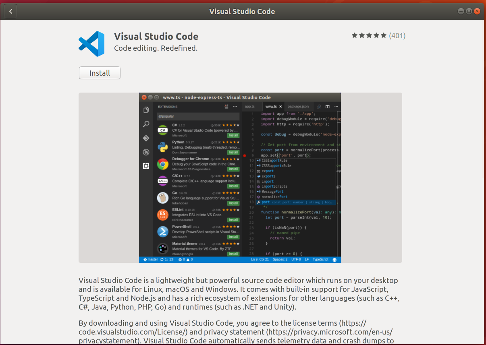

# 软件安装与文件操作

!!! success "本文已完稿并通过审阅，是正式版本。"

!!! abstract "导言"

    面对一个新的系统，你要怎样将它尽快地投入使用？通过这一章节的学习，你将会掌握以下几个技能：

    * 通过命令行安装需要的软件
    * 对文件与目录进行创建、移动、删除等
    * 压缩、解压文件
    * 对没有使用过的软件能够更快地了解使用方法

## 软件安装 {#software-installation}

软件安装的方法较多，这里将会提到几个比较常用的软件安装方法：

### 使用应用商店安装 {#use-app-store}

使用应用商店安装比较符合我们在 Google Play 和 App Store 安装应用的习惯，无需用户的干预，只需轻点鼠标即可完成安装。

在 Ubuntu 下，我们可以使用 Ubuntu Application Store 来进行安装，下图为应用商店中的 VSCode 应用页面。



!!! info "其它发行版的应用商店"

    本节中提到的这种方法常见于自带应用商店的发行版，如 Ubuntu、Manjaro 等。

    在其他的发行版上，如果没有预装好的应用商店，可以安装 [Snapcraft](https://snapcraft.io/) 或 [Flatpak](https://flatpak.org/) 等在不同发行版上通用的应用商店。（注意：Snap 商店在国内的访问速度较慢。）

### 使用包管理系统安装 {#use-package-management-system}

软件包管理器是一系列工具的集合，它自动化地完成软件的安装、更新、配置和移除功能。

在 Linux 下，相比起使用应用商店安装软件，包管理系统的使用要更加广泛，许多软件均可以通过一行命令完成其安装，优雅而快速。

软件包管理器的一个重要组成部分是软件仓库。软件仓库是收藏了互联网上可用软件包（应用程序）的图书馆，里面往往包含了数万个可供下载和安装的可用软件包。[^1]

有了软件仓库，我们不需要手动下载大量的软件包再通过包管理器安装。只需要知道软件在软件仓库中的名称，即可让包管理器从网络中抓取到相应的软件包到本地，自动进行安装。

但是与应用商店相比，使用包管理器安装需要预先知道所需软件在软件仓库中的对应包名，和应用商店相比无法进行模糊搜索（不过你也可以在包管理器官网上进行查找包名，再通过包管理器安装）。

包管理系统有很多，比如管理 Debian (.deb) 软件包的 `dpkg` 以及它的前端 `apt`（用于 Debian 系的发行版）；`rpm` 包管理器以及它的前端 `dnf`（用于 Fedora 和新版的 CentOS 和 RHEL）、前端 `yum`（用于 CentOS 7 和 RHEL 7 等）；`pacman` 包管理器（用于 Arch Linux 和 Manjaro）等等。

**为了方便讲述，本章下文中我们都将以 apt 作为典型实例进行讲解。**

apt 的全称是 Advance Package Tool，是一个处理在 Debian、Ubuntu 或者其他衍生发行版的 Linux 上安装和移除软件的自由软件。

apt 可以自动下载、配置和安装二进制或者源代码格式的软件包，简化了在这些发行版上管理软件的流程。因此，它常常用来安装软件、自动处理软件包之间的依赖关系、升级软件包以至升级发行版，自动处理升级发行版所需的依赖关系等等。

此外，由于可以自定义软件源（软件仓库），因此自由地添加第三方源可以达到安装官方软件源中没有的软件或者安装特定版本的目的。

#### 搜索 {#apt-search}

安装前，可以在浏览器中搜索所需的软件，查找包名，也可以使用 `apt search` 命令搜索软件仓库，查看对应的包名是否在软件仓库中。使用方法：`apt search 搜索内容`。

下面是 `apt search firefox` 搜索火狐浏览器的输出结果示例，由于输出结果过多，去除了无用的其他软件包：

```text
$ apt search firefox
Sorting... Done
Full Text Search... Done
(Output omitted)

firefox/bionic-updates,bionic-security,now 72.0.2+build1-0ubuntu0.18.04.1 amd64
  Safe and easy web browser from Mozilla

(Output omitted)
```

中间两行每个字段的含义：

| 样例中的字段                             | 含义                                  |
| ---------------------------------------- | ------------------------------------- |
| `firefox`                                | 即为在软件仓库中的包名                |
| `bionic-updates,bionic-security,now`     | 为包含这个软件包的仓库源              |
| `72.0.2+build1-0ubuntu0.18.04.1`         | 为软件包的版本                        |
| `amd64`                                  | 软件包的架构；还可能为`i386`、`all`等 |
| `Safe and easy web browser from Mozilla` | 在软件仓库中对这个软件包的描述        |

#### 安装 {#installation}

在确定了软件包的包名后，可以通过 `apt install 包名` 进行安装。

下面是 `apt install firefox` 安装火狐浏览器的输出结果示例。

```text
# apt install firefox
Reading package lists... Done
Building dependency tree
Reading state information... Done
The following additional packages will be installed:
  adwaita-icon-theme at-spi2-core dconf-gsettings-backend dconf-service fontconfig
  (Output omitted)
Suggested packages:
  fonts-lyx libasound2-plugins alsa-utils libcanberra-gtk0 libcanberra-pulse colord cups-common
  gvfs liblcms2-utils librsvg2-bin
The following NEW packages will be installed:
  adwaita-icon-theme at-spi2-core dconf-gsettings-backend dconf-service firefox fontconfig
  (Output omitted)
0 upgraded, 87 newly installed, 0 to remove and 1 not upgraded.
Need to get 64.5 MB of archives.
After this operation, 264 MB of additional disk space will be used.
Do you want to continue? [Y/n]
```

在运行结果中，会给出将会安装的软件包、下载大小以及安装后占用的大小。输入 `Y` 后回车确定进行安装。

!!! tip "可能会出现的权限问题"

    在一般情况下，如果直接运行 `apt install` 命令，会输出

    ```text
    $ apt install firefox
    E: Could not open lock file /var/lib/dpkg/lock-frontend - open (13: Permission denied)
    E: Unable to acquire the dpkg frontend lock (/var/lib/dpkg/lock-frontend), are you root?
    ```

    这是由于当前用户的权限无法满足安装软件所需的权限。修正方法：在命令前面添加 `sudo`。

    即使用 `sudo apt install firefox`。

    在输入之后，终端显示：

    ```text
    [sudo] password for ubuntu:
    ```

    这里提示的是需要用户输入密码，以提升权限来执行命令。

    当然，在用户输入密码的过程中，为了安全，终端是不会进行密码的回显的，即终端不会将用户的输入内容打印在屏幕上。

    因此当你发现自己输入了很多内容也没有什么反应的时候，不用惊慌，只需要像平常一样输入正确的密码、回车，即可完成密码的正确性的鉴定。

    如果密码输入正确，那么就可以正常地执行命令。

    否则，则需要再次尝试：

    ```text
    Sorry, try again.
    [sudo] password for ubuntu:
    ```

    具体有关权限的知识点将在[第五章](../Ch05/index.md)展开。

#### 官方软件源镜像 {#software-sources}

通过 apt 安装的软件都来源于相对应的软件源，每个 Linux 发行版一般都带有官方的软件源，在官方的软件源中已经包含了丰富的软件，apt 的软件源列表在 `/etc/apt/sources.list` 下。

??? example "查看本地的软件源列表"

    ```text
    $ cat /etc/apt/sources.list | grep -v "#"
    deb http://mirrors.ustc.edu.cn/ubuntu/ bionic main restricted

    deb http://mirrors.ustc.edu.cn/ubuntu/ bionic-updates main restricted

    deb http://mirrors.ustc.edu.cn/ubuntu/ bionic universe
    deb http://mirrors.ustc.edu.cn/ubuntu/ bionic-updates universe

    deb http://mirrors.ustc.edu.cn/ubuntu/ bionic multiverse
    deb http://mirrors.ustc.edu.cn/ubuntu/ bionic-updates multiverse

    deb http://mirrors.ustc.edu.cn/ubuntu/ bionic-backports main restricted universe multiverse

    deb http://security.ubuntu.com/ubuntu/ bionic-security main restricted
    deb http://security.ubuntu.com/ubuntu/ bionic-security universe
    deb http://security.ubuntu.com/ubuntu/ bionic-security multiverse
    ```

    每一个条目都遵循如下的格式：

    ```text
    deb http://site.example.com/ubuntu/ distribution component1 component2 component3
    deb-src http://site.example.com/ubuntu/ distribution component1 component2 component3
    ```

    分别是 Archive type、Repository URL、Distribution 和 Components。

    在 Ubuntu 下，Component 可以为如下几个之一[^1]：

    | 类型       | 含义                                                                                        |
    | ---------- | ------------------------------------------------------------------------------------------- |
    | Main       | 包含自由软件的软件包                                                                        |
    | Restricted | 包含通常使用的软件，由 Ubuntu 团队支持，但不是完全的自由软件许可授权                        |
    | Universe   | 包含了数千个不由 Canonical 官方支持的软件包。授权于各种自由软件许可协议，来自各种公共来源。 |
    | Multiverse | 包含非自由软件的软件包                                                                      |

    具体的含义见 [Source List](https://wiki.debian.org/SourcesList#sources.list_format)

Ubuntu 官方源位于国外，往往会有速度与延迟上的限制，可以通过修改官方源为其镜像实现更快的下载速度。

镜像缓存了官方源中的软件列表，与官方源基本一致。

!!! example "修改官方源为镜像，加快更新速度"

    本例以修改官方源为 USTC Mirror 为例[^2]。**注意：在操作前请做好备份。**

    一般情况下，`/etc/apt/sources.list` 下的官方源地址为 `http://archive.ubuntu.com/` ，我们只需要将其替换为 `http://mirrors.ustc.edu.cn` 即可。

    如果你使用 Ubuntu 图形安装器安装，默认的源地址通常不是 `http://archive.ubuntu.com/` ， 而是 `http://<country-code>.archive.ubuntu.com/ubuntu/` ，如 `http://cn.archive.ubuntu.com/ubuntu/`，同样也将其替换为 `http://mirrors.ustc.edu.cn` 即可。

    可以使用如下命令：

    ```shell
    $ sudo sed -i 's|//.*archive.ubuntu.com|//mirrors.ustc.edu.cn|g' /etc/apt/sources.list
    ```

    当然也可以直接使用 vim、nano 等文本编辑器进行修改。

#### 第三方软件源 {#third-party-software-sources}

有时候，由于种种原因，官方软件源中并没有我们需要的软件，但是第三方软件提供商可以提供自己的软件源。在将第三方软件源添加到 `/etc/apt/sources.list` 中之后，就可以获取到第三方提供的软件列表，再通过 `apt install package-name` 安装我们需要的第三方软件。你一般可以在需要的第三方软件官网找到这样的配置说明。

??? example "通过添加 Docker 软件源安装 Docker"

    Docker 是一个十分流行的容器实现，常见于开发、交付、运行应用，极大地简化了部署应用的流程。关于 Docker 将在本书[第八章](../Ch08/index.md)进行专门的介绍。

    在各大软件源中已经提供了 Docker，在 Ubuntu/Debian 下的包名为 `docker.io`。

    Docker 官方也提供了自己的软件源，包名为 `docker-ce`，它的版本会稍微更新一些。我们可以通过添加 Docker 的软件源到 `/etc/apt/sources.list` 中来进行安装。以下安装流程按照 [Docker 官方文档](https://docs.docker.com/install/linux/docker-ce/ubuntu/)展开。

    1. 安装需要的的软件包

        ```shell
        $ sudo apt-get update

        $ sudo apt-get install \
            ca-certificates \
            curl \
            gnupg-agent \
            software-properties-common
        ```

    2. 下载 Docker 软件源的 GPG Key

        这一步将 GPG Key 添加到系统目录中。GPG Key 用于验证软件源的完整性，如果下载的文件被篡改，GPG 签名验证会失败，从而系统不会继续进行安装操作，防止有问题的软件包进入系统。

        ```shell
        $ curl -fsSL https://download.docker.com/linux/ubuntu/gpg | sudo gpg --dearmor -o /usr/share/keyrings/docker-archive-keyring.gpg
        ```

    3. 添加 Docker 软件源到 `/etc/apt/sources.list.d/` 中

        为了方便维护，第三方的 APT 软件源一般都放在 `/etc/apt/sources.list.d/` 目录下（而非直接编辑 `/etc/apt/sources.list`）。

        ```shell
        $ echo \
        "deb [arch=$(dpkg --print-architecture) signed-by=/usr/share/keyrings/docker-archive-keyring.gpg] https://download.docker.com/linux/ubuntu \
        $(lsb_release -cs) stable" | sudo tee /etc/apt/sources.list.d/docker.list > /dev/null
        ```

        这里通过 `dpkg --print-architecture` 命令获取系统当前的架构，`lsb_release -cs` 命令获取当前的系统代号（Codename），通过 Shell 命令拼接后保存到 `/etc/apt/sources.list.d/docker.list` 文件中。

    4. 使用 apt 安装 Docker

        首先需要从第三方源更新软件列表。

        ```shell
        $ sudo apt update
        ```

        之后便可以直接安装 `docker-ce` 以及相关的软件包。

        ```shell
        $ sudo apt install docker-ce docker-ce-cli containerd.io
        ```

    5. 检查安装情况并确认启动

        Docker 是作为一个服务运行在系统的后台的，要查看 Docker 是否安装完成并确定 Docker 已经启动，可以通过如下方式：

        ```shell
        $ sudo systemctl status docker
        ```

        如果 Docker 已经在后台启动了，则会输出与下面相似的内容：

        ```text
        ● docker.service - Docker Application Container Engine
          Loaded: loaded (/lib/systemd/system/docker.service; enabled; vendor preset: enabled)
          Active: active (running) since Fri 2020-04-10 20:55:27 CST; 18h ago
          Docs: https://docs.docker.com
          Main PID: 1115 (dockerd)
          Tasks: 18
          CGroup: /system.slice/docker.service
              └─1115 /usr/bin/dockerd -H fd:// --containerd=/run/containerd/containerd.sock
        ```

        如果没有启动，则会输出类似于这样的结果：

        ```text
        ● docker.service - Docker Application Container Engine
          Loaded: loaded (/lib/systemd/system/docker.service; enabled; vendor preset: enabled)
          Active: inactive (dead) since Sat 2020-04-11 15:43:02 CST; 4s ago
          Docs: https://docs.docker.com
          Process: 1115 ExecStart=/usr/bin/dockerd -H fd:// --containerd=/run/containerd/containerd.sock (code=exited, status=0/
          Main PID: 1115 (code=exited, status=0/SUCCESS)
        ```

        这时候，我们可以通过 `systemctl` 命令启动 Docker 服务：

        ```shell
        $ sudo systemctl start docker
        ```

        再次检查 Docker 运行情况，即应该可以得到期望的结果。关于服务相关的内容，将在本书[第四章](../Ch04/index.md)展开。

### 更新软件列表与更新软件 {#update-and-upgrade}

在计算机本地，系统会维护一个包列表，在这个列表里面，包含了软件信息以及软件包的依赖关系，在执行 `apt install` 命令时，会从这个列表中读取出想要安装的软件信息，包括下载地址、软件版本、依赖的包，同时 apt 会对依赖的包递归执行如上操作，直到不再有新的依赖包。如上得到的所有包，将会是在 `apt install some-package` 时安装的。

#### 更新软件列表 {#apt-update}

为了将这个列表进行更新，就会用到 `apt update` 命令。获取到新的软件版本、软件依赖关系。

在 apt 的配置中，有许多的软件源，每一个软件源都会提供一定数量的包列表。通过增添软件源，即可实现通过 apt 安装官方源中并不提供的软件或版本。

!!! example "apt update 输出样例"

    ```text
    $ sudo apt update
    [sudo] password for ubuntu:
    Get:1 http://security.ubuntu.com/ubuntu bionic-security InRelease [88.7 kB]
    Get:2 https://cli-assets.heroku.com/apt ./ InRelease [2533 B]
    Get:5 http://mirrors.ustc.edu.cn/ubuntu bionic-updates InRelease [88.7 kB]
    Get:6 http://mirrors.ustc.edu.cn/ubuntu bionic-backports InRelease [74.6 kB]
    Get:7 http://mirrors.ustc.edu.cn/ubuntu bionic-updates/main amd64 Packages [853 kB]
    Get:8 http://mirrors.ustc.edu.cn/ubuntu bionic-updates/main Translation-en [298 kB]
    (Output ommitted)
    Reading package lists... Done
    Building dependency tree
    Reading state information... Done
    158 packages can be upgraded. Run 'apt list --upgradable' to see them.
    ```

    每一行对应获取一个软件源。

    在最后，`158 packages can be upgraded` 表示了系统中可以被更新的软件包的数量。

#### 更新软件 {#apt-upgrade}

在获取到了新的软件列表后，可以进行软件更新，这时候使用的是 `apt upgrade` 命令。

`apt upgrade` 会根据软件列表中的版本信息与当前安装的版本进行对比，解决新的依赖关系，完成升级。

!!! example "apt upgrade 输出样例"

    ```text
    Reading package lists... Done
    Building dependency tree
    Reading state information... Done
    Calculating upgrade... Done
    The following packages will be upgraded:
      apport dmidecode landscape-common libnss-systemd libpam-systemd libsystemd0 libudev1
      python3-apport python3-problem-report sosreport systemd systemd-sysv udev unattended-upgrades
    14 upgraded, 0 newly installed, 0 to remove and 0 not upgraded.
    Need to get 5062 kB of archives.
    After this operation, 236 kB of additional disk space will be used.
    Do you want to continue? [Y/n]
    ```

    apt 会列出将要更新的软件包、需要下载的大小以及更新这些包需要消耗（或释放）的磁盘空间。

### 使用包管理器手动安装软件包 {#use-package-manager-manually}

在一些情况下，软件仓库中并没有加入我们所需要的软件。除了添加第三方软件源，从源安装外，有时候还可以直接下载安装软件供应商打包好的 `deb`、`rpm` 等二进制包。

!!! tip "什么是软件包"

    软件包是将软件安装升级中需要地多个数据文件合并得到的一个单独文件，便于传输和减少存储空间。软件包中包括了所有需要的元数据，如软件的名称、软件的说明、版本号以及要运行这个软件所需要的依赖包等。

安装软件包需要相应的软件包管理器，deb 格式的软件包对应的是 `dpkg`。

相对于 `apt` 而言，`dpkg` 会更加底层，`apt` 是一个包管理器的前端，并不直接执行软件包的安装工作，相反的则是交由 `dpkg` 完成。`dpkg` 反馈的依赖信息则会告知 `apt` 还需要安装的其他软件包，并从软件仓库中获取到相应的软件包进行安装，从而完成依赖管理问题。

直接通过 `dpkg` 安装 deb 并不会安装需要的依赖，只会报告出相应的依赖缺失了。

!!! warning "请避免直接使用 `dpkg -i` 安装 deb 包。"

    在绝大多数情况下，都应该使用 `apt` 来安装 deb 文件。

    如果不小心执行了 `dpkg -i` 导致系统出现依赖问题，可以尝试通过如下的方式调用 `apt` 帮助修复依赖管理：

    ```shell
    $ sudo apt -f install
    ```

!!! example "用 deb 文件安装 VSCode"

    Visual Studio Code 并不在 Ubuntu 的官方源中，可以通过安装微软提供的 deb 文件的方式进行安装。

    首先，下载 [微软提供的 `deb` 文件](https://go.microsoft.com/fwlink/?LinkID=760868)。

    然后运行 `apt install ./<file>.deb` （`<file>.deb` 为下载得到的 deb 文件）。

### 安装预编译可执行文件 {#install-precompiled}

对于用户数量较多的发行版，软件提供商还可能提供预编译好的二进制文件，可以直接运行。对于没有在软件仓库中提供的软件，免去了从源码编译安装的麻烦。

!!! example "安装预编译的 LLVM"

    下面我们以 LLVM 为例作介绍。LLVM 是一个编译器组件工具集，可以帮助开发者开发编译器以及周边工具。

    注：使用 LLVM 需要其前端 Clang。Clang 在 apt 上有提供，使用 `apt install clang` （或对应版本的 clang 包名）命令安装即可。

    在 LLVM 的 [Prebuilt 下载页面](https://releases.llvm.org/download.html) 中下载需要的版本以及自己的发行版所对应的二进制文件（Pre-Built Binaries）。在 “LLVM 10.0.0” 栏目下找到 “Pre-Built Binaries:”，对于 Ubuntu 和 Xubuntu 只有 Ubuntu 18.04 的预编译二进制文件。

    ```shell
    $ # 下载二进制的压缩文件存档
    $ wget https://github.com/llvm/llvm-project/releases/download/llvmorg-10.0.0/clang+llvm-10.0.0-x86_64-linux-gnu-ubuntu-18.04.tar.xz

    $ # 创建 clang 目录
    $ mkdir clang

    $ # 将下载得到的压缩文件解压到当前目录
    $ tar xf clang+llvm-10.0.0-x86_64-linux-gnu-ubuntu-18.04.tar.xz -C clang

    $ cd clang
    ```

    在进入解压得到的目录后，可以查看当前的目录下有什么内容：

    ```shell
    $ ls
    bin  include  lib  libexec  share
    ```

    一般而言，软件的可执行文件都位于 bin 目录下：

    ```shell
    $ cd bin
    $ ls
    (Output omitted)
    clang                     clang-tidy            llvm-cov
    clang++                   clangd                llvm-cvtres
    clang-10                  diagtool              llvm-cxxdump
    clang-apply-replacements  dsymutil              llvm-cxxfilt
    (Output omitted)
    ```

    这个目录下的 `clang` 和 `clang++` 就类似于我们比较熟悉的 `gcc` 和 `g++`。这两个是可以直接运行进行编译源代码的可执行文件。

    当然，我们不能每次在需要编译程序的时候输入如此长的路径找到 `clang` 和 `clang++`，而更希望的是能够像 `apt` 那样在任何地方都可以直接运行。

    我们可以这样做：

    ```shell
    $ # 将 clang+llvm-10.0.0-x86_64-linux-gnu-ubuntu-18.04 目录下的所有内容复制到 /usr/local/ 下
    $ sudo cp -R * /usr/local/
    ```

    为什么是 `/usr/local` 呢？因为 `/usr/local/bin` 处在 PATH 环境变量下。当我们在终端输入命令时，终端会先判断是否为终端的内建命令，如果不是，则会在 $PATH 环境变量中包含的目录下进行查找。因此，只要我们将一个可执行文件放入了 $PATH 中的目录下面，我们就可以像 `apt` 一样，在任意地方调用我们的程序。

    通过这个命令可以看到当前的 PATH 环境变量有哪些目录。

    ```shell
    $ echo $PATH
    /usr/local/sbin:/usr/local/bin:/usr/sbin:/usr/bin:/sbin:/bin
    ```

    在上面的复制过程中，源目录和目标目录的两个 `bin` 目录会相互合并，`clang` 和 `clang++` 两个可执行文件也就倍复制到了 `/usr/local/bin/` 目录中。这样子也就达到了我们希望能够在任意地方调用我们的可执行文件的目的。此外，在复制的时候 lib、doc 等文件夹也会和 `/usr/local`  下的对应目录合并，将 clang 的库和文档加到系统当中。

### 更多用法 {#more-usage}

关于软件包管理器的更多用法可查看 [Pacman/Rosetta](https://wiki.archlinux.org/index.php/Pacman/Rosetta) 页面，该页展示了一些流行的 Linux 发行版包管理器命令以及命令操作内容的对应关系。

### 使用源代码编译安装 {#compiling-installation}

此部分内容请见拓展阅读：[编译安装](supplement.md)。

## 操作文件与目录 {#operate-files-and-dirs}

在 Linux 在进行操作文件与目录是使用 Linux 最基础的一个技能。不像在 Windows 和 macOS 下有图形化界面，拖拽文件即可完成文件的移动，很容易管理文件与目录，Linux 的命令行操作虽然繁琐一些，但一旦上手，就可以通过命令与参数的组合完成通过图形化界面难以实现或者无法实现的功能。

### 查看文件内容 {#view}

#### cat {#cat}

```shell
$ # 输出 FILE 文件的全部内容
$ cat [OPTION] FILE
```

!!! example "输出示例"

    * 输出 file.txt 的全部内容

        ```shell
        $ cat file.txt
        ```

    * 查看 file1.txt 与 file2.txt 连接后的内容

        ```shell
        $ cat file1.txt file2.txt
        ```

!!! note "为什么名字叫 cat？"

    当然和猫咪没有关系，cat 这里是 con**cat**enate（连接）的缩写，因为 cat 工具实际的功能是连接多个文件，然后输出。但是当只有一个文件的时候，cat 就会直接输出这个文件，所以 cat 最常见的用途就是输出单个文件。

#### less {#less}

less 和 cat 的区别在于，cat 会一次性打印全部内容到终端中并退出，而 less 一次只显示一页，且支持向前/后滚动、搜索等功能。如果要在一个大文件中（例如 man page）查找一部分内容，less 通常要比 cat 方便得多。

```shell
$ # 在可交互的窗口内输出 FILE 文件的内容
$ less FILE
```

常用的快捷键:

| 按键                                         | 效果                                      |
| -------------------------------------------- | ----------------------------------------- |
| `d` / `u`                                    | 向下/上滚动半页（**d**own/**u**p）        |
| ++"Page Down"++ / ++"Page Up"++<br>`f` / `b` | 向下/上滚动一整页（**f**orward/**b**ack） |
| `g` / `G`                                    | 跳转到文件开头/结尾                       |
| `j` / ++"Down"++                             | 向下移动一行                              |
| `k` / ++"Up"++                               | 向上移动一行                              |
| `/PATTERN`                                   | 在文件中搜索 PATTERN                      |
| `n` / `N`                                    | 跳转到下一个/上一个找到的 PATTERN         |
| `q`                                          | 退出                                      |

其中移动光标的快捷键还可以和数字组合，例如 `10 j` 会向下移动十行。此外，less 的不少快捷键是和 Vi/Vim 相同的，掌握了这些快捷键再上手 Vim 就会简单很多（Vim 的介绍位于本章[拓展阅读](supplement.md#vim)内）。

??? tip "more? most?"

    实际上 Linux 内还有 more 与 most 两个功能与 less 相似的指令，只是流行程度不如 less 高，你也可以尝试这些指令，比较它们之间的区别。

### 编辑文件内容 {#nano}

Nano 是在很多机器上自带的命令行文本编辑器，相比于 vim 和 emacs 来说，对新手更加友好，不需要提前记忆复杂的键位。

```shell
$ nano file.txt  # 使用 nano 编辑 file.txt 文件（如果没有则创建）
```

Nano 启动后，用户可以直接开始输入需要的内容，使用方向键移动光标。在终端最下方是 nano 的快捷键，`^` 代表需要按下 Ctrl 键（例如，`^X` 就是需要同时按下 Ctrl + X）。在编辑完成后，按下 Ctrl + X，确认是否保存后即可。

本章的[拓展阅读](./supplement.md#vim)也简单介绍了 vim 的基础使用。

### 复制文件和目录 {#cp}

```shell
$ # 将 SOURCE 文件拷贝到 DEST 文件，拷贝得到的文件即为 DEST
$ cp [OPTION] SOURCE DEST

$ # 将 SOURCE 文件拷贝到 DIRECTORY 目录下，SOURCE 可以为不止一个文件
$ cp [OPTION] SOURCE... DIRECTORY
```

常用的选项:

| 选项                      | 含义                             |
| ------------------------- | -------------------------------- |
| `-r`, `-R`, `--recursive` | 递归复制，常用于复制目录         |
| `-f`, `--force`           | 覆盖目标地址同名文件             |
| `-u`, `--update`          | 仅当源文件比目标文件新才进行复制 |
| `-l`, `--link`            | 创建硬链接                       |
| `-s`, `--symbolic-link`   | 创建软链接                       |

!!! example "复制示例"

    * 将 `file1.txt` 复制一份到同目录，命名为 `file2.txt`
    ```shell
    $ cp file1.txt file2.txt
    ```

    * 将 `file1.txt`、`file2.txt` 文件复制到同目录下的 `file` 目录中
    ```shell
    $ cp file1.txt file2.txt ./file/
    ```

    * 将 `dir1` 文件夹及其所有子文件复制到同目录下的 `test` 文件夹中
    ```shell
    $ cp -r dir1 ./test/
    ```

??? tip "硬链接和软链接"

    cp 的 `-l` 和 `-s` 参数分布为创建硬链接和软链接（又称为“符号链接”）。

    简单而言，一个文件的硬链接和软链接都指向文件自身，但是在底层有不同的实现。

    需要先了解一个概念：inode。

    在许多“类 Unix 文件系统”中，inode 用来描述文件系统的对象，如文件和目录。inode 记录了文件系统对象的属性和磁盘块的位置。可以被视为保存在磁盘中的文件的索引（英文：index node）。

    关于 inode 的进一步讲解可以参考[这篇文章](https://www.ruanyifeng.com/blog/2011/12/inode.html)。

    

    硬链接与软链接图例
    {: .caption }

    硬链接与源文件有着相同的 inode，都指向磁盘中的同一个位置。删除其中一个，并不影响另一个。

    软链接与源文件的 inode 不同。软链接保存了源文件的路径，在访问软链接的时候，访问的路径被替换为源文件的路径，因此访问软链接也等同于访问源文件。但是如果删除了源文件，软链接所保存的路径也就无效了，软链接因此也是无效的。

    `ln` 命令也可以用来创建硬链接和软链接。

    ```shell
    $ ln -s file symlink  # 创建指向文件 file 的软链接 symlink
    $ ln file hardlink  # 创建指向文件 file 的硬链接 hardlink
    ```

### 移动文件和目录 {#mv}

`mv` 与 `cp` 的使用方式相似，效果类似于 Windows 下的剪切。

```shell
$ # 将 SOURCE 文件移动到 DEST 文件
$ mv [OPTION] SOURCE DEST

$ # 将 SOURCE 文件移动到 DIRECTORY 目录下，SOURCE 可以为多个文件
$ mv [OPTION] SOURCE... DIRECTORY
```

常用的选项：

| 选项                      | 含义                             |
| ------------------------- | -------------------------------- |
| `-r`, `-R`, `--recursive` | 递归移动，常用于移动目录         |
| `-f`, `--force`           | 覆盖目标地址同名文件             |
| `-u`, `--update`          | 仅当源文件比目标文件新才进行移动 |

### 删除文件和目录 {#rm}

```shell
$ # 删除 FILE 文件，FILE 可以为多个文件。
$ # 如果需要删除目录，需要通过 -r 选项递归删除目录
$ rm [OPTION] FILE...
```

常用的选项：

| 选项                      | 含义                               |
| ------------------------- | ---------------------------------- |
| `-f`, `--force`           | 无视不存在或者没有权限的文件和参数 |
| `-r`, `-R`, `--recursive` | 递归删除目录及其子文件             |
| `-d`, `--dir`             | 删除空目录                         |

!!! example "删除示例"

    * 删除 `file1.txt` 文件：

        ```
        $ rm file1.txt
        ```

    * 删除 `test` 目录及其下的所有文件：

        ```
        $ rm -r test/
        ```

    * 删除 `test1/`、`test2/`、`file1.txt` 这些文件、目录。其中，这些文件或者目录可能不存在、写保护或者没有权限读写：

        ```
        $ rm -rf test1/ test2/ file1.txt
        ```

### 创建目录 {#mkdir}

```shell
$ # 创建一个目录，名为 DIR_NAME
$ mkdir [OPTION] DIR_NAME...
```

常用的选项：

| 选项 | 含义                                                           |
| ---- | -------------------------------------------------------------- |
| `-p` | 如果中间目录不存在，则创建；如果要创建的目录已经存在，则不报错 |

!!! example "创建目录示例"

    * 创建两个目录，名字分别为 `test1`、`test2`：

        ```shell
        $ mkdir test1 test2
        ```

    * 创建路径 `test1/test2/test3/`：

        ```shell
        $ mkdir -p test1/test2/test3/
        ```

### 创建文件 {#touch}

```shell
$ # 创建一个文件，名为 FILE_NAME
$ touch FILE_NAME...
```

!!! example "创建文件示例"

    创建两个文件，名字分别为 `file1`、`file2`：

    ```
    $ touch file1 file2
    ```

!!! note "为什么名字叫 touch 而非 create（或者类似意思的单词）呢？"

    touch 工具实际上的功能是修改文件的访问时间（access time, atime）和修改时间（modification time, mtime），可以当作是摸（touch）了一下文件，使得它的访问与修改时间发生了变化。当文件不存在时，touch 会创建新文件，所以创建文件也就成为了 touch 最常见的用途。

    `stat` 命令可以显示文件的属性信息，可以来看看 touch 对已有文件的操作：

    ```shell
    $ touch test  # 创建文件 test
    $ stat test  # 查看信息
    File: test
    Size: 0         	Blocks: 0          IO Block: 4096   regular empty file
    Device: 801h/2049d	Inode: 1310743     Links: 1
    Access: (0644/-rw-r--r--)  Uid: ( 1000/     ustc)   Gid: ( 1000/     ustc)
    Access: 2022-02-25 18:12:28.403981478 +0800
    Modify: 2022-02-25 18:12:28.403981478 +0800
    Change: 2022-02-25 18:12:28.403981478 +0800
    Birth: 2022-02-25 18:12:28.403981478 +0800
    $ # 等待一段时间
    $ touch test  # 「摸」一下文件 test
    $ stat test  # 查看 touch 之后的信息
      File: test
    Size: 0         	Blocks: 0          IO Block: 4096   regular empty file
    Device: 801h/2049d	Inode: 1310743     Links: 1
    Access: (0644/-rw-r--r--)  Uid: ( 1000/     ustc)   Gid: ( 1000/     ustc)
    Access: 2022-02-25 18:15:16.625288185 +0800
    Modify: 2022-02-25 18:15:16.625288185 +0800
    Change: 2022-02-25 18:15:16.625288185 +0800
    Birth: 2022-02-25 18:12:28.403981478 +0800
    $ # 可以看到 Access time 和 Modify time 变化了。
    ```

### 搜索文件和目录 {#find}

```shell
$ # 在 PATH（路径）中根据 EXPRESSION（表达式）搜索文件
$ find [OPTION] PATH [EXPRESSION]
```

常用的表达式：

| 选项            | 含义                                                                 |
| --------------- | -------------------------------------------------------------------- |
| `-name '*.ext'` | 文件名后缀为 ext。其中 `*` 是任意匹配符                              |
| `-type d`       | 文件类型为目录，其他的类型例如 `f`（普通文件）                       |
| `-size +1M`     | 大于 1M 的文件，`+` 代表大于这个大小，对应地，`-` 代表小于之后的大小 |
| `-or`           | 或运算符，代表它前后两个条件满足一个即可                             |

!!! example "搜索示例"

    * 在当前目录搜索名为 report.pdf 的文件：

        ```shell
        $ find . -name 'report.pdf'
        ```

    * 全盘搜索大于 1G 的文件：

        ```shell
        $ find / -size +1G
        ```

    * 在用户目录搜索所有名为 node_modules 的文件夹：

        ```shell
        $ find ~/ -name 'node_modules' -type d
        ```

### 模式匹配 {#pattern}

许多现代的 shell 都支持一定程度的模式匹配。举个例子，bash 的匹配模式被称为 [glob](https://mywiki.wooledge.org/glob)，支持的操作如下：

| 模式     | 匹配的字串                       |
| -------- | -------------------------------- |
| `*`      | 任意字串                         |
| `foo*`   | 匹配 foo 开头的字串              |
| `*x*`    | 匹配含 x 的字串                  |
| `?`      | 一个字符                         |
| `a?b`    | `acb`、`a0b` 等，但不包含 `a00b` |
| `*.[ch]` | 以 .c 或 .h 结尾的文件           |

和上面提到的命令结合，可以显著提高操作效率。例如：

| 命令                 | 效果                                                         |
| -------------------- | ------------------------------------------------------------ |
| `rm *.tar.gz`        | 删除所有以 `tar.gz` 结尾的压缩文件                           |
| `mv -r *.[ch] /path` | 将当前及子目录下所有以 `.c` 或 `.h` 结尾的代码移动到 `/path` |

!!! warning "高效的代价"

    使用通配符前请再三确认输入无误，否则可能出现严重的后果（如 `rm -rf *` 会删掉当前目录的所有文件）。

??? "更好，更大，更强的模式匹配"

    除了上面提到的 glob，bash 还支持 [extglob](https://www.linuxjournal.com/content/bash-extended-globbing)，不过需要先用 `shopt -s extglob` 启用。

    其他 shell 例如 zsh 还支持正则表达式（会在后续章节讲解）。

## 使用 tar 操作存档、压缩文件 {#tar}

经常，我们希望将许多文件打包然后发送给其他人，这时候就会用到 `tar` 这个命令，作为一个存档工具，它可以将许多文件打包为一个存档文件。

通常，可以使用其自带的 gzip 或 bzip2 算法进行压缩，生成压缩文件：

```shell
$ # 命令格式如下，请参考下面的使用样例了解使用方法
$ tar [OPTIONS] FILE...
```

常用选项：

| 选项                     | 含义                                         |
| ------------------------ | -------------------------------------------- |
| `-A`                     | 将一个存档文件中的内容追加到另一个存档文件中 |
| `-r`, `--append`         | 将一些文件追加到一个存档文件中               |
| `-c`, `--create`         | 从一些文件创建存档文件                       |
| `-t`, `--list`           | 列出一个存档文件的内容                       |
| `-x`, `--extract, --get` | 从存档文件中提取出文件                       |
| `-f`, `--file=ARCHIVE`   | 使用指定的存档文件                           |
| `-C`, `--directory=DIR`  | 指定输出的目录                               |

添加压缩选项可以使用压缩算法进行创建压缩文件或者解压压缩文件：

| 选项                                   | 含义                        |
| -------------------------------------- | --------------------------- |
| `-z`, `--gzip`, `--gunzip`, `--ungzip` | 使用 gzip 算法处理存档文件  |
| `-j`, `--bzip2`                        | 使用 bzip2 算法处理存档文件 |
| `-J`, `--xz`                           | 使用 xz 算法处理存档文件    |

!!! example "tar 使用实例"

    * 将 `file1`、`file2`、`file3` 打包为 `target.tar`：

        ```shell
        $ tar -c -f target.tar file1 file2 file3
        ```

    * 将 `target.tar` 中的文件提取到 `test` 目录中：

        ```shell
        $ tar -x -f target.tar -C test/
        ```

    * 将 `file1`、`file2`、`file3` 打包，并使用 gzip 算法压缩，得到压缩文件 `target.tar.gz` ：

        ```shell
        $ tar -cz -f target.tar.gz file1 file2 file3
        ```

    * 将压缩文件 `target.tar.gz` 解压到 `test` 目录中：

        ```shell
        $ tar -xz -f target.tar.gz -C test/
        ```

    * 将 `archive1.tar`、`archive2.tar`、`archive3.tar` 三个存档文件中的文件追加到 `archive.tar` 中

        ```shell
        $ tar -Af archive.tar archive1.tar archive2.tar archive3.tar
        ```

    * 列出 `target.tar` 存档文件中的内容

        ```shell
        $ tar -t -f target.tar

        $ # 打印出文件的详细信息
        $ tar -tv -f target.tar
        ```

!!! tip "组合 tar 的选项"

    与大部分 Linux 命令相同，tar 命令允许将多个单字母（使用单个 `-` 符号的）选项组合为一个参数，便于用户输入。例如，以下命令是等价的：

    ```shell
    $ tar -c -z -v -f target.tar test/
    $ tar -czvf target.tar test/
    $ tar -f target.tar -czv test/
    ```

!!! tip "存档文件的后缀名"

    后缀名并不能决定文件类型，但后缀名通常用于帮助人们辨认这个文件的可能文件类型，从而选择合适的打开方法。

    在第一个例子中，创建得到的文件名为 `target.tar`，后缀名为 `tar`，表示这是一个没有进行压缩的存档文件。

    在第二个例子中，创建得到的文件名为 `target.tar.gz`。将 `tar.gz` 整体视为后缀名，可以判断出，为经过 gzip 算法压缩（`gz`）的存档文件（`tar`）。可知在提取文件时，需要添加 `-z` 选项使其经过 gzip 算法处理后再进行正常 tar 文件的提取。

    同样地，通过不同压缩算法得到的文件应该有不同的后缀名，以便于选择正确的参数。如经过 `xz` 算法处理得到的存档文件，其后缀名最好选择 `tar.xz`，这样可以知道为了提取其中的文件，应该添加 `--xz` 选项。

!!! tip "为什么使用 tar 创建压缩包需要“两次处理”"

    tar 名字来源于英文 **t**ape **ar**chive，原先被用来向只能顺序写入的磁带写入数据。tar 格式本身所做的事情非常简单：把所有文件（包括它们的“元数据”，包含了文件权限、时间戳等信息）放在一起，打包成一个文件。**注意，这中间没有压缩的过程。**

    为了得到更小的打包文件，方便存储和网络传输，就需要使用一些压缩算法，缩小 tar 文件的大小。这就是 tar 处理它自己的打包文件的逻辑。在 Windows 下的一部分压缩软件中，为了获取压缩后的 tar 打包文件的内容，用户需要手动先把被压缩的 tar 包解压出来，然后再提取 tar 包中的文件。

## 软件的使用文档 {#software-manuals}

面对一个新的软件，比如上面提到的 tar 存档软件，除了使用搜索引擎在互联网上搜索使用方法外，还可以通过软件安装时自带的使用文档来学习。

掌握通过一些手段了解一个新的命令的使用方法的技能在 Linux 学习中是极其重要的，Linux 的命令众多，并不会有很多的命令会有详细的说明。有时候官方文档也没有解释清楚的，可能需要手动试错乃至翻阅源代码了解命令的参数含义。

### man 命令 {#man}

通过 `man 命令名` 可以得到大部分安装在 Linux 上的软件的用户手册。

大部分软件在安装时会将它的软件手册安装在系统的特定目录， `man` 命令就是读取并展示这些手册的命令。在软件手册中，会带有软件的每一个参数的含义、退出值含义、作者等内容，大而全。但一般较少带有使用样例，需要根据自身需要拼接软件参数。

```shell
$ # 调出 tar 命令和 ls 命令的文档
$ man tar
$ man ls
```

文档中，往往会有命令的参数组合以及参数的详细含义，大而全能够很好地描述它，但是这对于我们希望能够快速上手一个命令是不利的，这就需要后面的另一个工具 `tldr`。

```console
$ man tar
TAR(1)                      GNU TAR Manual                     TAR(1)

NAME
       tar - an archiving utility

SYNOPSIS
   Traditional usage
       tar {A|c|d|r|t|u|x}[GnSkUWOmpsMBiajJzZhPlRvwo] [ARG...]

   UNIX-style usage
       tar -A [OPTIONS] ARCHIVE ARCHIVE

       tar -c [-f ARCHIVE] [OPTIONS] [FILE...]

$ man ls
LS(1)                       User Commands                       LS(1)

NAME
       ls - list directory contents

SYNOPSIS
       ls [OPTION]... [FILE]...

DESCRIPTION
       List  information  about  the  FILEs (the current directory by
       default).  Sort entries alphabetically if  none  of  -cftuvSUX
       nor --sort is specified.

(Output omitted)
```

### tldr 软件 {#tldr}

通常，软件手册中的内容十分繁多，如果只是希望能够快速了解软件的常用用法，可以使用 `tldr` 软件。

`tldr` 软件中包含有一个由[社区](https://github.com/tldr-pages/tldr)维护的精简版文档，通过几个简单的例子让用户可以快速地一窥软件的使用方法。

#### 安装 {#install-tldr}

在 Debian 系下，可以直接通过 `apt` 进行安装：

```shell
$ sudo apt install tldr
$ # 更新 tldr pages
$ tldr --update
```

#### 使用 {#use-tldr}

直接输入 `tldr 命令名` 即可。由于是由社区维护的，一些自行安装的软件可能不会有精简过的文档。

输入 `tldr tar` 的样例：

```text
$ tldr tar
tar
Archiving utility.
Often combined with a compression method, such as gzip or bzip.
More information:
https://www.gnu.org/software/tar

 - Create an archive from files:
   tar cf {{target.tar}} {{file1}} {{file2}} {{file3}}

 - Create a gzipped archive:
   tar czf {{target.tar.gz}} {{file1}} {{file2}} {{file3}}

 - Extract a (compressed) archive into the current directory:
   tar xf {{source.tar[.gz|.bz2|.xz]}}

 - Extract an archive into a target directory:
   tar xf {{source.tar}} -C {{directory}}

 - Create a compressed archive, using archive suffix to determine the compression program:
   tar caf {{target.tar.xz}} {{file1}} {{file2}} {{file3}}

 - List the contents of a tar file:
   tar tvf {{source.tar}}

 - Extract files matching a pattern:
   tar xf {{source.tar}} --wildcards {{"*.html"}}
```

可以从输出中快速地了解到：

-   创建存档文件；
-   创建压缩的存档文件；
-   解压一个存档文件；
-   解压一个存档文件到指定目录；
-   创建一个存档文件，并通过给定的目标存档文件的后缀名判断希望的压缩算法。在例子中，目标存档文件的后缀名是 `tar.gz` ，即希望创建由 gzip 压缩的存档文件；
-   给出一个存档文件中的文件列表；
-   解压一个存档文件，但是只有特定的文件名的文件才会被解压（在例子中，使用了通配符 `*.html` ，即只有以 `.html` 结尾的文件才会被解压）。

## 思考题 {#questions}

!!! question "Матрёшка"

    在本章[软件的使用文档](#software-manuals)一节中，我们介绍了两个十分有用的文档命令：`man` 和 `tldr`。这两个工具帮助我们详细或快速了解一个命令的功能和用法。

    那么 `man` 和 `tldr` 的用法又要怎么查看呢？

!!! question "查找需要安装的软件包"

    有时候，你会发现缺少了一些文件，而这些文件需要安装特定的软件包来补充。搜索资料，尝试说明如何方便地解决这样的问题。

!!! question "硬链接与软链接的判断"

    搜索资料，尝试说明如何判断一个文件是否有硬链接，或者是否是软链接。

!!! question "错误使用 tar 命令导致的文件丢失"

    这是一个真实的故事。某同学希望打包一些文件传输给另一位同学，于是他执行了下面这条命令：

    ```
    tar -cf * target.tar
    ```

    这会导致什么后果？尝试解释原因。（提示：`*` 代表当前目录下的所有文件，这个符号在执行之前会被 Shell 展开。）

!!! question "为什么不建议使用 `apt-key`"

    在 2020 年初撰写本章时，“第三方软件源”中安装 Docker 的示例中使用了 `apt-key` 添加信任的 GPG Key，如下所示：

    ```shell
    $ curl -fsSL https://download.docker.com/linux/ubuntu/gpg | sudo apt-key add -
    ```

    但是如今可以注意到，Docker 官方的安装教程也不再使用此方式，转而先手动下载、经过 `gpg` 程序处理后放置在 `/usr/share/keyrings/` 下，然后在软件源配置文件中使用 `signed-by` 参数指定成这个文件。为什么要换成这么麻烦的步骤？

    背景知识：GPG 签名是非对称密码体系的一个例子。这里，软件包发布者有两把密钥：公钥（供用户公开下载）和私钥（必须妥善保存，不能让别人知道）。发布者使用**私钥**对软件包签名后，用户可以用**公钥**验证软件包确实为该发布者发布，且未被篡改。

    提示：私钥泄漏之后可能会发生什么？

## 引用来源 {#references .no-underline}

[^1]: [软件仓库](http://people.ubuntu.com/~happyaron/udc-cn/lucid-html/ch06s09.html)
[^2]: [Ubuntu 源使用帮助](https://mirrors.ustc.edu.cn/help/ubuntu.html)
