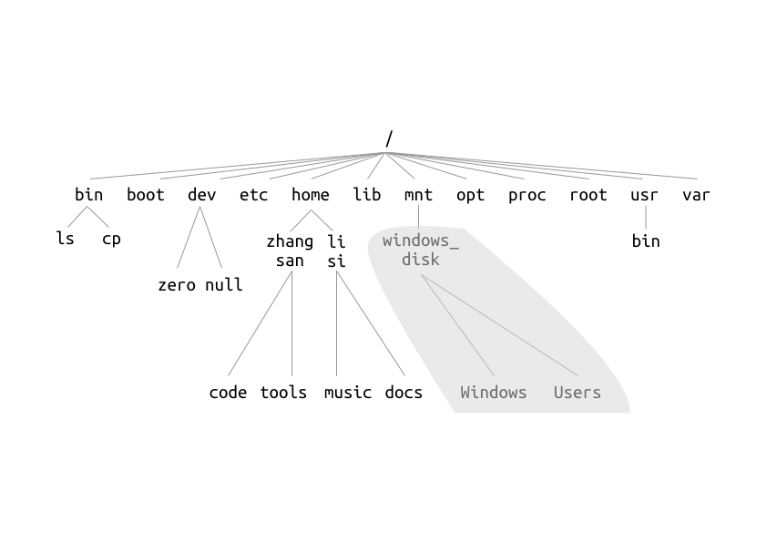

# 用户与用户组、文件权限、文件系统层次结构

!!! success "本文已完稿并通过审阅，是正式版本。"

!!! abstract "导言"

    很多 Linux 的初学者都会对以下这些问题感到迷惑：

    * 为什么我动不动改个设置，装个软件就要输密码？
    * 为什么有些命令要 `sudo`，有些不要？
    * 为什么我运行不了网上下载的程序？为什么系统里面有些目录我看不了？
    * 我的 C 盘、D 盘跑哪里去了？根目录 (`/`) 里面一堆 `etc`, `usr` 是什么玩意啊？

    以下内容将会解答你的疑问。

## 用户与用户组 {#users-and-groups}

### 为何需要「用户」 {#why-user}

早期的操作系统没有用户的概念（如 MS-DOS），或者有「用户」的概念，但是几乎不区分用户的权限（如 Windows 9x）。而现在，这不管对于服务器，还是个人用户来说，都是无法接受的。

在服务器环境中，「用户」的概念是明确的：服务器的管理员可以为不同的使用者创建用户，分配不同的权限，保障系统的正常运行。也可以为网络服务创建用户（此时，用户就不再是一个有血有肉的人），通过权限限制，以减小服务被攻击时对系统安全的破坏。

而对于个人用户来说，他们的设备不会有第二个人在使用。此时，现代操作系统一般区分使用者的用户与「系统用户」，并且划分权限，以尽可能保证系统的完整性不会因为用户的误操作，或恶意程序破坏。

### Linux 下的用户简介 {#intro-user-under-linux}

你可以查看 `/etc/passwd` 文件，来得到系统中用户的配置信息。**下文的内容，在没有特殊说明的情况下，都假设你的用户名是 `me`**。

!!! example "`/etc/passwd` 示例"

    以下是一个例子：

    ```
    root:x:0:0:root:/root:/bin/bash
    daemon:x:1:1:daemon:/usr/sbin:/usr/sbin/nologin
    bin:x:2:2:bin:/bin:/usr/sbin/nologin
    （中间内容省略）
    sshd:x:110:65534::/run/sshd:/usr/sbin/nologin
    me:x:1000:1000:me:/home/me:/bin/bash
    lxd:x:998:100::/var/snap/lxd/common/lxd:/bin/false
    mysql:x:111:116:MySQL Server,,,:/nonexistent:/bin/false
    ```

    在此文件中，每一行都是一个用户，每行中用户信息由冒号 `:` 隔开。里面存储的包括用户名、用户编号 (UID, User ID)、家目录位置等信息。更多介绍，可以通过 `man 5 passwd` 查阅。

可以关注到，除了你自己以外，还有一些特殊的用户：`root`，和一大堆你素未相识的名字。下面将会进行介绍。

??? tip "小知识：`/etc/passwd` 作用的变化"

    在 Unix 最初的时候，`passwd` 文件存储了用户密码的哈希[^1]。但是，这个文件是所有用户都可以读取的。为了不让用户的密码哈希被任意获取被暴力破解，现在一般把密码存在别的地方。对于 Linux 来说，密码哈希信息存储在 `/etc/shadow` 里面，只有下文提到的根用户可以访问与修改。

#### 根用户 {#root-user}

在前文中我们知道，在使用 `apt` 安装软件时，我们需要在前面加上 `sudo`。这可以使我们以根用户 (`root`) 的身份安装软件。

根用户 / `root` 用户在 Linux 操作系统中拥有最高的权限，可以对系统做任何操作（包括删除所有系统文件这一类**极端危险的操作**）。`root` 用户的用户数据存储在 `/root` 下。

在我们使用 `sudo` 的时候，输入自己的密码后，在验证正确之后，`sudo` 就会以 `root` 用户的身份，执行后面我们希望执行的命令。而使用 `apt` 安装的软件存储在了系统的目录下，所以必须要以 `root` 用户的身份安装。这就是我们平时需要 `sudo` 来安装软件的原因。

!!! danger "谨慎使用 `root` 用户权限执行命令！"

    我们知道，`root` 用户可以对系统做及其危险的操作。当使用 `root` 权限执行命令时（如使用 `sudo`），一定要**小心、谨慎，理解命令的含义之后再按下回车**。**请不要复制网络上所谓的「Linux 优化命令」等**，以 `root` 权限执行，否则**可能会带来灾难性的后果**。

    以下是一些会对系统带来<span class=red>毁灭性破坏</span>的例子。 **<span class=red>再重复一遍，不要执行下面的命令！</span>**

    * `rm -rf /`（删除系统中的所有可以删除的文件，**包括被挂载的其他分区**。**即使不以 `root` 权限执行，也可以删掉自己的所有文件。**）
    * `mkfs.ext4 /dev/sda`（将系统的第一块硬盘直接格式化为 ext4 文件系统。这会破坏其上所有的文件。）
    * `dd if=/dev/urandom of=/dev/sda`（对系统的第一块硬盘直接写入伪随机数。这会破坏其上所有的文件，并且找回文件的可能性降低。）
    * `:(){ :|: & };:`（被称为「Fork 炸弹」，会消耗系统所有的资源。在未对进程资源作限制的情况下，只能通过重启系统解决，所有未保存的数据会丢失。）

#### 系统用户 {#system-user}

除了你、`root` 和其他在用你的电脑/服务器的人（如果有）以外，剩下还有很多用户，如 `nobody`, `www-data` 等。它们由系统或相关程序创建，用于执行服务等系统任务。**不要随意删除这些用户**，以免系统运行出现问题。

??? tip "技术层面上[^2]，系统用户和普通用户的区别"

    一般地，在 Linux 中，系统用户的 UID 有一个指定范围，而这段范围在各个发行版中可能不同。如 Debian 使用了 100-999, 60000-64999 等区间分配给系统用户[^3]。

    此外，由于系统用户的特殊性，它们一般默认禁止登录。

#### 普通用户 {#normal-user}

普通用户可以登录系统，并对自己的家目录下的文件进行操作。所有普通用户的家目录都在 `/home/` 下，位于 `/home/username/` 的位置，其中 `username` 是用户名。

普通用户无法直接进行修改系统配置，安装或卸载软件等操作。

### 切换用户：使用 `su` 和 `sudo` {#using-su-and-sudo}

#### `sudo` {#sudo}

`sudo` 命令可以让你以另一个用户的身份执行指定的命令。当然，它最常见的用途，就是能让普通用户以 `root` 的身份执行命令：不加入其他参数，`sudo` 后面直接加命令，我们在前面的课程中也见到很多次了。

??? tip "以 `root` 用户执行上一条命令"

    是否常常很多次忘记敲 `sudo`，结果还要把后面的整条命令重新敲一遍？在发现权限不足之后有一个方便的「补救方案」：`sudo !!`，效果如下：

    ```
    $ apt update
    Reading package lists... Done
    E: Could not open lock file /var/lib/apt/lists/lock - open (13: Permission denied)
    E: Unable to lock directory /var/lib/apt/lists/
    W: Problem unlinking the file /var/cache/apt/pkgcache.bin - RemoveCaches (13: Permission denied)
    W: Problem unlinking the file /var/cache/apt/srcpkgcache.bin - RemoveCaches (13: Permission denied)
    $ sudo !!
    sudo apt update
    [sudo] password for me:
    Hit:1 http://mirrors.ustc.edu.cn/ubuntu bionic InRelease
    （以下内容省略）
    ```

    其实，在 Shell 中，`!!` 即代表上一条命令，也可以和其他的命令结合使用。

那么，如何以 `root` 之外的用户的身份执行命令呢？加上 `-u 用户名` 的参数即可。

```
$ sudo -u nobody id
uid=65534(nobody) gid=65534(nogroup) groups=65534(nogroup)
```

这里，我们就用 `nobody` 这个用户的身份，执行了 `id`，得到了 `nobody` 的 UID 等信息。

??? example "修改 `sudo` 配置的例子：无密码执行 `sudo` (\*)"

    `sudo` 的配置存储在 `/etc/sudoers` 文件中，仅 `root` 用户有权查看和修改。**不要直接修改此文件。**对这个文件的任何修改，都应该使用 `visudo` 这个命令去做。

    默认的 Ubuntu 配置中，安装时创建的用户在 `sudo` 用户组（下文会提到这个概念）中。在 `sudoers` 文件中，它的配置像这样：

    ```
    # Allow members of group sudo to execute any command
    %sudo	ALL=(ALL:ALL) ALL
    ```

    将配置行修改成以下即可。

    ```
    %sudo   ALL=(ALL:ALL) NOPASSWD:ALL
    ```

    `sudoers` 的配置比较复杂。可以使用 `man sudoers`，或在网络上搜索资料以得到更详细的说明。

#### `su` {#su}

`su` 命令用于直接切换用户，格式是 `su 用户名`。如果没有用户名这个参数，则切换到 `root` 用户。

在读完上面这句话之后，你可能会尝试切换到 `root`，但是却失败了：

```
$ su
Password:
（密码？什么密码？输我自己的密码试试？）
su: Authentication failure
$
```

这是因为，如 Ubuntu 等 Linux 发行版默认禁止了 `root` 用户的密码登录，只允许通过 `sudo` 提高权限。但是，我们可以用 `sudo` 运行 `su`，来得到一个为 `root` 用户权限的 shell。

```
$ sudo su
Password:
（没错，是我自己的密码）
# id
uid=0(root) gid=0(root) groups=0(root)
# exit
$
```

`sudo su`, `sudo su -` 等命令有一些细微的区别，可以阅读本章的补充材料。另外，也可以使用 `sudo -i`（与 `sudo su -` 等价），获得一个 `root` 权限 shell。

### 用户组简介 {#intro-user-group}

用户组是用户的集合。通过用户组机制，可以为一批用户设置权限。可以使用 `groups` 命令，查看自己所属的用户组。

```
$ groups
me adm cdrom sudo dip plugdev lxd
```

可以看到，用户 `me` 从属于多个用户组，包括一个与其名字相同的用户组。一般在用户创建的时候，都会创建与它名字相同的用户组。

对于普通用户来说，用户组机制会在配置部分软件时使用到。如在使用第八章的 Docker 时，可以把自己加入 `docker` 用户组，从而不需要使用 `root` 权限，也可以访问它的接口。

同样，用户组和用户一样，也有编号：GID (Group ID)。

### 命令行的用户配置操作 {#user-configuration-command-line}

#### 修改密码：`passwd` {#passwd}

可以使用此命令修改用户密码，格式为 `passwd 用户名`。如果没有输入用户名，则修改自己的密码。

#### (\*) 简单的用户配置：`adduser` {#adduser}

!!! warning "`adduser` 是 Debian 及其衍生发行版的专属命令"

    如果你正在使用其他发行版（如 Fedora, CentOS 等），或者有更多的需求，则需要使用 `usermod`, `useradd`, `groupadd` 等替代。具体信息详询各自的 `man` 文档。

`adduser` 是 Debian 及其衍生发行版中附带的一个方便的用户管理脚本。它可以用来向系统添加用户、添加组，以及将用户加入组。输入：

```shell
$ sudo adduser 用户名
```

即可添加此用户。而输入

```shell
$ sudo adduser --group 组名
```

即可添加此用户组。将用户加入指定用户组也非常简单：

```
$ sudo adduser 用户名 组名
```

!!! example "添加用户至 sudo 用户组"

    在通过 `adduser` 创建了新的用户后，直接使用 `sudo` 以 `root` 身份运行程序可能会得到：

    ```text
    $ sudo apt update
    [sudo] password for me:
    me is not in the sudoers file.  This incident will be reported.
    ```

    除了可以通过 `visudo` 命令编辑 `sudoers` 文件外，可以直接通过将新的用户加入到 `sudo` 用户组，以能够使用 `sudo` 命令。

    ```shell
    $ sudo adduser me sudo
    ```

    再此切换到新的用户即可看到使用 sudo 的提示：

    ```text
    To run a command as administrator (user "root"), use "sudo <command>".
    See "man sudo_root" for details.
    ```

## 文件权限 {#file-permission}

在 Linux 中，每个文件和目录都有自己的权限。可以使用 `ls -l` 查看当前目录中文件的详细信息。

```
$ ls -l
total 8
-rwxrw-r-- 1 me me   40 Feb  3 22:37 a_file
drwxrwxr-x 2 me me 4096 Feb  3 22:38 a_folder
```

第一列的字符串从左到右意义分别是：文件类型（一位）、文件所属用户的权限（三位）、文件所属用户组的权限（三位）、其他人的权限（三位）。如文件 `a_file` 为普通文件 (`-`)，所属用户权限为 `rwx`，所属用户组权限为 `rw-`，其他人的权限为 `r--`。

第三、四列为文件所属用户和用户组。

对于每个权限，第一位 `r` 代表读取 (**R**ead)，第二位 `w` 代表写入 (**W**rite)，第三位 `x` 代表执行 (E**x**ecute)，`-` 代表没有对应的权限。

??? tip "执行权限意味着什么？"

    读取和写入权限是很容易理解的。但是执行权限是什么意思？对于一个文件来说，拥有执行权限，它就可以被操作系统作为程序代码执行。如果某个程序文件没有执行权限，你仍然可以查看这个程序文件本身，修改它的内容，但是无法执行它。

    而对于目录来说，拥有执行权限，你就可以访问这个目录下的文件的内容。以下是一个例子：

    ```
    $ ls -l
    total 8
    -rwxrw-r-- 1 me me   40 Feb  3 22:37 a_file
    drw-rw-r-- 2 me me 4096 Feb  3 22:38 a_folder
    $ （与上面不同，我们去掉了 a_folder 的执行权限）
    $ cd a_folder
    -bash: cd: a_folder/: Permission denied
    $ （失败了，这说明，如果没有执行权限，我们无法进入这个目录）
    $ ls a_folder
    ls: cannot access 'a_folder/test': Permission denied
    test
    $ （列出了这个目录中的文件列表，但是因为没有执行权限，我们没有办法访问到里面的文件 test）
    $ cat a_folder/test
    cat: a_folder/test: Permission denied
    $ cp a_folder/test test
    cp: cannot stat 'a_folder/test': Permission denied
    $ mv a_folder/test a_folder/test2
    mv: failed to access 'a_folder/test2': Permission denied
    $ touch a_folder/test2
    touch: cannot touch 'a_folder/test2': Permission denied
    $ rm a_folder/test
    rm: cannot remove 'a_folder/test': Permission denied
    $ （可以看到，即使我们有写入权限，向此目录添加、删除、重命名仍然是不行的）
    ```

    而拥有读取权限，对应的是可以列出目录下面存在的文件。可以把目录视为一个「文件」来看待，这个文件包含了目录中下一层的文件列表——「读取」对应读取文件列表的权限，「写入」对应修改文件列表（添加、删除、重命名文件）的权限，「执行」对应实际去访问列表中文件、以及使用 `cd` 切换当前目录到此目录的权限。

    有关文件与目录权限的完整表格，可以查看 Arch Wiki 的 [File permissions and attributes](https://wiki.archlinux.org/index.php/File_permissions_and_attributes#Viewing_permissions) 一页。

可以使用 `chmod` (**ch**ange file **mod**e bits) 修改权限，`chown` (**ch**ange file **own**er) 修改文件所有者。具体的使用方法，请查阅相关的文档，这里不再列出。

!!! example "例子：如何执行从网络上下载的程序或脚本"

    有时候，我们会从网上下载一些二进制的程序，或者根据网络的教程编写脚本程序，但当你想执行的时候却发现：

    ```
    $ ./program
    -bash: ./program: Permission denied
    ```

    大多数情况下，这说明这个文件缺少执行 (`x`) 权限。可以使用 `chmod +x` 命令添加执行权限。

    ```
    $ chmod +x program
    $ ./program
    （可以执行了）
    ```

## 文件系统层次结构 {#fhs}

相信到现在你应该已经发现了：Linux 下文件系统的结构和 Windows 的很不一样。在 Windows 中，以盘符的形式（如「C 盘」、「D 盘」），各个分区的分界线是很明确的。在系统所在的分区（一般为 C 盘）中，存储着程序文件 (`Program Files`)，系统运行需要的文件 (`Windows`)，用户文件 (`Users`) 等。这种组织形式源于 DOS 和早期的 Windows，并一直传承下来。

而 UNIX 系列采用了一种不一样的思路组织文件：整个系统的文件都从 `/`（根目录）开始，像一棵树一样，类似于下图。



其他的分区等以挂载 (mount) 的形式「挂」在了这棵树上，如图中的 `/mnt/windows_disk/`。

那么在根目录下的这些目录各自有什么含义呢？这就由文件系统层次结构标准 (FHS, Filesystem Hierarchy Standard) 来定义了。这个标准定义了 Linux 发行版的标准目录结构。大部分的 Linux 发行版遵循此标准，或由此标准做了细小的调整。以下进行一个简要的介绍。也可以在[官网](https://refspecs.linuxfoundation.org/FHS_3.0/fhs/index.html)查看标准的具体内容。

当然，实际情况不一定会和以下介绍的内容完全一致。可以使用 `man hier` 和 `man file-hierarchy` 查看你的系统中关于文件系统层次结构的文档。

`/bin`
: 存储必须的程序文件，对所有用户都可用。

`/boot`
: 存储在启动系统时需要的文件。

`/dev`
: 存储设备文件。

    !!! tip "什么是设备文件？"

        设备文件是计算机设备抽象成文件的形式，程序和用户可以以读写普通文件的方式向这些文件输入内容，或者从文件中获取内容。系统驱动程序会相应处理用户对对应设备文件的输入和输出。

`/etc`

: 存储系统和程序的配置文件。

    !!! tip "注册表与配置文件"

        Windows 系统与其上很多程序都使用注册表，而非文件的形式存储配置信息。注册表是一个数据库，拥有数据库的优点（如原子性），集中地管理配置项。而 Linux 下的程序更喜欢将配置以文件的形式存储，保持配置简单，便于用户编辑与备份。

        当然，这不是绝对的。现在 Windows 下的 .NET 程序更偏向于将配置存储在 XML 文件中，而 Linux 下的 GNOME 桌面环境也采取了类似于注册表的形式: `GConf`，存储自己的配置信息。

`/home`

: 用户的家目录。存储用户自己的信息。

`/lib`

: 存放系统运行必须的程序库文件。

`/media` 和 `/mnt`

: 这两个目录都用于挂载其他的文件系统。`/media` 用于可移除的文件系统（如光盘），而 `/mnt` 用于临时使用。

`/opt`

: 存放额外的程序包。一般将一些大型的、商业的应用程序放置在这个目录。

`/root`

: `root` 用户的家目录。

`/run`

: 系统运行时的数据。在每次启动时，里面的数据都会被删除。

`/sbin`

: 存储用于系统管理，以及仅允许 `root` 用户使用的程序。如 `fsck`（文件系统修复程序）、`reboot`（重启系统）等。

`/srv`

: 存储网络服务的数据。

`/tmp`
: 临时目录，所有用户都可使用。

`/usr`
: 大多数软件都会安装在此处。其下有一些目录与 `/` 下的结构相似，如：

    - `/usr/bin`
    - `/usr/lib`
    - `/usr/sbin`

    此外，还有一些目录：

    - `/usr/include`: 存储系统通用的 C 头文件。当然，里面会有你非常熟悉的头文件，如 `stdio.h`。
    - `/usr/local`: 存储系统管理员自己安装的程序，这些文件不受系统的软件管理机制（如 `apt`）控制。`/usr/local` 里面的层次结构和 `/usr` 相似。
    - `/usr/share`: 存储程序的数据文件（如 `man` 文档、GUI 程序使用的图片等）

`/var`
: 存储会发生变化的程序相关文件。

## 思考题 {#questions}

!!! question "nobody 用户"

    关于 `nobody` 用户，网络上有一种说法称，所有网络服务（如 Web 服务器）都应该以此用户身份运行。从安全性的角度反驳此观点。

!!! question "系统用户的默认 Shell"

    在 `/etc/passwd` 中最后一列是用户的默认 Shell（如果你没有修改过的话，那么一般是 `/bin/bash`）。为什么会有很多用户的默认 Shell 是 `/usr/sbin/nologin` 或者 `/bin/false`？这样做有什么意义？

!!! question "启用 root 用户"

    在 Ubuntu 等 Linux 发行版中，`root` 用户是默认禁用（无法直接登录）的。如何启用此用户？

!!! question "文件的可执行权限"

    如果向一个 MP3 音频文件添加「可执行」(`x`) 属性，那么这个文件就可以被执行吗？为什么？

!!! question "`sudo cd`?"

    当需要浏览仅 `root` 用户可查看的目录时，很多人的第一反应是 `sudo cd xxx`，但最终失败了。尝试解释这样做不可行的原因。

## 引用来源 {#references .no-underline}

- [维基百科上的 Passwd 词条（英语）](https://en.wikipedia.org/wiki/Passwd)
- [Simple explanation of `sudoers` file](https://askubuntu.com/questions/118204/5958455) - Ask Ubuntu
- [Sudoers - Community Help Wiki](https://help.ubuntu.com/community/Sudoers) - Ubuntu Documentation

[^1]: 这里的哈希，指经过了[密码哈希函数](https://zh.wikipedia.org/wiki/%E5%AF%86%E7%A2%BC%E9%9B%9C%E6%B9%8A%E5%87%BD%E6%95%B8) ([Cryptographic hash function](https://en.wikipedia.org/wiki/Cryptographic_hash_function)) 的处理。密码哈希函数是一种特殊的单向函数，将任意大小的数据映射到一串长度固定的字符串，并且拥有一些优良的性质（如难以找到两个不同的数据，使得映射后的字符串相同），使其破解难度加大。
[^3]: <https://www.debian.org/doc/debian-policy/ch-opersys.html#uid-and-gid-classes>
[^2]: 然而，对于 Linux 内核来说，系统用户和真实的用户其实没有区别，除了 UID = 0 的用户 (root) 以外。「系统用户」是一个约定俗成而产生的概念。
