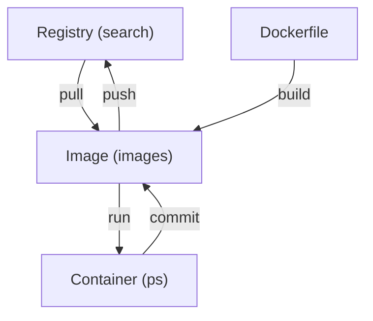

# Docker

!!! Warning "本文已基本完稿，正在审阅和修订中，不是正式版本。"

!!! abstract "导言"

    「容器」，是近年来非常热门的一个概念。它通过操作系统内核提供的隔离技术，实现轻量级的虚拟化环境。目前，它在软件的开发、部署等方面有着非常广泛的应用。

    而 Docker，是 Linux 容器技术中的代表性软件，它为用户提供了方便的接口来创建、使用 Linux 容器。下面，就让我们简单地入门一下 Docker。

## 为什么使用 Docker？ {#why-docker}

Docker 能够利用 Linux 内核的容器特性，隔离出一个轻便的环境来运行程序。这有什么意义呢？试想以下这些情况：

- 你运行的 Linux 发行版很老，而你需要运行一个更新版本的 Linux 发行版，或者完全不同的 Linux 发行版设计的程序。基于 Docker 的实现方式，与虚拟机（VM）不同，它们都共用同一个 Linux 内核（虚拟机是完全的虚拟化，包括内核和用户空间）。
- 你和朋友在设计一个大型的程序，而因为你们配置的环境不同，有时候在某个人的机器上正常运行的程序，在另一台机器上没法正常运行。
- 你希望在多台服务器上部署一个项目，但是项目需要非常复杂的配置，一个一个配置服务器的成本非常大。
- …………

Docker 就可以帮助解决这些问题。它可以快速配置不同的环境（比如说，通过 Docker，你可以在 Ubuntu 发行版上使用 CentOS 发行版的环境），部署应用。

## 安装 Docker {#install-docker}

Docker 可以在 Windows, Linux 和 macOS 上安装。下面我们讨论内容都基于 Docker 免费的社区版本。

### 在 Windows 或 macOS 上安装 {#install-on-windows-or-macos}

上面提到，Docker 使用了 Linux 内核的容器特性，它依赖于 Linux。所以在 Windows 和 macOS 上，Docker 不得不通过虚拟 Linux 内核的方式来完成任务。其提供了一套被称为 Docker Desktop 的软件来帮助在 Windows 和 macOS 上配置 Docker。直接从[官网下载](https://www.docker.com/products/docker-desktop)即可。

!!! info "Docker Desktop on Windows 的环境要求"

    Docker Desktop on Windows [对系统有一定的环境要求](https://docs.docker.com/desktop/windows/install/#system-requirements)，以便虚拟化运行 Linux。如果环境要求无法达到，可以安装[老版本的 Docker Toolbox on Windows](https://docs.docker.com/toolbox/toolbox_install_windows/)。

!!! note "Windows 容器"

    你可能会搜索到，Docker 也支持「Windows 容器」。是的，在新版本（1607 之后）的 Windows 10 中，Windows 内核支持 Windows 容器。可以在这样的容器中运行 Windows 程序。如果你感兴趣，可以阅读[微软的 Containers on Windows Documentation](https://docs.microsoft.com/en-us/virtualization/windowscontainers/) 和 [Docker Windows Containers 的介绍](https://www.docker.com/products/windows-containers)。这样的容器无法运行 Linux 程序，下面也不会涉及到。

### 在 Linux 上安装 {#install-on-linux}

各大发行版的软件源包含 Docker，也可以跟从[官方文档](https://docs.docker.com/install/linux/docker-ce/debian/)，安装其提供的 Docker 社区版本。

!!! info "docker, docker.io 和 docker-ce"

    首先，在 Debian/Ubuntu 上，**不要运行 `sudo apt install docker`**。现在，这里安装的 `docker` 是一个系统托盘程序，和本章的 Docker **没有任何关系**。

    `docker.io` 是由 Debian/Ubuntu 维护的 Docker 版本，和软件源里的其他程序一样，它比官方的最新版本要稍微老一些。它所依赖的程序库由 Debian/Ubuntu 软件源中的其他软件包提供。

    而 `docker-ce` 是由 Docker 官方维护的。它依赖的程序库都被打包在了这个包中。本章中，可以安装这两个版本中的任意一个。

    Docker 官方提供了安装 Docker 社区版本的简易安装脚本：

    ```console
    $ curl -fsSL https://get.docker.com -o get-docker.sh
    $ sudo sh get-docker.sh
    ```

!!! warning "不要在 WSL1 上安装 Docker"

    WSL1 在 Windows 上提供了方便的 Linux 环境。但很遗憾，Docker 的核心服务无法在 WSL1 上运行，直接安装是无法使用的。虽然可以把 WSL 中的 Docker 的命令行工具连接到 Docker for Windows 的核心服务上，但是比较麻烦，这里不推荐这样做。

    如果你正在使用 WSL2，可以安装 Docker，并且使用 Windows 下的 Docker Desktop 进行管理，详细信息可阅读 [Using Docker in WSL 2](https://code.visualstudio.com/blogs/2020/03/02/docker-in-wsl2)。

在安装完成后，可以使用

```console
$ sudo adduser 用户名 docker
```

将需要使用 Docker 的用户[加入](../Ch05/index.md#adduser) `docker` 用户组，以便使用命令行方式操作 Docker。**注意：`docker` 用户组中的用户拥有与 root 等效的权限。**

### 配置 Registry Mirror（可选，推荐） {#setup-registry-mirror}

!!! tip "本节操作请参考其他文档"

    你可以参考 <https://yeasy.gitbook.io/docker_practice/install/mirror> 获取目前可能可以使用的 registry mirror。

### 使用 Hello World 测试 Docker 安装 {#verify-docker-setup}

Docker 官方提供了最精简的 `hello-world` 镜像，可以用来验证 Docker 安装是否正确、是否正常工作。尝试运行 `docker run --rm hello-world` 看看吧。

```text
$ docker run --rm hello-world

Hello from Docker!
This message shows that your installation appears to be working correctly.

To generate this message, Docker took the following steps:
 1. The Docker client contacted the Docker daemon.
 2. The Docker daemon pulled the "hello-world" image from the Docker Hub.
    (amd64)
 3. The Docker daemon created a new container from that image which runs the
    executable that produces the output you are currently reading.
 4. The Docker daemon streamed that output to the Docker client, which sent it
    to your terminal.

To try something more ambitious, you can run an Ubuntu container with:
 $ docker run -it ubuntu bash

Share images, automate workflows, and more with a free Docker ID:
 https://hub.docker.com/

For more examples and ideas, visit:
 https://docs.docker.com/get-started/
```

如果你看到了像上面这样的输出，说明你安装的 Docker 已经一切准备就绪，可以使用了。

## 使用 Docker 容器 {#use-docker}

接下来我们来尝试几个例子，体验 Docker 环境的独立性与易用性。

### 在 Ubuntu 容器中使用 shell {#use-ubuntu-bash}

- `docker run -it --rm --name ubuntu-container ubuntu:latest`

这里，`--rm` 代表容器停止运行（退出）之后，会被立刻删除；`--name` 参数代表给容器命名，如果没有加这个参数，那么 docker 会给容器随机起一个格式类似于 gracious_brahmagupta 的名字。

`-it` 是为了获得可交互的 Shell 所必须的。`-i` 会将容器的 init（主进程，这里是 `/bin/bash`）的标准输入与 `docker` 这个程序的标准输入相连接；而 `-t` 会告知主进程输入为终端（TTY）设备。

在执行以上命令之后，你会获得一个 Ubuntu（版本为 `latest` 即最新的 LTS；如果需要指定版本，可以使用类似 `20.04` 的版本号替换 `latest`，推荐在生产环境中这么做，因为 `latest` 指定的最新版本可能随时间变化）的容器环境，退出 Shell 之后容器就会被销毁。

如果没有加上 `--rm`，退出后可以使用 `docker ps -a` 查看系统中所有的容器。

```console
$ sudo docker ps -a
CONTAINER ID   IMAGE          COMMAND   CREATED         STATUS                     PORTS     NAMES
39d8ef1d4acf   ubuntu:20.04   "bash"    4 seconds ago   Exited (0) 2 seconds ago             ubuntu-container
```

之后使用 `docker start` 启动容器。

```console
$ sudo docker start -ai ubuntu-container
root@39d8ef1d4acf:/#
```

`-a` 代表连接输出以及信号。最后的 `ubuntu-container` 代指我们刚刚创建的那个容器。也可以输入容器的 ID 来启动（不需要输入完整的 ID，只需要前几位即可）：

```console
$ sudo docker start -ai 39d
root@39d8ef1d4acf:/#
```

如果忘记加上了参数直接启动，也可以使用 `docker attach` 将容器的主进程的输入输出接上。

```console
$ sudo docker attach ubuntu-container
root@39d8ef1d4acf:/#
```

`docker exec` 也可以完成相似的事情：它可以在容器中执行指定的命令（当然也包括 Shell 了）。

```console
$ sudo docker exec -it ubuntu-container bash
root@39d8ef1d4acf:/#
```

由于 `docker exec` 创建的进程不是主进程，退出后容器也不会退出，适合需要调试容器的场合。

与 `docker start` 相对应，`docker stop` 可以关闭一个容器，`docker rm` 可以删除一个容器。

```console
$ sudo docker stop ubuntu-container
39d
$ sudo docker rm ubuntu-container
39d
```

### 在 Python 容器中使用 Python 命令行 {#use-python-repl}

- `docker run -it --name python3 python`

与上面的例子类似，执行之后会获得一个 Python 3 最新版本的环境。这里我们通过 `--name` 将创建的容器命名为 `python3`。

### 在 MkDocs 容器中构建本书 {#use-mkdocs-material-build}

- 从 GitHub 上获取本书源码：`git clone https://github.com/ustclug/Linux101-docs.git`
- `docker run --rm -v ${PWD}/Linux101-docs:/docs -p 8000:8000 squidfunk/mkdocs-material`

在执行完成之后，可以使用浏览器访问本地的 8000 端口，以查看构建结果。

这里多出了两个参数：

- `-v`: 代表将本地的文件（夹）「挂载」（实际是 bind mount）到容器的对应目录中（这里是 `/docs`）。注意这个参数只接受绝对路径，所以这里读取了 `PWD` 这个变量，通过拼接的方式拼出绝对路径。
- `-p 8000:8000`: 代表将容器的 8000 端口暴露在主机的 8000 端口上，否则容器外部访问不了 8000 端口。
- 另外，我们不需要在终端中与容器中的进程进行交互，所以没有设置 `-it` 参数。

## 构建自己的 Docker 镜像 {#build-docker-image}

### Docker 的关键概念

在继续之前，我们来梳理一下 Docker 中的几个关键概念：**容器（container）**、**镜像（image）**、**镜像仓库（registry）**。

- **镜像仓库**是存储镜像的地方
- **镜像**是 Docker 容器内文件系统的一份快照
- **Dockerfile** 包含生成镜像的指令序列，可以理解为构建镜像的脚本
- **容器**是一个（隔离）的运行环境

它们之间的关系可以用下图表示，其中括号中的命令是查看相应对象列表的命令。



### 手工构建镜像 {#build-manually}

`docker commit` 命令可以从当前运行的容器新建镜像。以下是一个简单的例子：

```console
$ sudo docker run -it ubuntu
root@82d245a5a4a1:/# apt update && apt install curl
（输出省略）
root@82d245a5a4a1:/# exit
exit
$ sudo docker ps -a
CONTAINER ID        IMAGE                COMMAND                  CREATED             STATUS                      PORTS               NAMES
82d245a5a4a1        ubuntu               "/bin/bash"              2 minutes ago       Exited (0) 23 seconds ago                       laughing_elgamal
$ sudo docker commit 82d245a5a4a1
sha256:fe0a84d81b867949b27bacec4794303852b05ae76df14818bae85751b14f6e20
$ sudo docker images
REPOSITORY          TAG                 IMAGE ID            CREATED             SIZE
<none>              <none>              fe0a84d81b86        54 seconds ago      116MB
$ sudo docker save fe0a84d81b86 > example.tar
$ ls -lh example.tar
-rw-r--r-- 1 ustc ustc 114M Feb 10 17:48 example.tar
```

得到的 example.tar 即为我们的 Docker 镜像。可以使用 `docker load < example.tar` 的方式在其他环境中加载。但是，从可维护性等方面考虑，我们更推荐以下使用 Dockerfile 的做法。

### 使用 Dockerfile 自动化构建 {#build-with-dockerfile}

Dockerfile 是构建 Docker 镜像的标准格式，下面会举一些例子。我们会基于这些例子简单介绍 Dockerfile 的语法。

#### 构建简单的交叉编译环境 {#cross-compile-example}

这个例子尝试使用 Debian 仓库中的 RISC-V [交叉编译](../Ch07/supplement.md#cross-compile-example)工具链与 QEMU 模拟器构建一个简单的用于交叉编译的环境。

```Dockerfile
FROM debian:buster-slim

RUN sed -i 's/deb.debian.org/mirrors.ustc.edu.cn/g' /etc/apt/sources.list && \
    apt update && apt install -y --no-install-recommends \
        gcc-riscv64-linux-gnu g++-riscv64-linux-gnu libc6-dev-riscv64-cross \
        binutils-riscv64-linux-gnu libstdc++-dev-riscv64-cross \
        qemu-system-misc qemu-user-static qemu-user binfmt-support \
        fish vim

WORKDIR /workspace/
ENV QEMU_LD_PREFIX=/usr/riscv64-linux-gnu/

CMD ["fish"]
```

通过使用 `docker build`，我们可以构建出镜像。

```console
sudo docker build -t riscv-cross:example .
```

`-t riscv-cross:example` 代表为这个镜像打上 `riscv-cross:example` 的标签，`.` 表示从当前目录下寻找 Dockerfile 并以当前目录作为构建过程的“工作路径”。构建完成后，使用 `docker run` 执行即可：

```console
$ sudo docker run -v ${PWD}/workspace:/workspace -it riscv-cross:example
Welcome to fish, the friendly interactive shell
root@dec3d33003ee /workspace# vim helloworld.c
root@dec3d33003ee /workspace# riscv64-linux-gnu-gcc helloworld.c
root@dec3d33003ee /workspace# qemu-riscv64 ./a.out
Hello, world!
```

从这个例子中，我们可以看到 Dockerfile 的一些指令：

1. `FROM` 定义了基础镜像，之后执行的命令都是在基础镜像之上进行操作。如果希望基础镜像为空，可以使用 `FROM scratch`。
2. `RUN` 指定了在镜像中执行的命令。可以注意到，我们将多个命令合并在了一起执行，这有助于减小镜像的冗余大小。
3. `WORKDIR` 可以切换当前的所在的工作目录。
4. `ENV` 指定了当前的环境变量。
5. `CMD` 指定了容器启动时执行的命令。

Docker 在根据 Dockerfile 构建时，会从上到下执行这些指令，每条指令对应镜像的一层。Docker 容器镜像的独特之处就在于它的分层设计：在构建镜像时每层的更改会叠加在上一层上（这意味着，上一层的所有数据仍然会保留，即使在新的一层删除了）；如果某一层已经存在，Docker 会直接使用这一层，节约构建的时间和占用的空间。

??? tips "镜像分层是如何实现的？"

    Docker 默认使用 OverlayFS 存储镜像。Overlay 文件系统允许用户将一个目录挂在另一个只读的目录上，所有修改都记录在可写的上层上。这种特性在 Linux LiveCD 中非常有用：可以将只读的 LiveCD 和硬盘上的目录使用 Overlay 文件系统挂载在一起，然后所有的修改都可以存储在硬盘上。

!!! tip "尽量减少 Docker 镜像的层数"

    因为 Docker 容器镜像的分层设计，上面提到，`RUN` 中将多个命令通过 `&&` 的方式合并在了一起执行，有助于减小镜像的冗余大小。Dockerfile 不是 Shell 脚本，请避免每条命令都使用单独的 `RUN` 来执行的写法，以下是一个生产环境的错误例子节选（删除了某些部分以方便展示），**无论如何，请不要这么写 Dockerfile**：

    ```Dockerfile
    FROM centos:7

    RUN yum -y install wget make yum-utils

    RUN yum-builddep python -y

    RUN yum -y install gcc
    RUN yum -y install vim
    RUN yum -y install mariadb-devel

    RUN wget -O /tmp/Python-3.7.3.tgz https://www.python.org/ftp/python/3.7.3/Python-3.7.3.tgz
    RUN tar -zxvf /tmp/Python-3.7.3.tgz -C /tmp/
    RUN /tmp/Python-3.7.3/configure
    RUN make && make install

    RUN rm -f /usr/bin/python
    RUN ln -s /usr/local/bin/python3 /usr/bin/python
    RUN ln -s /usr/local/bin/pip3 /usr/bin/pip

    RUN pip install --upgrade pip

    RUN sed -i 's/python/python2/' /usr/bin/yum

    RUN rm -rf /tmp/Python-3.7.3*
    RUN yum clean all
    ```

    当然，这不等于说必须要把所有命令都写在一条 `RUN` 里面。对于执行时间很长的命令，可以考虑放在 Dockerfile 的开头，并且使用单独的 `RUN` 运行，因为 Docker 在构建镜像时，**可以重复使用之前构建好的层**。这么做可以节约构建与调试 Dockerfile 的时间。

#### 在生产环境中运行使用 Flask 编写的简单网站 {#flask-production-example}

Flask 是一个知名的 Python web 框架。本例子包含了一个运行 Flask 编写的网站的简单 Dockerfile（不包含数据库等部分）：

```dockerfile
FROM tiangolo/uwsgi-nginx-flask:python3.8

RUN pip3 config set global.index-url https://mirrors.ustc.edu.cn/pypi/simple
RUN pip3 install pyopenssl

COPY ./app /app
```

这里使用了 `COPY` 指令，将本地的 `app` 目录复制进容器镜像的 `/app` 中。

## 使用 Docker Compose 自动运行容器 {#docker-compose}

Docker Compose 是一个方便的小型容器编排工具。如果前面安装的是 `docker.io` 软件包，那么系统中可能未安装 `docker-compose`，使用以下命令安装：

```console
$ sudo apt install docker-compose
```

### 使用 Docker Compose 创建 WordPress 博客 {#use-docker-compose-build-wordpress-with-mysql}

WordPress 是一个知名的博客应用。本例子使用 Docker Compose，创建了一个使用 MySQL 数据库的 WordPress。

新建一个文件夹，在其中放入一个名为 `docker-compose.yml` 的配置文件：

```yaml
version: "3"
services:
  db:
    image: mysql:5.7
    container_name: wordpress_db
    restart: always
    volumes:
      - ./mysql:/var/lib/mysql
    environment:
      MYSQL_ROOT_PASSWORD: linux101-test
      MYSQL_DATABASE: wordpress
      MYSQL_ROOT_HOST: "%"

  wordpress:
    image: wordpress:latest
    container_name: wordpress
    restart: always
    ports:
      - "80:80"
    depends_on:
      - db
    volumes:
      - ./wp-content:/var/www/html/wp-content
    environment:
      WORDPRESS_DB_HOST: db:3306
      WORDPRESS_DB_USER: root
      WORDPRESS_DB_PASSWORD: linux101-test
```

在文件夹中运行 `docker-compose up` 命令即可启动样例，在 127.0.0.1:80 上即可看到 WordPress 的初始化界面。用 `docker-compose up -d` 命令可以让容器分离（detach）命令行。运行完成后，可以使用 `docker-compose down` 停止并删除容器。
